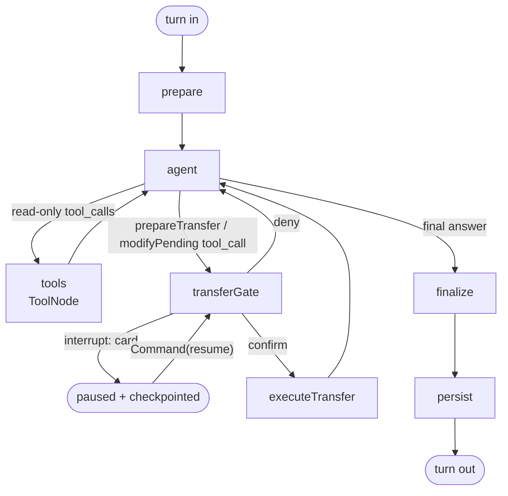
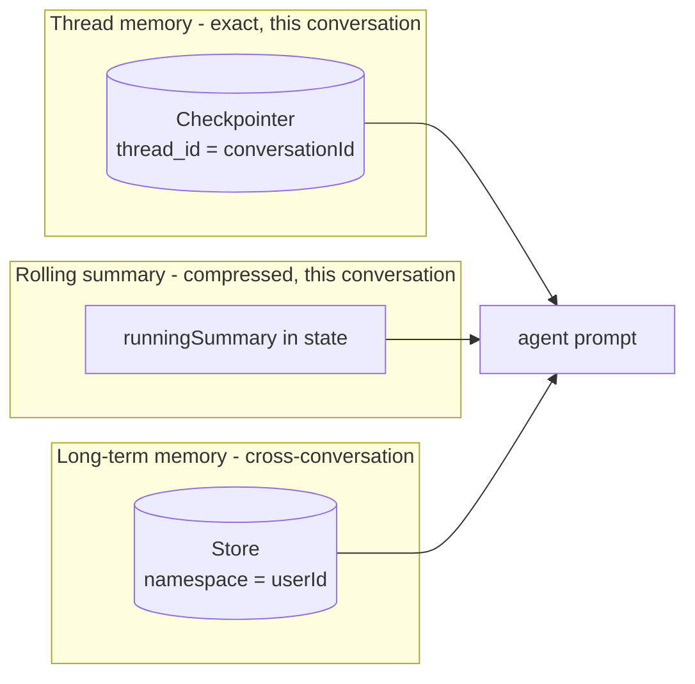
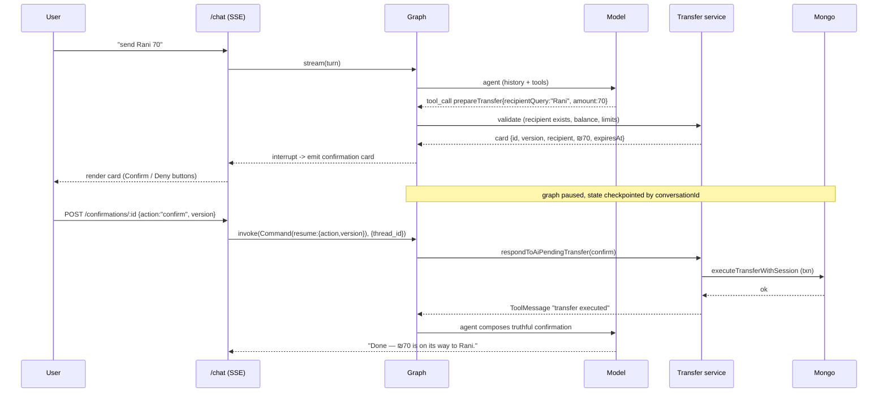

# Graph v2 — Architecture & Design

This is the "what and why". The "how" (phases, files, acceptance) is in
[02-implementation-plan.md](02-implementation-plan.md); the prompts and tool
schemas are in [03-prompts-and-tools.md](03-prompts-and-tools.md).

---

## 1. Design brief & principles

The product requirement, verbatim in spirit: *the user should be able to talk to
the assistant like a normal conversation — continuous context, fluency, and the
AI understanding what the user is trying to do or what information to get, like a
conversation with Claude or ChatGPT.* The redesign is **not LLM-invocation
budgeted**: spend tokens to be correct and fluent.

Five principles drive every decision below:

1. **The model is the brain; the graph is plumbing.** Intent, coreference,
   arithmetic, language, planning, and clarification are the model's job. The
   graph exists only to give the model durable memory, a toolbelt, a way to pause
   for human confirmation, and a way to stream.
2. **Tools are the model's API to the bank.** Every account capability is a tool
   with a Zod schema and a rich description. The model selects, chains, and
   parallelizes them. There is no `intent → tool` table.
3. **Determinism only where it must be exact.** Reading balances/transactions and
   *moving money* are deterministic backend operations. The model never computes
   a balance, invents an email, or moves money by emitting text.
4. **Continuous context is infrastructure, not heuristics.** A checkpointer holds
   the real thread; a store holds long-term facts; a summarizer keeps long
   threads affordable. We never reconstruct context from regex again.
5. **Drop the apparatus.** Per the brief, the deterministic mirror pipeline and
   the current safety machinery are removed. We keep exactly one structural
   invariant (below) and otherwise trust a strong model.

### <a id="money-invariant"></a>The money invariant (the only hard rule)

> Money moves **only** by calling `executeTransferWithSession()` inside the
> backend transfer service, and that call is reachable **only** from the
> human-confirmed resume path of the graph. No model token, tool description, or
> prompt injection can reach it, because the model is given no tool that executes
> a transfer — only a tool that *proposes* one (builds a card and pauses).

This replaces the old refusal/post-check/masking layer with a single
architectural fact. Everything the old graph spent code defending against
("chat text said 'confirm' so don't execute") is structurally impossible: the
only resume trigger is the authenticated `POST /api/ai/confirmations/:id`
endpoint carrying a card id + version.

---

## 2. From v1 to v2 at a glance

| Concern | v1 (current) | v2 (this design) |
| --- | --- | --- |
| Intent | 33-value enum, regex classifier + LLM, fixed map | Implicit; the model reasons about the goal |
| Tool selection | `intentToReadOnlyTools` table | Model picks via tool descriptions (parallel, multi-hop) |
| Coreference ("him", "the second one") | `TransferIntentFrame`, regex, `resolveTurnContext` `TurnDelta` | Model reads real thread history |
| Amounts ("double that", "what we discussed") | `AmountExpr` mini-language + `evaluateAmountExpr` | Model computes intent; a `quoteTransfer`/draft tool echoes the exact number for confirmation |
| Context store | Hand-rolled `CounterpartyMemory` (entities, answerFrames, frame, caps) | Checkpointer (thread) + Store (cross-thread) + rolling summary |
| Transfers | `transfer_prepare` / `modify` / `pending` subgraphs + separate resume | `prepareTransfer` tool → native `interrupt()` → `Command` resume |
| Clarification | `ClarificationRequest` state machine + resume fields | Model just asks; next user turn answers, context intact |
| Multilingual | regex language detection + branching prompts | Model instructed to mirror the user's language |
| Response safety | post-checks, masking, personality linter w/ retry | Personality in the system prompt; trust the model |
| Streaming | 7 fixed phases | Token stream + semantic custom events + card updates |
| Size | `graph.ts` 4,149 lines + ~12k lines of `ai/` | Agent loop in the low hundreds + a tool module per capability |

What is **deleted** (moved to "trust the model" or "the model has history"):
`router.ts` classifier & map, `messageNormalization`, `dateResolution` regex,
`amountResolution` + `amountExpr`, `TransferIntentFrame` + inheritance,
`resolveTurnContext`/`TurnDelta`, slot extraction, response post-checks, masked
label hydration, the personality-linter rejection loop, and the six compiled
subgraphs.

What is **kept**: the backend services (`prepareAiPendingTransfer`,
`modifyAiPendingTransfer`, `respondToAiPendingTransfer`,
`executeTransferWithSession`), the Mongo models (`AiConversation`,
`AiPendingTransfer`, `AiAuditLog`), the assistant personalities, the response
**blocks** schema (for rich UI cards), and the entire **external HTTP contract**.

---

## 3. State

v2 state is message-centric. We build on `MessagesAnnotation` (the `messages`
channel uses the `add_messages` reducer, so appends merge correctly and tool
results thread naturally) and add a small amount of working state.

```ts
import { Annotation, MessagesAnnotation } from "@langchain/langgraph";

const AgentState = Annotation.Root({
  ...MessagesAnnotation.spec,            // messages: BaseMessage[] (+ add_messages)

  // identity / request scope (set once at turn start)
  userId:        Annotation<string>(),
  conversationId:Annotation<string>(),
  assistantId:   Annotation<AssistantId>(),
  requestId:     Annotation<string | undefined>(),
  locale:        Annotation<"he" | "en" | "mixed" | "unknown">(),

  // hydrated context (from Store + summary), injected into the prompt
  memoryContext: Annotation<LongTermMemorySnapshot | undefined>(),
  runningSummary:Annotation<string | undefined>(),

  // user-facing output, accumulated by tools + finalize
  uiBlocks:      Annotation<AssistantResponseBlock[]>({
    reducer: (a, b) => [...(a ?? []), ...(b ?? [])],
    default: () => []
  }),

  // the card awaiting human confirmation (the interrupt payload)
  pendingConfirmation: Annotation<TransferConfirmation | undefined>(),
  confirmationOutcome: Annotation<"confirmed" | "denied" | undefined>(),

  // surfaced to the API layer
  clarification: Annotation<ClarificationRequest | undefined>(),
  refusalReason: Annotation<string | undefined>()
});
```

Notes:

- **`messages` is the conversation** — `HumanMessage`, `AIMessage` (with
  `tool_calls`), and `ToolMessage`. Unlike v1 (which deliberately persisted no
  `ToolMessage`), v2 persists the tool round-trip *to the checkpointer thread* so
  the model has its own reasoning trace next turn. The Mongo `AiConversation`
  on-disk shape can stay `{role, content}` for the client transcript; the
  checkpointer holds the richer thread (see §6).
- **`uiBlocks`** is how tools hand structured cards to the UI without the model
  re-serializing numbers as Markdown. A tool returns its `ToolMessage` *and*
  pushes a block (via `Command` state update — see §5.3).
- Almost everything v1 kept in `CounterpartyMemory` (entities, answerFrames,
  mentionedCounterparties, transferIntentFrame, mode) is **gone from state** — it
  lived only to reconstruct what the message history already contains.

---

## 4. Graph topology



Routing is one conditional edge out of `agent`, mirroring `toolsCondition` but
with a money branch:

```ts
function routeAgent(state): "tools" | "transferGate" | "finalize" {
  const last = state.messages.at(-1) as AIMessage;
  const calls = last.tool_calls ?? [];
  if (calls.length === 0) return "finalize";
  if (calls.some(c => MONEY_TOOLS.has(c.name))) return "transferGate";
  return "tools";
}
```

### 4.1 Node responsibilities

- **`prepare`** — runs once per turn before the model. Ensures the DB connection;
  resolves `assistantId`/`locale`; reads the long-term `Store` for this user
  (known counterparties, preferences, salient facts) into `memoryContext`; loads
  `runningSummary`. It does **not** classify or extract anything. (The
  checkpointer has already restored `messages`.)
- **`agent`** — the brain. A `ChatOpenAI` (latest model) bound to the full
  toolbelt with `parallel_tool_calls: true`, invoked with a system message
  assembled from policy-lite + personality + capabilities + `memoryContext` +
  `runningSummary` + today's date/timezone, followed by the thread `messages`.
  It returns one `AIMessage` that either contains `tool_calls` or is the final
  answer. Tokens stream out as it generates (§7).
- **`tools`** — a `ToolNode` over all **read-only** tools. Executes every
  requested call (in parallel), appends `ToolMessage`s, and pushes any
  `uiBlocks`. Loops back to `agent` so the model can read results and decide
  whether it needs more data or can answer. Tool *errors* come back as
  `ToolMessage`s with an error summary, so the model recovers conversationally.
- **`transferGate`** — handles the two money-proposing tools. It validates the
  proposed transfer through the existing backend service, builds the
  `TransferConfirmation` card, stores it in state, and calls
  `interrupt({ type: "transfer_confirmation", card })`. The graph **pauses** and
  the checkpointer persists the interrupted state; the API returns the card.
  When resumed via `Command({ resume: { action, version, idempotencyKey } })`,
  it branches: `confirm → executeTransfer`, `deny → agent` (with a
  `ToolMessage` telling the model the user declined).
- **`executeTransfer`** — the *only* node that moves money. Calls
  `respondToAiPendingTransfer({ action: "confirm", ... })` →
  `executeTransferWithSession()` in a Mongo transaction. Appends a `ToolMessage`
  with the real outcome and loops to `agent`, which composes a natural,
  truthful confirmation ("Done — ₪70 is on its way to Rani.").
- **`finalize`** — no model call by default. Collects the streamed assistant text
  + accumulated `uiBlocks` into the `RunAssistantResult`, attaches any
  `clarification`/`confirmation`, and resolves the personality phrase pack into
  the already-generated text only if a light post-pass is enabled (off by
  default — personality is in the prompt).

  > **Where personality lives:** `server/src/ai/v2/persona.ts` exports
  > `buildPersonaSection`, which renders the per-assistant tone, phrases, and
  > opening style into the system prompt assembled by `agent`. Because the reply
  > is generated in a single streaming pass inside `agent`, `finalize` makes no
  > model call — a second compose/finalize pass would break streaming. The
  > serious-situation tone override (`[TONE — SERIOUS SITUATIONS]`) is a hard
  > prompt rule inside `persona.ts`, verified non-blockingly by the
  > `persona-tone.test.ts` eval (see the evals README).
- **`persist`** — upserts long-term memory into the `Store` (counterparties the
  user interacted with this turn, any stated preference), and, if the thread
  exceeds a token/turn budget, runs the **summarizer** to fold old turns into
  `runningSummary` and trims `messages`. The checkpointer persists thread state
  automatically; this node also mirrors the human+assistant turn into the Mongo
  `AiConversation` transcript for the client history view.

### 4.2 Why a custom `StateGraph` and not bare `createReactAgent`

`createReactAgent` gives the agent loop for free, and we should reuse its
internals where possible — but we need four things it does not provide
out of the box: (a) a **money branch** with `interrupt`/resume distinct from
ordinary tools, (b) **structured `uiBlocks`** accumulation separate from the
chat text, (c) a **summarize/persist** tail with the long-term `Store`, and
(d) **semantic streaming phases**. So v2 is a thin custom graph whose middle is
exactly the ReAct loop (`agent ⇄ tools`) with two extra exits. This keeps the
loop idiomatic while giving us the production seams.

---

## 5. Tools — the model's API to the bank

### 5.1 Catalog

All current read-only executors become `tool()`s. The model's tool-selection
quality is dominated by the **description**, so each gets a crisp, example-laden
one (full text in [03-prompts-and-tools.md](03-prompts-and-tools.md)). Grouped:

| Group | Tools |
| --- | --- |
| Accounts | `getAccounts`, `getBalance` |
| Transactions | `searchTransactions` (filters: direction, dateRange, amountRange, counterparty, reason, text, limit, sort), `getTransactionStats`, `getTransactionReceipt` |
| Counterparties | `findCounterparty` (name/pronoun/ordinal/email → candidates), `getCounterpartySummary`, `getCounterpartyTransactions`, `getTotals` (sent/received/net in one call), `getRecentSent`, `getRecentReceived`, `getLastSent`, `getVerifiedRecipients` |
| Transfer preflight | `getTransferLimits`, `checkTransferEligibility`, `getTransferQuote`, `getDailyTransferUsage`, `getPendingTransfers` |
| Money actions | `prepareTransfer` (HITL), `modifyPendingTransfer`, `cancelPendingTransfer` |

Two consolidations worth calling out:

- **`searchTransactions`** absorbs `recent_transactions`, `transaction_search`,
  `transaction_count`, `transaction_summary/stats` (via a `mode: "list" |
  "stats" | "count"` param) and `transfer_status`. The model expresses what it
  wants in arguments instead of us pre-binning 8 intents.
- **`getTotals`** absorbs `counterparty_total_sent/received/net` with a
  `direction` arg.

This shrinks ~26 tool names to ~18 sharper ones and removes the three
contract-only ghosts (`getCashflowSummary`, `getMyProfile`,
`getAvailableActions`) until they have real executors.

### 5.2 Tool shape

```ts
import { tool } from "@langchain/core/tools";
import { z } from "zod";

export const getBalance = tool(
  async ({ accountId }, config) => {
    const ctx = toolCtx(config);                  // userId, now, tz from config.configurable
    const result = await balanceService(ctx.userId, accountId);
    // semantic status event for the UI
    config.writer?.({ kind: "status", label: "Checked your balance" });
    return new Command({
      update: {
        messages: [new ToolMessage({ /* model-facing summary */ })],
        uiBlocks: [balanceBlock(result)]           // user-facing card
      }
    });
  },
  {
    name: "getBalance",
    description: BALANCE_DESC,                      // see 03-prompts-and-tools.md
    schema: z.object({
      accountId: z.string().optional()
        .describe("Specific account; omit for the default/primary account.")
    })
  }
);
```

Key points:

- **`config.configurable`** carries `userId`, `conversationId`, `now`,
  `timezone` — tools never trust model-supplied identity. (Same trust boundary
  v1 had, now expressed through LangGraph's config instead of a hand-built
  `ToolContext`.)
- A tool returning `Command({ update: { uiBlocks } })` is how structured cards
  reach the UI without the model formatting numbers — preserving the v1
  "structured blocks are authoritative, the model writes only a short intro"
  win, but driven by the tool that actually has the data.
- `config.writer?.(...)` emits a **custom stream event** (§7) — this is how we
  get "Looking up Rani…" / "Checking your daily limit…" status lines that are
  *semantically accurate* because they come from the tool actually running.

### 5.3 Counterparty resolution is now a tool, not a pipeline

The single biggest fluency change. v1 had a `resolveCounterpartyReference` node,
a `resolveContextualAmounts` node, a `TransferIntentFrame`, a `TurnDelta`
resolver, and regex for pronouns/ordinals. v2:

- The model sees the real history. For "send **him** the same again", it already
  knows who "him" is and what "the same" was, because those turns are in
  `messages`. It calls `prepareTransfer({ recipientQuery: "Rani", amount: 70 })`
  or, if it only has a name, calls `findCounterparty({ query: "Rani" })` first.
- `findCounterparty` returns **candidates** (0, 1, or many). On many/zero, the
  model asks a natural clarifying question ("I see two Ranis — the one at m\*\*\*@…
  or m\*\*\*2@…?"). That question is just an `AIMessage`; the user's next turn
  answers it; the checkpointer kept everything. **No clarification state machine.**
- The model never receives a raw email to put in `recipientEmail`; it passes a
  *query* or a candidate id, and the **tool/backend** resolves and returns the
  authoritative email. (The v1 "F2" rule — an email inside an amount clause must
  never become the recipient — is naturally handled: amounts and recipients are
  separate tool arguments with separate descriptions.)

---

## 6. Memory — the three layers

This section is the core of "continuous context and fluency". Three layers, each
with a clear job:



### 6.1 Thread memory — LangGraph checkpointer

- **What:** the full `messages` thread, persisted per `thread_id =
  conversationId`, restored automatically at the start of every turn.
- **Why it matters:** coreference, ellipsis, topic continuity, and "the amount we
  discussed" are resolved by the model from the actual prior turns. This is the
  feature that makes it feel like Claude/ChatGPT.
- **Where:** a **MongoDB checkpointer** (`@langchain/langgraph-checkpoint-mongodb`,
  added as a dep) keyed on `conversationId`, so it lives in the existing
  database and survives restarts. It also enables `interrupt`/resume (§8) and
  time-travel debugging.
- **Trimming:** the checkpointer keeps the full thread, but the *prompt* is built
  from `runningSummary` + a `trimMessages(...)` window of the most recent turns,
  so cost/latency stay bounded (§6.2).

### 6.2 Rolling summary — bounded context

- When `messages` exceeds a budget (e.g. > N turns or > T tokens), `persist`
  invokes a cheap summarizer call that folds everything older than the last `k`
  turns into `runningSummary` (a few sentences: who they've been transferring to,
  open threads, stated preferences), then trims those old messages from the
  prompt window. The verbatim recent window + the summary preserve fluency
  without unbounded growth — the standard LangGraph long-conversation pattern.
- This explicitly avoids the anti-pattern of replaying a 100-turn history on
  every call.

### 6.3 Long-term memory — LangGraph Store

- **What:** durable, cross-conversation facts under `namespace = (userId,)`:
  - **Counterparties**: `name ↔ email ↔ relationship/last-interaction` (so "send
    Rani 50" works in a brand-new conversation if the user has paid Rani before).
  - **Preferences**: default assistant/personality, preferred language, "always
    ask before sending over ₪500", display preferences.
  - **Salient facts** the user states ("my rent is the 1st").
- **Where:** a `BaseStore` backed by Mongo (custom thin adapter, or the in-memory
  store for dev/eval). Optionally **vector-indexed** for semantic recall of the
  right counterparty/fact.
- **Lifecycle:** `prepare` reads it into `memoryContext`; `persist` upserts what
  was learned this turn. This is the "it remembers me" layer that the v1
  per-conversation `CounterpartyMemory` could never provide.

> Net effect: the model is grounded by **(a)** the exact recent thread, **(b)** a
> compressed summary of the rest of this conversation, and **(c)** a durable
> profile of the user — exactly the substrate a fluent assistant needs.

---

## 7. Streaming — the chat-app feel

We use LangGraph's multi-mode streaming (`graph.stream(input, { ...,
streamMode: ["messages", "custom", "updates"] })`) and map each to an SSE event:

| Stream mode | Source | SSE event | UX |
| --- | --- | --- | --- |
| `messages` | LLM token deltas in `agent` | `token` | true type-on effect for the reply |
| `custom` | `config.writer(...)` inside tools | `status` | *semantic* progress: "Looking up Rani", "Checking your daily limit", "Preparing your confirmation" |
| `updates` | node state deltas | `block` | render a balance/stats card the moment its tool returns, before text finishes |
| (final) | `finalize` | `result` | the existing `RunAssistantResult` shape |

This both **supersedes** v1's 7 fixed phases (which were derived from node names
and could be semantically wrong) and adds token streaming the current
implementation lacks. The endpoint keeps emitting `accepted`/`completed` for
compatibility; the richer events are additive.

---

## 8. Transfers — native human-in-the-loop

The whole transfer story collapses into one idiomatic flow.



- **Prepare** = the `prepareTransfer` tool + `interrupt()`. The backend
  validation (recipient exists, sender ≠ recipient, sufficient balance) stays
  exactly as `prepareAiPendingTransfer` does it today — and because there is now
  a *single* money path, we can finally **enforce limits** (the v1 known mismatch
  where `getTransferLimits` was informational only).
- **Modify** ("actually make it 70") = the model calls `prepareTransfer`/
  `modifyPendingTransfer` again with the new value; it sees the pending card in
  state, so it changes only what the user changed. The backend supersedes the old
  card (existing `modifyAiPendingTransfer` logic, `supersededById`). No special
  "modify subgraph".
- **Confirm/Deny** = the existing `POST /api/ai/confirmations/:id` becomes the
  **resume trigger**: it loads the thread by `conversationId` and calls
  `graph.invoke(new Command({ resume: { action, version, idempotencyKey } }),
  { configurable: { thread_id } })`. Version + idempotency checks remain in
  `respondToAiPendingTransfer`. Client code does not change.
- **Why this is safe without the old apparatus:** the model has no
  execute-transfer tool. The only path to `executeTransferWithSession` is the
  authenticated resume of a previously-built card. Chat text saying "yes confirm"
  doesn't resume anything — only the button's POST does.

---

## 9. Model & OpenAI usage

- **Model:** latest OpenAI flagship (GPT‑5 class) via `@langchain/openai`
  `ChatOpenAI`, configured through `config.ai.model`. The agent benefits from a
  strong reasoner because it plans multi-tool sequences and handles bilingual
  coreference.
- **Parallel tool calls:** enabled — "what's my balance and who did I pay last?"
  fires `getBalance` + `getLastSent` together.
- **Structured outputs:** used sparingly. Tools have typed Zod *inputs*; the only
  place we might use structured *output* is an optional "block-selection" pass,
  but since tools already emit `uiBlocks`, the agent's job is just fluent text.
- **Reasoning effort:** tune per call — higher for the agent, minimal/none for
  the summarizer.
- **Prompt caching:** the large, stable system prefix (policy-lite + tool docs +
  personality) is identical across turns → cache it for latency/cost. The
  per-turn tail (memory context, summary, date) is small.
- **OpenAI SDK direct:** available if we want Responses-API features (server-side
  tool/state primitives, hosted tools) for specific tools; the default path is
  `@langchain/openai` so it slots into LangGraph's streaming and tracing.

---

## 10. Observability, errors, concurrency

- **Tracing:** LangSmith is native to LangGraph — every node, tool, and model
  call is a span with token counts and latency. We keep writing the existing
  `AiAuditLog` (intent inferred from the final answer/tools, tools requested vs
  executed, refusal, outcome) so the current audit UI keeps working.
- **Tool errors:** returned as `ToolMessage`s, not thrown — the model reads "that
  counterparty wasn't found" and recovers by asking. Node-level `try/catch`
  guards the model call; a hard failure yields a graceful localized message.
- **Concurrency / idempotency:** the checkpointer serializes turns on a thread;
  the confirmation resume keeps `version` + `idempotencyKey`, so a double-click
  or a stale card is rejected exactly as today.
- **Cost guardrails:** the rolling summary + trim window cap per-turn tokens;
  parallel tools cap wall-clock; prompt caching caps the stable prefix cost.

---

## 11. Risks & mitigations

| Risk | Mitigation |
| --- | --- |
| Model picks the wrong/no tool | Invest in tool descriptions + few-shot examples in the system prompt (§03); eval suite asserts tool-call choice on a fixture set; `getTransferQuote` lets the model preview before committing. |
| Hallucinated numbers in prose | Numbers render from authoritative `uiBlocks`; the model is told to write only a short intro and never restate figures as Markdown (carried over from v1's structured-response win). |
| Prompt injection via transaction memos / counterparty names | The model has **no** money-executing tool, so the worst case is a bad *proposal* the user still has to confirm. Tool inputs are validated server-side; identity comes from `config`, never the model. |
| Long threads → cost/latency | Rolling summary + `trimMessages` window + prompt caching. |
| Checkpointer/store as new infra | Use Mongo-backed adapters in the existing DB; feature-flag; dev/eval use in-memory. |
| Regression vs the 200+ passing v1 evals | Re-target fixtures as multi-turn LLM-judge scenarios + tool-call assertions; run v1 and v2 in shadow before cutover (§02). |
| Losing Hebrew/English nuance | System prompt mandates mirroring the user's language; bilingual scenarios are first-class in the eval set. |

---

## 12. What success looks like

A user can, in one flowing conversation and in Hebrew or English:

1. "how much did I send Rani this month?" → model calls `findCounterparty` +
   `getTotals` (or `getCounterpartySummary`), answers with a card.
2. "and to Dan?" → model reuses the thread, swaps the counterparty, answers.
3. "ok send her the same I sent him last week" → model resolves "her" = Rani,
   "the same I sent him" = the Dan figure from the prior turns, calls
   `prepareTransfer`, the graph shows a card.
4. "actually make it 100" → model re-proposes 100, new card supersedes.
5. *clicks Confirm* → money moves once, the model says so truthfully.
6. *next week, new conversation* "pay Rani 50" → long-term memory already knows
   Rani, straight to a card.

No regex, no frame, no intent table, no clarification state machine — just a
model with memory, tools, and a confirmation gate. That is the deliverable.
