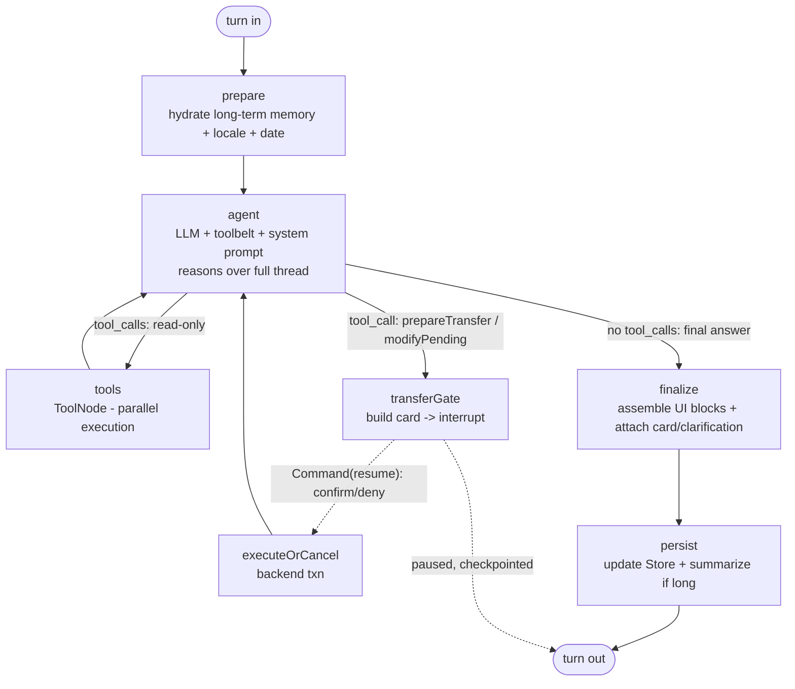

# Virly AI Assistant — Graph v2

> **Status:** Design proposal (no code yet). Target stack: **LangGraph.js 1.4**,
> `@langchain/openai` 1.4, `@langchain/langgraph-checkpoint-*`, OpenAI SDK.
> Author: design pass requested 2026-06-13.

This folder specifies a ground-up redesign of the Virly AI assistant graph. The
goal is a single, **conversational, LLM-first agent** — the user talks to it the
way they talk to Claude or ChatGPT, with continuous context across turns, fluent
coreference ("send him the same again", "actually make it 70", "the second
one"), and the model itself deciding what the user wants and which tools to call.

## Why a redesign

The current graph (`server/src/ai/graph.ts`, 4,149 lines) is **deterministic-first**:
a regex/LLM intent classifier picks one of 33 intents, a fixed `intent → tools`
map runs, deterministic resolvers reconstruct coreference from a hand-built
`TransferIntentFrame` + an `AmountExpr` mini-language, and the LLM is only ever a
narrow gap-filler wrapped in post-checks, masking, and a personality linter. It
works, but every new conversational nuance costs another regex, another frame
field, another no-op guard. It does not feel like a conversation; it feels like a
form-filler with an LLM bolted on.

v2 inverts the relationship: **the LLM is the brain**, the graph is a thin,
durable agent loop around it, and deterministic code is reserved for the one
thing that must be exact — *moving money and reading account facts from the
database*. Per the design brief, we **drop the deterministic mirror pipeline and
the heavy guardrail apparatus** (refusal taxonomy, injection scanning, response
post-checks, masking gymnastics, personality-rejection loop) and trust a strong
model plus a structural money invariant.

## The one invariant we keep

Everything else is negotiable; this is not: **money moves only through the
backend transfer service, reachable only from the human-confirmed resume path.**
The model can *propose* a transfer (a tool that builds a confirmation card and
pauses the graph), but no model output ever silently executes a transfer. This
is not "safety theater" — it is simply *where the money-moving function is
callable from*. See [01-design.md](01-design.md#money-invariant).

## Documents

| File | What it covers |
| --- | --- |
| [01-design.md](01-design.md) | Architecture: state, graph topology, the agent loop, the 3-layer memory model, tools-as-API, transfers via native `interrupt()`, streaming, model/OpenAI usage, what gets deleted, old-vs-new, production concerns, risks. |
| [02-implementation-plan.md](02-implementation-plan.md) | Phased build plan (files to add / change / delete, acceptance criteria, sequencing), test & eval strategy, and feature-flagged rollout. |
| [03-prompts-and-tools.md](03-prompts-and-tools.md) | The fluency engine: the system-prompt skeleton, the full tool catalog (Zod schemas + the natural-language descriptions the model reads), and worked multi-turn transcripts. |

## The shape of v2 in one picture

## Headline outcomes

- **Continuous context for free.** Thread history is restored every turn by a
  LangGraph checkpointer (`thread_id = conversationId`). The model resolves
  coreference, ellipsis, and "the amount we discussed" from the *real*
  conversation — deleting ~1,500 lines of frame/regex/expression machinery.
- **Cross-session memory.** A LangGraph `Store` (namespaced by `userId`) gives
  the assistant durable memory of your counterparties and preferences — the
  "it remembers me" feel.
- **The model decides.** No fixed intent→tool map. Well-described tools + a
  capable model = correct, chained, parallel tool use, and natural clarifying
  questions instead of a clarification state machine.
- **Transfers are idiomatic.** `prepareTransfer` builds a card and the graph
  `interrupt()`s; the confirmation endpoint resumes with `Command`. One flow
  replaces four subgraphs + bolted-on resume logic — and we can finally enforce
  limits on the single money path.
- **It streams like a chat app.** Token-by-token text, semantic status events
  from inside tools ("checking your limits…"), and cards that render as they
  land.
- **Smaller, testable.** ~4,150-line `graph.ts` → a few hundred lines, evaluated
  with multi-turn LLM-judge scenarios and tool-call assertions.

The external HTTP contract (`POST /api/ai/chat`, `/chat/stream`,
`/confirmations/:id`, the confirmation-card shape, response blocks) is
**preserved**, so the client and OpenAPI spec keep working through the cutover.
