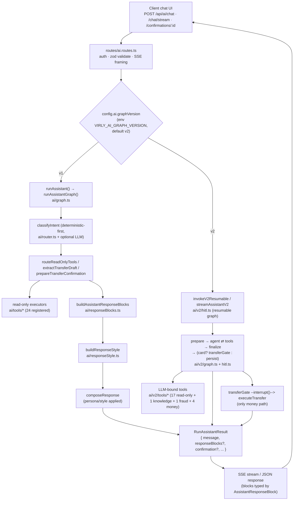
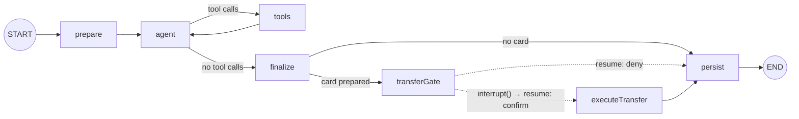

# AI Assistant Architecture (v1 + v2)

> **Subsystem:** `server/src/ai/` (v1 deterministic structured pipeline) and
> `server/src/ai/v2/` (LangGraph agent with HITL, memory, persona).
> **Audience:** anyone touching the assistant — backend, prompt, or eval work.
> **Status:** verified against live code on 2026-06-27.

This is the architecture doc for the highest-complexity subsystem in the repo: how
a chat message becomes a streamed, structured, persona-styled response with a
money-movement gate. Two assistant implementations share **one** request/response
contract; a single env flag selects which one serves a turn.

**Related docs (link, don't duplicate):**

- Transfer mechanics, limits, idempotency, execution — [Transfers domain](../domain/transfers.md)
- HTTP endpoints, request/response shapes — [API reference](../api/README.md)
- Memory storage migration off Mongo — [Postgres migration Phase 2 design](../superpowers/specs/2026-06-25-postgres-migration-phase2-design.md) *(written later this effort)*
- Tests and evals overview — [Testing](../testing.md)
- Frontend chat surface — [Frontend: AI assistant](../frontend/areas/ai-assistant.md)
- v2 eval harness — [`server/src/ai/evals/v2/README.md`](../../server/src/ai/evals/v2/README.md)
- LangSmith evals — [`server/src/ai/evals/langsmith/README.md`](../../server/src/ai/evals/langsmith/README.md)
- Backend module layout — [Backend](../backend/)
- MCP trust boundary — [Security](../security.md)
- Env vars / configuration — [Configuration](../configuration.md)
- Fraud risk money-path — [Transfers domain](../domain/transfers.md)

---

## 1. Scope map (HTTP → router → graph → tools → blocks → SSE)



### v1 vs v2 selection rule (`config.ai.graphVersion` / `VIRLY_AI_GRAPH_VERSION`)

> **The selection is NOT per-assistant-id or per-request-shape.** It is a single
> global env flag. The four assistant ids (`oshri`, `chaya`, `yehuda`, `yohai`)
> select *persona*, not implementation — both v1 and v2 honor every id.

The dispatch lives in two places, both keyed on the same config value:

`server/src/ai/runAssistant.ts:24` — the sibling-agnostic dispatch the conformance
harness uses:

```ts
export function runAssistant(input, options = {}) {
  if (config.ai.graphVersion === "v2") {
    return runAssistantGraphV2(input, options);   // ai/v2/graph.ts
  }
  return runAssistantGraph(input, options);        // ai/graph.ts
}
```

The **production HTTP route** branches on the same flag but routes v2 through the
*resumable HITL* graph (`ai/v2/hitl.ts`), not the plain per-turn entry —
`server/src/routes/ai.routes.ts:135`:

```ts
const result =
  config.ai.graphVersion === "v2"
    ? await invokeV2Resumable(runInput, runOptions)   // ai/v2/hitl.ts
    : await runAssistant(runInput, runOptions);
```

The flag is defined in `server/src/config.ts:173-176`:

```ts
graphVersion: (() => {
  const raw = getStringEnv("VIRLY_AI_GRAPH_VERSION", "v2").trim().toLowerCase();
  return raw === "v1" ? "v1" : "v2";
})() as "v1" | "v2"
```

| Selector | Value | Implementation chosen | Entry point |
| --- | --- | --- | --- |
| `VIRLY_AI_GRAPH_VERSION` | `v1` | deterministic structured pipeline | `runAssistantGraph` (`ai/graph.ts`) |
| `VIRLY_AI_GRAPH_VERSION` | `v2` (default) or anything else | LangGraph agent (HITL on the HTTP route) | `invokeV2Resumable` / `streamAssistantV2` (`ai/v2/hitl.ts`); `runAssistantGraphV2` (`ai/v2/graph.ts`) for the non-resumable / conformance path |
| `assistantId` (`oshri`/`chaya`/`yehuda`/`yohai`) | — | does NOT change implementation; selects persona only | both graphs |

> The `getStringEnv` default is `"v2"`; only the literal string `v1` selects v1.
> Rollback is a single env flip. (Note: the `runAssistant.ts` file-header comment
> still says "default `v1`" — that comment is stale; `config.ts` is authoritative.)

`server/src/ai/router.ts` itself is the **intent classifier**, not the v1/v2 switch:
`classifyAssistantIntent` runs `classifyAssistantIntentDeterministic` (regex-based,
EN + HE) first, short-circuits on transfer/pending intents, and only calls the LLM
classifier for the rest (falling back to the deterministic result on error).

---

## 2. v1 — deterministic structured pipeline (`ai/graph.ts`)

v1 is a deterministic-first state graph. The LLM is **optional** at every node: if
no provider is configured (or it throws), each node falls back to deterministic
logic. Trace of one turn (node names are the real ones emitted as
`node_transition` diagnostics when `config.ai.debugTrace` is on):

```
classifyIntent            intent classification (router.ts; deterministic → optional LLM)
  → routeReadOnlyTools    read-only intents: run the allowlisted tools for the intent
  → extractTransferDraft  transfer intents: pull recipient/amount/reason (deterministic → optional LLM)
  → prepareTransferConfirmation / modifyPendingTransferConfirmation
                          build a confirmation *card* via the injected service (no money moves)
  → buildResponseBlocks   buildAssistantResponseBlocks (responseBlocks.ts)
  → buildResponseStyle    build the persona/style context (responseStyle.ts)
  → composeResponse       compose final text with the persona/style applied
```

### Intent → tool selection

`intentToReadOnlyTools` in `ai/router.ts` is a static allowlist: each
`AssistantIntent` maps to the exact read-only tool names allowed for it (e.g.
`balance_inquiry → [getUserAccounts, getAccountBalance]`). Transfer intents
(`transfer_prepare`, `transfer_modify_pending`, `transfer_cancel_pending`) map to
**`[]`** — they never run a read tool; they route to the preparation service
instead. `getReadOnlyToolsForIntent` and `isReadOnlyToolName` enforce this.

### Tools (`ai/tools/*`)

The directory has ~28 `.ts` files, but several are shared helpers
(`counterpartyHelpers.ts`, `pendingTransferHelpers.ts`, `transactionHelpers.ts`,
`transferPreflightHelpers.ts`), not tools. The authoritative count is the
**24 registered executors** in `readOnlyToolExecutors` (`ai/tools/index.ts`):
`getUserAccounts`, `getAccountBalance`, `getRecentTransactions`,
`getLastSentCounterparty`, `getTransactionsWithCounterparty`,
`getTotalSentToCounterparty`, `getTotalReceivedFromCounterparty`,
`getNetWithCounterparty`, `getVerifiedRecipients`, `getTransferLimits`,
`getRecentSentCounterparties`, `getRecentReceivedCounterparties`,
`resolveCounterpartyCandidates`, `getCounterpartySummary`,
`getCounterpartyActivityTimeline`, `searchTransactions`, `getTransactionStats`,
`resolveTransactionReference`, `getTransactionReceipt`, `getTransferEligibility`,
`getTransferQuote`, `getDailyTransferUsage`, `getPendingAiTransfers`,
`resolvePendingTransferReference`. **All 24 are read-only** — none moves money.

### Persona / style linting (`ai/responseStyle.ts`)

After the facts are assembled, `resolveResponseSituation` maps
`(intent, riskLevel, failureReason, transferStatus, …)` to a `ResponseSituation`
(e.g. `balance_inquiry_success`, `transfer_prepare_needs_confirmation`,
`insufficient_funds`, `security_sensitive`). `buildPersonalityPromptSection` then
injects the persona's phrase pack for that situation, and `lintPersonalityUsage` /
`buildPersonalityLintFeedback` check the composed reply against the expected voice.
The **risk gate is structural**: `riskLevel` `high`/`blocked` collapses to serious
situations (`insufficient_funds`, `security_sensitive`) that strip personality —
numbers, warnings, and refusals are never reshaped by tone.

### Deterministic fallback

`composeResponse` uses the LLM responder when available but always passes a
`fallbackMessage`; if the responder is absent or its output fails a post-check
(e.g. it claims a transfer was sent), the deterministic fallback text stands. The
LLM never gets to invent a balance, a status, or an executed transfer.

### `AssistantResponseBlock` contract (shared with the client)

Structured UI blocks are the wire format the client renders instead of raw text.
The server type is `AssistantResponseBlock` in
`server/src/ai/responseBlocks.ts:196` (format version constant
`assistantResponseFormatVersion = 1` at line 14; builder
`buildAssistantResponseBlocks` at line 936). **The identical contract is mirrored
on the client** at `client/src/lib/types.ts:457` (`AssistantResponseBlock`), with
the block-type union `AssistantResponseBlockType` at line 403 and the field
`responseBlocks?: AssistantResponseBlock[]` at line 650. The two are kept in sync
by `aiSafety.test.ts` (the "client … union stays in sync with state contracts"
tests). Block types: `text`, `account_summary`, `transaction_list`,
`transaction_detail`, `transaction_stats`, `pending_transfers`, `transfer_quote`,
`transfer_confirmation`, `transfer_status`, `transfer_limits`,
`video_session_cta`, `empty_state`, `notice`.

A `RunAssistantResult` carries `message`, `responseMessage`,
`responseFormatVersion`, optional `responseBlocks`, `intent`, `toolCalls`,
`toolResults`, and optional `clarification` / `confirmation` /
`supersededConfirmationId`. Both v1 and v2 return this exact shape, so
`ai.routes.ts:toChatResponse` is implementation-agnostic.

---

## 3. v2 — LangGraph agent (`ai/v2/`)

v2 is LLM-first: a single agent reasons over the whole thread and calls tools
itself. There are **two compiled graphs** built from the same nodes:

- **`ai/v2/graph.ts` (`runAssistantGraphV2`)** — the read-only loop, no
  checkpointer. Used by the conformance harness and the non-resumable path. Its
  header notes "Phase 5 (transfer execution via interrupt/resume) is NOT wired"
  here — money tools only build cards.
- **`ai/v2/hitl.ts` (`buildResumableGraph` → `invokeV2Resumable` /
  `streamAssistantV2` / `resumeV2Confirmation`)** — the **production** graph,
  compiled `WITH` a checkpointer so `interrupt()` can pause on a prepared card.
  This is what `ai.routes.ts` calls when `graphVersion === "v2"`.

### Confirmed node graph (production resumable graph)

> The plan listed `prepare → transferGate → executeTransfer → finalize → persist`.
> **The real graph differs:** `finalize` runs **before** `transferGate`, there is
> an `agent ⇄ tools` loop, and `transferGate`/`executeTransfer` are reached only
> conditionally (when a card was prepared). The corrected, verified topology from
> `ai/v2/hitl.ts:76-97` (and `routeAgent` / `routeAfterFinalize`):



Node responsibilities (`ai/v2/nodes/*`):

| Node | Role |
| --- | --- |
| `prepare` | validates identity from `config.configurable`; in-graph seam to hydrate the long-term `Store` snapshot. Read-only loop: pass-through. |
| `agent` | the only model call. `model.bindTools(allTools, { parallel_tool_calls: true })`; system prompt from `buildSystemPrompt`. Loops with `tools` until it emits no tool calls (`routeAgent`). |
| `tools` | `createV2ToolNode()` executes the requested tools (read-only and money/card tools). |
| `finalize` | no model call. Extracts the last AI message text and folds the per-turn outcome (`confirmation` / `clarification` / `supersededConfirmationId`) into state. |
| `transferGate` | **HITL pause.** Reached only if `state.confirmation` is set (`routeAfterFinalize`). Calls `interrupt({ type, card })`, checkpoints, returns the card. On resume routes `confirm → executeTransfer`, `deny → persist`. |
| `executeTransfer` | the **only** node that moves money. Calls `respondToAiPendingTransfer → executeTransferWithSession`. Reachable only from the human-confirmed resume of `transferGate`. |
| `persist` | turn tail; in-graph seam for long-term `Store` upserts / summary trimming. Read-only loop: pass-through. (Entry owns the conversation-store I/O.) |

### HITL interrupt (`ai/v2/nodes/transferGate.ts` + `ai/v2/hitl.ts`)

The pause is LangGraph-native. `transferGateNode` calls `interrupt({ type:
"transfer_confirmation", card })`; the graph checkpoints and `invokeV2Resumable`
detects `__interrupt__` and returns the card with the `confirmation` block. Later,
the authenticated `POST /api/ai/confirmations/:id` resolves the resumable card
(`getResumablePendingForUser`) and calls `resumeV2Confirmation`, which invokes the
same graph with `new Command({ resume: { action, version, idempotencyKey } })` on
the same `thread_id = conversationId`. `interrupt()` returns the decision, and the
graph routes to `executeTransfer` (confirm) or `persist` (deny). If no resumable
checkpoint exists, `ai.routes.ts:264-290` falls back to the direct
`respondToAiPendingTransfer` service (which enforces its own version/idempotency
guards).

### Streaming events (`ai/v2/streamEvents.ts`)

`streamAssistantV2` streams the graph with
`streamMode: ["messages", "custom", "updates"]`. `mapStreamChunk` translates each
chunk into additive SSE events on top of the existing
`accepted`/`status`/`result`/`completed` contract:

- `messages` → `token` events (LLM text deltas)
- `custom` → `status` events (e.g. "Checking your balance") and `block` events
  (a card the moment its tool returns), emitted by tools via `config.writer`
- `updates` → drives the final `result` envelope's `responseMessage`

SSE framing itself (`event:`/`data:` lines, header flushing) is in
`ai.routes.ts:writeSseEvent` / `/chat/stream`.

### Memory (`ai/v2/memory/*`) — swappable backend (Phase M1.5)

The LangGraph persistence layer is now selectable at runtime via
`VIRLY_AI_MEMORY_BACKEND` (`mongo` default | `postgres`). The selection is
orthogonal to `VIRLY_DB_DRIVER`: the app's OLTP store can stay on Mongo while AI
memory moves to Postgres, or vice versa. Reversible by env flip. See
[Configuration](../configuration.md) for the full env reference.

Three persistence components:

1. **Thread checkpointer** (`memory/checkpointer.ts`) — persists the full
   `messages` thread per `thread_id = conversationId` and restores it at the start
   of every turn (this is what makes "the amount we discussed" resolvable) and
   underpins `interrupt`/resume. Backend selection happens in
   `getResumableGraph` (`hitl.ts:105-129`):
   - `postgres` → `getPostgresCheckpointer()`, which returns a
     `PostgresSaver` from `@langchain/langgraph-checkpoint-postgres` using the
     `VIRLY_AI_PG_URL` connection string (shared with the RAG store, see below).
     Tables are created idempotently at boot by `setupAiMemoryBackend` →
     `setupPostgresCheckpointer` (`memory/setup.ts`, called from `index.ts:12`).
   - `mongo` (default) → `createMongoCheckpointer(mongoose.connection.getClient())`,
     a `MongoDBSaver` from `@langchain/langgraph-checkpoint-mongodb`.
   - Both branches fall back to `MemorySaver` when the backing store is
     unavailable (dev/eval/degraded); pending transfer state is not lost because
     it persists in its own repository, independently of the graph checkpointer.

2. **Long-term store** (`memory/store.ts` + `memory/postgresStore.ts`) — a
   `BaseStore` namespaced by `userId` holding durable cross-conversation facts
   (counterparties, preferences, salient facts). Backend selection is in
   `resolveLongTermStore` (`memory/loop.ts:28-46`):
   - `postgres` → `getPostgresLongTermStore()`, a hand-rolled `PostgresLongTermStore`
     extending `BaseStore` (`memory/postgresStore.ts`). Items live in one
     `ai_memory_store` table (prefix + key primary key, JSONB value) on the same
     dedicated AI Postgres. `setup()` creates the table and index idempotently;
     `setupAiMemoryBackend` calls it at boot.
   - `mongo` (default) → `MongoDBStore` from
     `@langchain/langgraph-checkpoint-mongodb`.
   - `prepare` reads a snapshot; `persist` upserts (wired via `memory/loop.ts`).
     Types live in `memory/types.ts`.

3. **Rolling summary** (`memory/summary.ts`) — `foldRollingSummary` keeps long
   threads affordable: above `SUMMARY_BUDGET_MESSAGES` (16) it folds everything
   older than `KEEP_RECENT_MESSAGES` (8) into a 2–4 sentence `runningSummary` (a
   cheap model call, degrading to a plain trim on failure) and replays only the
   recent window. This explicitly avoids the "replay 100 turns every call"
   anti-pattern.

> **Shared AI Postgres.** When `VIRLY_AI_MEMORY_BACKEND=postgres`, the checkpointer
> and long-term store use the SAME dedicated pgvector database as RAG
> (`db/vector.ts`, resolved via `resolveAiPgUrl()`). Its migration history is
> independent of the app's OLTP migrations (`__drizzle_migrations_ai` tracking
> table, applied by `npm run rag:migrate`). See [Backend](../backend/) for module
> layout.
>
> **Forward link.** The end-state design (single Postgres, no Mongo dependency for
> AI memory) is documented in the
> [Postgres migration Phase 2 design](../superpowers/specs/2026-06-25-postgres-migration-phase2-design.md).

---

## 4. RAG — policy-document retrieval

The RAG pipeline lets the v2 agent answer questions about Virly's internal
products, loan packages, eligibility rules, and company policies without
hallucinating terms. It is self-contained inside `server/src/ai/rag/` and
`server/src/repositories/vector/`; for module layout see [Backend](../backend/).
Env vars are documented in [Configuration](../configuration.md).

### `searchPolicyDocs` tool (`ai/v2/tools/policyDocs.ts`)

`searchPolicyDocsTool` is the agent's entry point to the knowledge base. It is
registered in `tools/index.ts` as `knowledgeTools` and composed into `allTools`
alongside the read-only and money tools.

Key facts (verified in `policyDocs.ts`):

- Calls `retrievePolicyDocs` directly in-process — there is no MCP hop.
- Emits SSE status event `"Looking through policy documents"` via
  `statusWriter(config)` before the search runs.
- Schema: `query` (string, max 500 chars); `category` (optional enum
  `"policy" | "loan_package"`); `limit` (integer 1–10, default 5).
- Returns numbered citations (`[1] Title (category) — source\nexcerpt`) the model
  must cite by `[number]` in its answer. If no hits match, returns a plain
  "no matching documents" string. If RAG is disabled or not configured, returns a
  clear human-readable message rather than an error — the tool never throws to the
  agent loop.
- Description lives in `tools/descriptions.ts` (`SEARCH_POLICY_DOCS_DESC`).

### Retriever (`ai/rag/retriever.ts`)

`retrievePolicyDocs(query, options)` is the single retrieval entry point. It
gates on two conditions before touching the database:

1. `config.rag.enabled` — if false, returns `{ available: false, reason: "disabled" }`.
2. `isEmbeddingsConfigured()` (`rag/embeddings.ts`) — checks that
   `config.ai.openAIApiKey` and `config.rag.embeddingModel` are non-empty; if not,
   returns `{ available: false, reason: "not_configured" }`.

When both pass, it calls `searchKnowledge`: embeds the query, runs a pgvector
cosine top-k search, and maps hits to `PolicyDocCitation` objects carrying
`title`, `category`, `uri`, `sourceRef`, `chunkIndex`, `score`, and `excerpt`.
Config knobs: `config.rag.topK` (default 5, env `VIRLY_RAG_TOP_K`) and
`config.rag.minScore`. Both the repository and the embedder are injectable, so
the retriever is unit-testable without a live database.

### Embedder (`ai/rag/embeddings.ts`)

A process-wide singleton `OpenAIEmbeddings` instance (from `@langchain/openai`).
Model: `config.rag.embeddingModel` (env `VIRLY_RAG_EMBEDDING_MODEL`, default
`text-embedding-3-small`). Dimensions: `config.rag.embeddingDimensions` (hardcoded
1536). Uses the same `config.ai.openAIApiKey` as the rest of the app.
`isEmbeddingsConfigured()` checks that both the key and the model string are set.

### pgvector store (`db/vector.ts` + `repositories/vector/knowledge.repository.ts`)

The knowledge base lives in a dedicated Postgres database (the AI Postgres, also
shared with the LangGraph checkpointer when `VIRLY_AI_MEMORY_BACKEND=postgres`).
`db/vector.ts` owns the connection pool and the `resolveAiPgUrl()` function
(priority order: `VIRLY_AI_PG_URL` > `VIRLY_VECTOR_DB_URL` > `config.rag.aiPgUrl`).
`knowledge.repository.ts` implements `KnowledgeRepository` over two tables —
`knowledge_documents` and `knowledge_chunks` — using Drizzle ORM and pgvector's
cosine-distance operator (`<=>`) with an HNSW index. Search returns chunks ordered
by distance; post-query filtering removes chunks below `minScore`. Schema
migrations use a separate `__drizzle_migrations_ai` tracking table (applied by
`npm run rag:migrate`) to avoid colliding with the app's OLTP migrations. For
further layout details see [Backend](../backend/).

### Ingestion (sync-time)

`ai/rag/ingest.ts` is the ingestion orchestrator: it pulls files from a source,
chunks and embeds the ones whose revision changed (skipping unchanged revisions),
and upserts them into the vector store. Removed files are deleted. It is
idempotent and source-agnostic — sources live in `ai/rag/sources/` (local
filesystem and Google Drive). Document chunking is in `ai/rag/chunk.ts`; PDF
extraction in `ai/rag/pdf.ts`. Ingestion runs at deploy time, not per-request:

```sh
npm run rag:sync   # server/scripts/sync-knowledge-base.ts
```

Ingestion is a sync-time operation, not part of the agent loop. For operational
details (scheduling, monitoring, rollback) see the operations runbook.

---

## 5. Fraud risk tool (`ai/v2/tools/fraud.ts`)

`assessTransactionRiskTool` lets the agent warn the user about a prospective
transfer's risk level before they confirm. It is registered in `tools/index.ts`
as `fraudTools` and is part of `allTools`.

Key facts (verified in `fraud.ts`):

- **Read-only.** Calls `scoreTransfer` from `fraud/service.ts` with
  `alreadyExecuted: false` — the scoring service evaluates the transfer against
  the authenticated user's history without recording a flag. No money moves; no
  flag is written. Flags are recorded post-commit by the execution path.
- **User-scoped.** The `userId` is read from `config.configurable` (the
  authenticated identity injected per-turn), so the risk score is always computed
  against the requesting user's own history.
- Emits SSE status event `"Checking transfer risk"` before calling the service.
- Schema: `recipientEmail` (string), `amount` (positive number in ILS).
- Returns a plain string: risk level (`low` / `medium` / `high`) + score + reason
  phrases. For `low` the message is brief; for elevated risk the tool instructs
  the model to surface the reasons to the user before they confirm.
- The description (inlined in `fraud.ts`, not in `descriptions.ts`) instructs the
  model: call this before or while preparing a transfer, or when the user asks
  whether a transfer is safe.

The fraud risk money-path (what happens to flags after execution, limits, held
transfers) is documented in [Transfers domain](../domain/transfers.md).

---

## 6. Support MCP server (`mcp/support.ts`)

The Support MCP server is a **read-only, internal-staff** front-end onto the same
capabilities the in-app assistant uses. It does not replace the in-app agent; it
is an alternate surface for support and ops staff (e.g. via Claude Desktop).

```sh
npm run mcp:support   # server/scripts/mcp-support-server.ts
```

`buildSupportMcpServer()` constructs an `McpServer` (`@modelcontextprotocol/sdk`)
named `virly-support` and registers the tools produced by `createSupportTools(deps)`.
Dependencies are injected so the tool logic is unit-testable without a live MCP
client. Every call is logged to stderr in the format
`[mcp-support][operator=<name>] <tool> <args>` (stdout is the MCP protocol
channel), providing a per-call audit trail attributable to the operator.

Tools exposed (verified in `mcp/support.ts`):

| Tool | What it does |
| --- | --- |
| `lookup_customer` | Customer info by email (id, verified, role, balance, created). Start here. |
| `get_balance` | Current available balance. Delegates to `getAccountBalance` executor. |
| `get_recent_transactions` | Recent transactions. Delegates to `getRecentTransactions` executor. |
| `get_transfer_limits` | Per-transfer and daily limits. Delegates to `getTransferLimits` executor. |
| `get_daily_transfer_usage` | Daily limit used / remaining. Delegates to `getDailyTransferUsage` executor. |
| `get_pending_transfers` | Confirmation cards awaiting action. Delegates to `getPendingAiTransfers` executor. |
| `get_counterparty_summary` | Relationship totals between two customers by email. Delegates to `getCounterpartySummary`. |
| `list_fraud_flags` | Recent medium/high fraud flags on executed transfers. Optional filter by level or customer. |
| `list_held_transfers` | Transfers held for email confirmation. Optional filter by status or customer. |
| `search_policy_docs` | Semantic search over the policy/loan-package knowledge base. Calls `retrievePolicyDocs`. |

All account-scoped tools resolve the customer by email first (via
`repos.users.findByEmail`), then invoke the same `readOnlyToolExecutors` the v1
in-app assistant uses (`ai/tools/index.ts`). There is no money-movement path —
transfer execution stays exclusively in the in-app HITL confirmation flow.

The trust boundary (who can run `mcp:support`, DB credential scoping) is
documented in [Security](../security.md). For module layout see [Backend](../backend/).

---

## 7. Safety & extension

### The money-movement gate (always HITL, never a tool alone)

**Money never moves without the human confirmation gate.** This is enforced at the
graph topology level, not just by prompt text:

- v2 money tools (`ai/v2/tools/money.ts`) — `prepareTransfer`,
  `modifyPendingTransfer`, `cancelPendingTransfer`, `requestClarification` — only
  build/modify/discard a confirmation **card** via injected services. The file
  header states it plainly: "there is no execute-transfer tool, and
  `executeTransferWithSession` is reachable only from the human-confirmed resume
  path." `prepareTransfer` also enforces `config.ai.perTransferLimit` before
  building a card.
- The only node that moves money is `executeTransfer`, reachable **only** from
  `transferGate`'s confirmed-resume edge. As `transferGate.ts` puts it: "This is
  the ONLY path that can reach money execution — no model token can."
- v1 mirrors this: transfer intents route to `prepareTransferConfirmation`
  (card only); `ai/policy.ts:assistantSystemPolicy` says "Never execute transfers
  from chat text" and `getUnsafeRequestReason` refuses bypass/injection patterns.

The transfer *mechanics* (execution, idempotency, limits, ledger effects) are
documented in [Transfers domain](../domain/transfers.md) — not duplicated here.

### Persona layer (`ai/v2/persona.ts` + `ai/assistants.ts`)

**There are 4 personas** (verified in `ai/assistants.ts:assistantPersonalities`):

| id | name | role (tagline, Hebrew) |
| --- | --- | --- |
| `oshri` *(default, `DEFAULT_ASSISTANT_ID`)* | Oshri | חיוך חינם, העברות בתשלום |
| `chaya` | Chaya | שפע, סדר ובשורות טובות |
| `yehuda` | Yehuda | עושה את המינימום בצורה מקסימלית |
| `yohai` | Yohai | לחשוב מהר, לחשב נכון |

`buildPersonaSection` injects a `[PERSONA]` block into the v2 system prompt:
identity + voice + `globalGuidance`, a "stay FULLY in character on safe turns"
directive, a locale-aware vocabulary block (Hebrew signature phrases used verbatim
only in Hebrew; in other languages they are a register reference, never injected as
Hebrew — preserving language mirroring), and a hard **`SERIOUS_TONE_RULE`** that
**overrides** the in-character directive: on insufficient funds, a failed/declined/
cancelled transfer, a security-sensitive or out-of-scope request, or a missing
recipient/amount, the assistant drops all humor and uses plain, neutral wording.
Personality "never obscures, delays, or alters a number, confirmation, or
warning." (v1 reaches the equivalent gate structurally via `responseStyle.ts`'s
risk levels; v2 does it in one prompt pass — no second compose node.)

### Safety invariants (`ai/tests/aiSafety.test.ts`)

The safety suite encodes the guarantees as executable tests. Real cases include:

- `send money request prepares a transfer confirmation and executes no tool`
- `chat confirmation wording never executes money movement`
- `llm response post-check rejects chat-confirmation money movement claims`
- `transfer preparation route skips generic read-only tool flow` (and the
  preparation service is called exactly once; no read tools run)
- `transfer request with missing amount asks clarification and creates no confirmation`
- `llm responder cannot reword missing transfer details as ready to transfer`
- `unsafe request cannot be reclassified by the llm`
- `prompt injection cannot enable write tools`
- `user cannot request another user's account data`
- `assistant refuses to reveal system prompt`
- `planned but unimplemented tools fail closed in graph execution`
- `audit log is written for accepted and refused requests`
- the OpenAPI/client contract-sync tests (intent, tool, confirmation, and
  `AssistantResponseBlock` unions stay in sync across server, OpenAPI, and
  `client/src/lib/types.ts`)

See [Testing](../testing.md) for how to run them and the eval harnesses
([v2](../../server/src/ai/evals/v2/README.md),
[LangSmith](../../server/src/ai/evals/langsmith/README.md)).

### How to add a tool

v1 and v2 register tools **differently** — note which one you are extending.

**v1 read-only tool (`ai/tools/*`):**

1. Create `ai/tools/<name>.ts` exporting an executor with the
   `AssistantToolExecutors` signature (takes a `ToolContext`, returns a
   `createToolResult({...})`).
2. Register it in `readOnlyToolExecutors` in `ai/tools/index.ts` and add the name
   to `assistantToolNames` in `ai/state.ts`.
3. Wire it to an intent: add the name to that intent's entry in
   `intentToReadOnlyTools` (`ai/router.ts`), and add the intent to
   `assistantIntentValues` + a classifier branch if it is new.
4. If it produces structured UI, add a block builder in `ai/responseBlocks.ts` and
   the block type to both `AssistantResponseBlockType` (server **and**
   `client/src/lib/types.ts`).
5. Keep the OpenAPI/client contract tests in `aiSafety.test.ts` green.

**v2 tool (`ai/v2/tools/*`):**

1. Add a `tool(handler, { name, description, schema })` (LangChain `tool` +
   Zod schema) to the appropriate file: `ai/v2/tools/readOnly.ts` (account/
   transaction reads), `ai/v2/tools/policyDocs.ts` (knowledge retrieval),
   `ai/v2/tools/fraud.ts` (risk scoring), or `ai/v2/tools/money.ts`
   (card-building). Put the description string in `ai/v2/tools/descriptions.ts`
   (or inline in the tool file as `fraud.ts` does).
2. Export the new tool in its file's array (`readOnlyTools`, `knowledgeTools`,
   `fraudTools`, or `moneyTools`). It is then composed automatically into
   `allTools` in `ai/v2/tools/index.ts`, which `agent.ts` binds to the model. A
   money/card tool records its outcome on `cfg.turnOutcome` and must **never**
   execute a transfer — only `executeTransfer` (post-confirmation) does.
3. If it emits a streamed status/block, call `statusWriter(config)?.({...})`.

v2 currently exposes **17 read-only tools + 1 knowledge tool + 1 fraud tool +
4 money tools = 23** bound tools (`readOnly.ts` + `policyDocs.ts` + `fraud.ts` +
`money.ts`). The v2 read-only tool *names* are a re-cut of v1's (e.g. `getBalance`,
`getTotals`, `findCounterparty`), tuned for an LLM caller. All four arrays are
composed in `tools/index.ts` as `allTools`.

---

## 8. Acceptance-criteria trace

**A chat message → streamed blocks, v1:** client `POST /chat/stream` →
`ai.routes.ts` (auth, zod) → `graphVersion === "v1"` → `runAssistant` →
`runAssistantGraph`: `classifyIntent` → `routeReadOnlyTools` (or transfer
preparation) → tool executors → `buildAssistantResponseBlocks` → `composeResponse`
+ style lint → `RunAssistantResult` → SSE `status` phases then a final `result`
envelope carrying `responseBlocks`.

**A chat message → streamed blocks, v2:** client `POST /chat/stream` →
`ai.routes.ts` → `graphVersion === "v2"` → `streamAssistantV2` (resumable graph) →
`prepare → agent ⇄ tools → finalize`; tools emit `custom` `status`/`block` events
and the agent emits `token` deltas, mapped by `mapStreamChunk` to SSE; if a card
was prepared the turn pauses at `transferGate` and the `result` carries the
`confirmation` card.

**v1-vs-v2 selection matches the dispatch:** `config.ai.graphVersion`
(`VIRLY_AI_GRAPH_VERSION`, default `v2`), branched identically in
`runAssistant.ts:24` and `ai.routes.ts:135`. Assistant id selects persona only.

**Money requires HITL:** no tool moves money; `executeTransfer` is the sole money
node and is reachable only from `transferGate`'s human-confirmed `interrupt()`
resume — enforced by graph topology and asserted by `aiSafety.test.ts`.

**RAG policy retrieval (v2):** a policy/loan question → agent calls
`searchPolicyDocs` → emits `"Looking through policy documents"` status event →
`retrievePolicyDocs` gates on `config.rag.enabled` and `isEmbeddingsConfigured()`
→ embeds query via OpenAI → pgvector cosine top-k search → numbered citations
returned to agent → agent cites by `[number]` in its reply. When RAG is off or
unconfigured, the tool returns a clear "unavailable" string rather than erroring
the turn.

**Fraud pre-warn (v2):** user says "send 5000 to a new contact" → agent calls
`assessTransactionRisk(recipientEmail, amount)` alongside or before
`prepareTransfer` → emits `"Checking transfer risk"` → `scoreTransfer` with
`alreadyExecuted: false` evaluates the prospective transfer against the user's
history → agent surfaces elevated risk to the user before the confirmation card
appears → no flag is written at this stage; the execution path records flags
post-commit.

**AI memory backend selection:** `VIRLY_AI_MEMORY_BACKEND=postgres` →
`setupAiMemoryBackend()` at boot creates `PostgresSaver` tables and the
`ai_memory_store` table on the AI Postgres. `getResumableGraph()` then constructs
the `PostgresSaver` checkpointer (same DB, via `resolveAiPgUrl()`). `resolveLongTermStore()`
returns a `PostgresLongTermStore` instance. Flip back to `mongo` (or unset) to
revert to `MongoDBSaver` / `MongoDBStore` with no data migration required.
