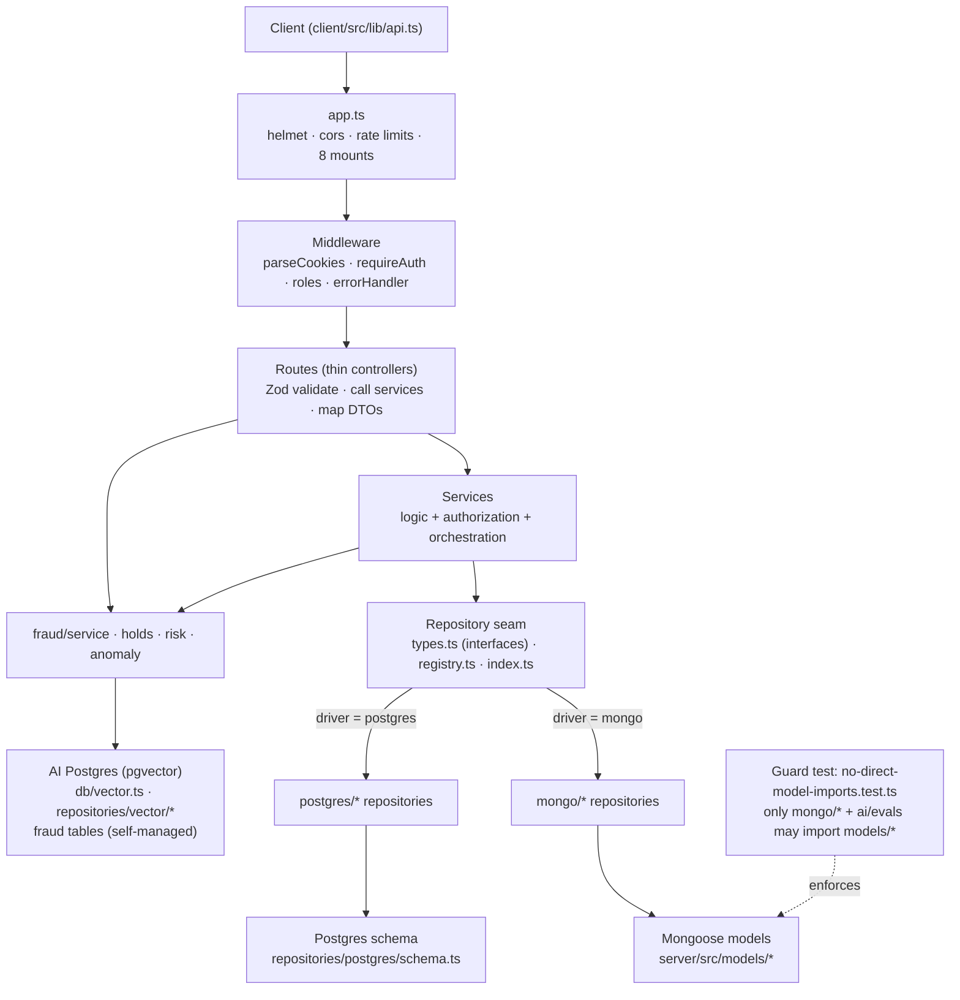

# Virly Backend Reference

Virly is a cash-transfer web application: a React + Vite + TypeScript frontend
([reference](../frontend/index.md)), a Node/Express backend (this document), and
a LangGraph/OpenAI assistant layer behind that backend. This reference catalogues
the **server** the way the frontend reference catalogues the client: the request
lifecycle, the layering rules, and one file per area documenting its routes and
the services/repositories they call.

The backend is **authoritative for all state** — every balance and ledger
mutation happens here, inside a `runInTransaction` call. The client prepares and
initiates; it never moves money. The AI assistant cannot move money on its own
either: it can only prepare a confirmation card that a subsequent authenticated
request settles. Those rules are documented in depth in the linked domain and AI
docs and are not re-derived here.

> **This doc links, it does not duplicate.** Per-endpoint request/response
> schemas live in the [API reference](../api/README.md) and `openapi.yaml`;
> money-movement mechanics live in the [Transfers domain doc](../domain/transfers.md);
> assistant internals live in the [AI architecture doc](../ai/architecture.md).
> The area files below point at those rather than restating them.

## Conventions

- **Backend root:** `server/` (Node + Express + TypeScript, ESM with `.js`
  import specifiers). Boot files: `server/src/{app.ts,index.ts,db.ts,config.ts}`.
- **Two app persistence drivers:** MongoDB is the default; PostgreSQL is
  selectable at boot. Both sit behind one repository seam
  (`server/src/repositories/`), so no service or route knows which driver is
  live.
- **A third, dedicated AI Postgres** (`server/src/db/vector.ts`) is always
  Postgres (pgvector extension) and is reachable regardless of the app driver.
  It stores RAG knowledge chunks and fraud data. Its schema has its own
  independent migration history (`server/drizzle-ai/`, applied by
  `npm run rag:migrate`). See the [Data layer area](areas/data-layer.md#ai-postgres-pgvector).
- **One inventory drives the areas:** [`_inventory.md`](_inventory.md) lists
  every file under `routes/`, `services/`, `repositories/`, `models/`,
  `middleware/`, `fraud/`, `ai/rag/`, and `mcp/` with its layer and one-line
  role. Read it first.
- **Endpoint shapes are not repeated here.** Each area links the
  [API reference](../api/README.md) for exact request/response bodies.

## Request lifecycle

A request flows top-down through four layers and the response unwinds back up.
Each layer has exactly one responsibility:

1. **Route** (`server/src/routes/*.routes.ts`) — a **thin controller**. It runs
   middleware (`requireAuth`, role guards), validates the request with Zod,
   calls one or more services, maps the result to a DTO, and sets the HTTP
   status. It contains no business rules and never touches a model.
2. **Service** (`server/src/services/*.service.ts`) — **owns logic and
   authorization**. It enforces ownership/role/limit rules, orchestrates
   multi-step work (e.g. an atomic debit + credit), and calls repositories. It
   never imports Express or a Mongoose model.
3. **Repository** (`server/src/repositories/`) — **owns data access**. A
   driver-agnostic interface (`types.ts`) with two implementations (`mongo/`,
   `postgres/`). Services depend only on the interface.
4. **Driver** — Mongoose models (`server/src/models/*`) for Mongo, or the SQL
   schema (`repositories/postgres/schema.ts`) for Postgres. Only the matching
   repository implementation reaches this layer.

Errors thrown anywhere bubble to `next(error)` and are normalised by the
`errorHandler` middleware into the JSON error envelope (see the
[API reference §3](../api/README.md#3-error-envelope)).

### The layering rule

> **Routes are thin controllers, services own logic + authorization,
> repositories own data access.** A route that queries a model directly, or a
> service that imports Express, is a layering violation. The
> [improvements folder](../planning/archive/improvements/README.md) records the (now-shipped)
> migration that moved inline model access out of the route handlers and behind
> services and the repository seam.

### The `no-direct-model-imports` guard

The layering rule's data-access half is **enforced by a test**:
`server/src/repositories/no-direct-model-imports.test.ts`. It walks every
non-test `.ts` file under `server/src/` and fails if any file imports
`../models/*` (matched as `from "…/models/…"`), **except** files under
`server/src/repositories/mongo/` and `server/src/ai/evals/`. In other words: the
Mongoose models may only be touched by the Mongo repository implementations (and
the eval harness); routes, services, and the Postgres repositories must go
through the repository seam. If a future change reaches into a model directly,
this test turns red and names the offending file.

## Layer diagram



ASCII equivalent:

```
client/src/lib/api.ts
        |
        v
   app.ts  (helmet, cors, rate limiters, 8 route mounts)
        |
        v
 middleware  (parseCookies -> requireAuth / roles -> ... -> errorHandler)
        |
        v
   routes/*.routes.ts        thin controllers: validate, call services, map DTOs
        |                                   |
        v                                   | (fraud gate in transaction.routes.ts)
 services/*.service.ts       logic + authorization + orchestration
        |
        v
 repositories/  types.ts (interfaces) + registry.ts + index.ts   <- the app seam
        |                                   |
  driver=mongo                        driver=postgres
        v                                   v
 mongo/* repos --> models/*          postgres/* repos --> postgres/schema.ts
        ^
        |  (only mongo/* and ai/evals may import models/* —
        |   enforced by no-direct-model-imports.test.ts)

Separate AI Postgres (always Postgres, independent of driver switch):
 db/vector.ts (getAiDb)
        |
        +-- repositories/vector/knowledge.repository.ts  (RAG knowledge base)
        +-- fraud/service.ts · fraud/holds.ts             (ai_fraud_flags, held_transfers)
        +-- fraud/repository.ts                           (fraud_transactions, offline only)
```

## Table of contents

Eleven areas, one file each under `areas/`. The
[inventory](_inventory.md) maps every file to its area.

| Area | Endpoints (prefix) | File |
|------|--------------------|------|
| [Auth](areas/auth.md) | `/api/auth` | `areas/auth.md` |
| [Accounts / Users](areas/accounts-users.md) | `/api/accounts`, `/api/users` | `areas/accounts-users.md` |
| [Transactions / Transfers](areas/transactions-transfers.md) | `/api/transactions` (incl. `/held/*`) | `areas/transactions-transfers.md` |
| [Exchange rates / FX](areas/exchange-rates-fx.md) | `/api/exchange-rates` | `areas/exchange-rates-fx.md` |
| [AI](areas/ai.md) | `/api/ai` | `areas/ai.md` |
| [Video sessions](areas/video-sessions.md) | `/api/video-sessions`, `/api/admin/video-sessions` | `areas/video-sessions.md` |
| [Fraud detection](areas/fraud.md) | — (service layer + held-transfer store) | `areas/fraud.md` |
| [RAG knowledge base](areas/rag-knowledge.md) | — (ingestion CLI + in-process retrieval) | `areas/rag-knowledge.md` |
| [Support MCP server](areas/mcp-support.md) | — (stdio MCP, `npm run mcp:support`) | `areas/mcp-support.md` |
| [Data layer](areas/data-layer.md) | — (seam, repositories, models, AI Postgres) | `areas/data-layer.md` |
| [Cross-cutting](areas/cross-cutting.md) | — (middleware, utils) | `areas/cross-cutting.md` |

### Route mounts (from `server/src/app.ts`)

| Mount | Router | Notes |
|-------|--------|-------|
| `GET /` | inline | `{ name: "Virly API", status: "ok" }` |
| `GET /api/health` | inline | `{ status: "ok" }` |
| `/api/auth` | `auth.routes.ts` | `authLimiter` in production |
| `/api/accounts` | `user.routes.ts` | own account + personal details |
| `/api/users` | `userProfile.routes.ts` | public profiles |
| `/api/transactions` | `transaction.routes.ts` | history, quote, transfer, held confirm/cancel |
| `/api/exchange-rates` | `exchangeRate.routes.ts` | current rates |
| `/api/ai` | `ai.routes.ts` | `aiLimiter` in production |
| `/api/video-sessions` | `videoSession.routes.ts` (`default`) | user lifecycle |
| `/api/admin/video-sessions` | `videoSession.routes.ts` (`adminVideoSessionRoutes`) | role-gated agent lifecycle |

## Related docs (link, don't duplicate)

- **API reference** — per-endpoint request/response, auth/CSRF, error envelope,
  pagination, rate limits, SSE: [`../api/README.md`](../api/README.md)
- **Transfers domain** — money-movement mechanics, limits, idempotency,
  FX/quote rules: [`../domain/transfers.md`](../domain/transfers.md)
- **AI architecture** — graph versions, HITL confirm flow, response blocks,
  tools, streaming: [`../ai/architecture.md`](../ai/architecture.md)
- **Security** — trust boundaries for the held-transfer token link and the
  Support MCP server: [`../security.md`](../security.md)
- **Improvements** — the (shipped) service/repository migration rationale:
  [`../planning/archive/improvements/README.md`](../planning/archive/improvements/README.md)
- **Frontend reference** — the client equivalent of this doc:
  [`../frontend/index.md`](../frontend/index.md)
- **Architecture decisions** — ADR log for key decisions (DB driver, auth, AI graph, personas):
  [`../adr/README.md`](../adr/README.md)

---

> **Verification:** paths/endpoints checked on **2026-06-27**. Every endpoint
> documented in the area files exists in `server/src/app.ts` (8 mounts + `GET /`
> and `GET /api/health`) or in `server/src/routes/transaction.routes.ts` (held
> endpoints). Every cited `server/src/*` file path was confirmed present with
> `find`. No invented references.
