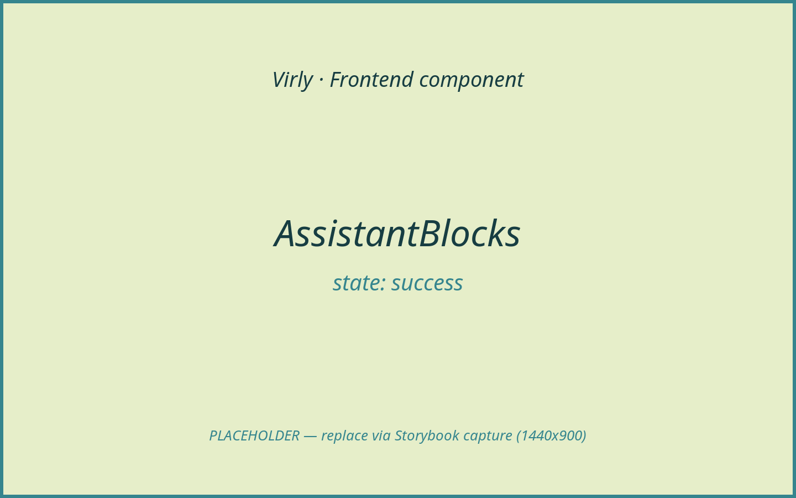
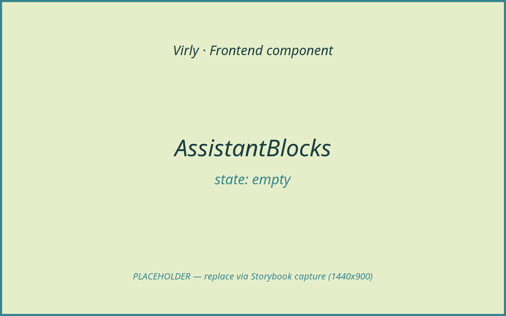
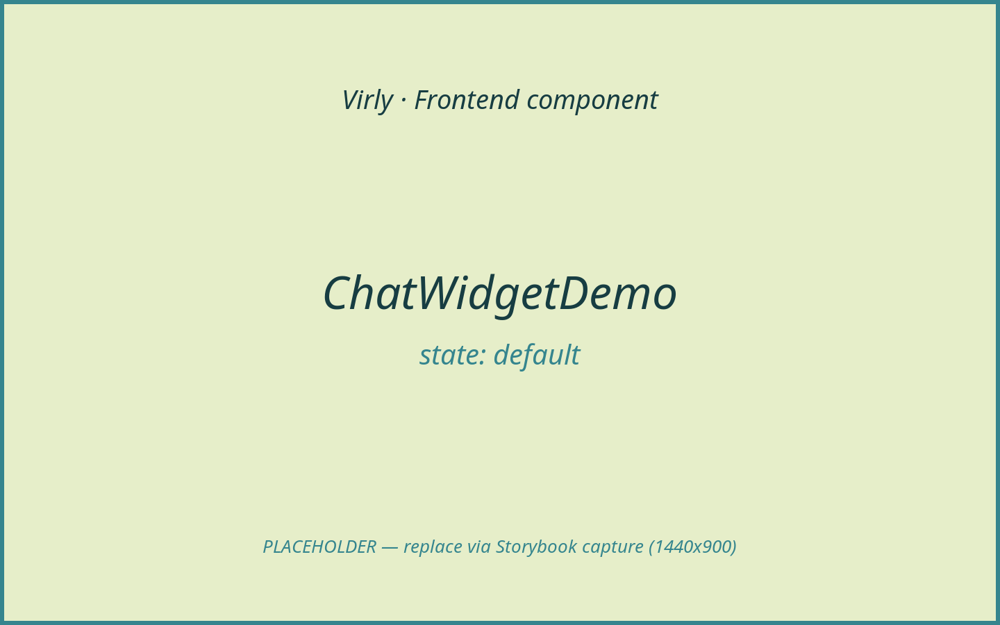
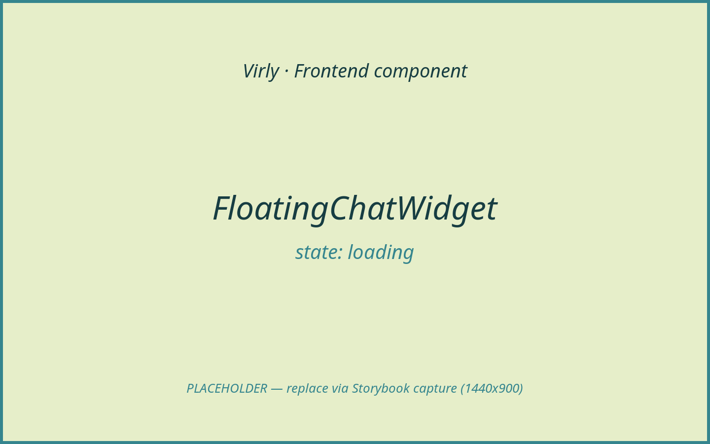
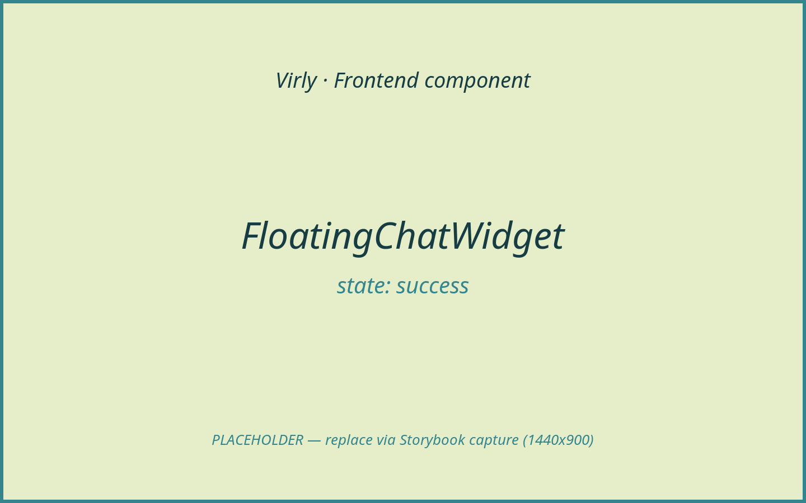
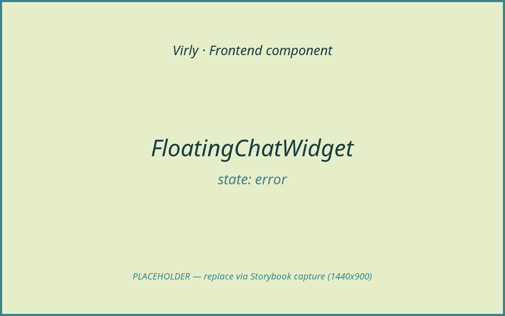

# AI Assistant

Virly's assistant is a LangGraph/OpenAI layer behind the backend. On the
frontend it is a **read-only / preparation surface**: a floating chat widget
that streams the assistant's structured response and renders it as typed cards.
The assistant cannot pick tools, move money, or approve a transfer on its own —
those decisions live on the server, and any money movement requires an explicit
user confirmation that the client posts to a dedicated confirmation endpoint.

**Architecture, in one line:** the chat UI sends the user's message, displays
whatever structured blocks the backend returns, and — for a prepared transfer —
shows a confirmation card whose **Confirm** button is the only path that
executes the transfer (`POST /api/ai/confirmations/:id` with `action: "confirm"`
and the confirmation `version`). The assistant proposes; the user disposes; the
backend executes. Every component here carries the **Architecture constraints**
callout.

> Screenshots are placeholders pending Storybook capture; filenames follow the
> final convention.

## Components in this area

- [AssistantBlocks](#assistantblocks)
- [ChatWidgetDemo](#chatwidgetdemo)
- [FloatingChatWidget](#floatingchatwidget)

---

### AssistantBlocks

- **Path:** `client/src/components/assistant/AssistantBlocks.tsx`
- **Category:** feature | **Feature area:** AI Assistant | **Tier:** Full
- **Summary:** The renderer that turns the backend's typed `responseBlocks` into
  cards (account summary, transaction lists, transfer quote/limits/status,
  pending transfers, transfer confirmation, notices, video CTA).

**Screenshot(s)**


*A mix of rendered block cards (account summary + transaction list).*


*Transfer confirmation block with Confirm / Deny actions.*


*Empty-state / notice block.*

> **Architecture constraints**
>
> - Backend is authoritative; this component does not mutate balances client-side
>   — it only renders the server's structured output.
> - For transfers: the `transfer_confirmation` block exposes **Confirm**/**Deny**
>   that call the parent's `onConfirmTransfer`/`onDenyTransfer` callbacks; the
>   actual execution (`POST /api/ai/confirmations/:id`) is performed by
>   `FloatingChatWidget`. Buttons are disabled once the confirmation is no longer
>   `pending` or has expired.
> - AI Assistant: this is a read-only render of prepared actions; the assistant
>   cannot select tools or approve a transfer — the user must press Confirm.

**Purpose & context**

A pure presentational dispatcher: given `blocks: AssistantResponseBlock[]`, it
maps each block `type` to a typed card. It is the structured (v1) rendering path
for assistant responses; free text is rendered separately by `AssistantMarkdown`
(exported from the same file). It is bidi-aware (Hebrew/RTL detection) and
formats money via the assistant money helpers.

**Anatomy (block renderers)**

- `text`, `account_summary` (`AccountSummaryCard`), `transaction_list`
  (`TransactionListCard` + `TransactionRow`), `transaction_detail`,
  `transaction_stats`, `pending_transfers` (`PendingTransferCard`),
  `transfer_quote`, `transfer_confirmation` (`TransferConfirmationCard`),
  `transfer_status`, `transfer_limits`, `video_session_cta`
  (`VideoSessionCtaCard`), `empty_state`, `notice`.
- Shared primitives: `AssistantCard`, `KeyValueGrid`, `MoneyValue`,
  `DateTimeValue`, `CounterpartyValue`, `StatusBadge`.
- Helpers: `hasTransferConfirmationBlock`, `AssistantMarkdown` (also exported).

**Props / API**

| Prop | Type | Required | Default | Description |
|------|------|----------|---------|-------------|
| `blocks` | `AssistantResponseBlock[]` | Yes | — | The typed blocks to render (returns `null` if empty). |
| `locale` | `string` | No | — | Preferred locale for money/date formatting. |
| `confirmationStatus` | `TransferConfirmationCardStatus` | No | — | Drives the confirmation card's button/label state. |
| `onConfirmTransfer` | `(confirmation: AiTransferConfirmation) => void` | No | — | Fired by the Confirm button. |
| `onDenyTransfer` | `(confirmation: AiTransferConfirmation) => void` | No | — | Fired by the Deny button. |

**State & data**

- No local state; no data fetching. Money formatting via `formatMoney` /
  `formatMoneyILS`; bidi via a Hebrew-range regex.

**Interactions & events**

- `transfer_confirmation` Confirm → `onConfirmTransfer(confirmation)`.
- `transfer_confirmation` Deny → `onDenyTransfer(confirmation)`.
- `video_session_cta` → `Link` to `block.appPath`.
- Buttons are disabled when `confirmationStatus !== "pending"` or the
  confirmation has expired.

**States & variants**

- `default` (informational blocks), `success` (confirmation card actionable),
  `empty` (`empty_state`/`notice`), expired/superseded confirmation (disabled
  actions). Loading is owned by the widget. Error: surfaced as `notice` blocks.

**Dependencies**

- Libraries: `lucide-react`, `react-router-dom`.
- Helpers: `formatDate`, `formatMoneyILS`, `cn`. Styling: Tailwind utility
  classes.

**Accessibility**

Cards use `dir="auto"`/explicit `dir` for bidi; money/dates are wrapped in
`<bdi dir="ltr">` to keep numerals LTR inside RTL text; status badges are text.
Confirm/Deny are real `<button>`s with disabled states. TODO: add `aria-label`s
to the Confirm/Deny buttons (currently rely on visible text + icon).

**Usage example**

```tsx
<AssistantBlocks
  blocks={chatMessage.responseBlocks}
  confirmationStatus={chatMessage.confirmationStatus}
  onConfirmTransfer={(c) => handleConfirmationAction(chatMessage.id, c, "confirm")}
  onDenyTransfer={(c) => handleConfirmationAction(chatMessage.id, c, "deny")}
/>
```

**Related / used by**

Rendered by `FloatingChatWidget`. `AssistantMarkdown` (same file) renders the
assistant's free-text message.

**Notes / gotchas**

`hasTransferConfirmationBlock` lets the widget avoid rendering its *own* legacy
pending-transfer card when a `transfer_confirmation` block is already present —
the two confirmation UIs are mutually exclusive per message.

---

### ChatWidgetDemo

- **Path:** `client/src/components/ui/floating-chat-widget-demo.tsx`
- **Category:** page (demo harness) | **Feature area:** AI Assistant | **Tier:** Full
- **Summary:** A minimal demo/Storybook harness that centres a single
  `FloatingChatWidget` on a blank page.

**Screenshot(s)**


*The widget mounted alone on a blank background.*

> **Architecture constraints**
>
> - Backend is authoritative; this harness adds no logic — all behaviour and the
>   confirmation gate live in `FloatingChatWidget`.
> - For transfers / AI Assistant: identical constraints to `FloatingChatWidget`;
>   the demo simply mounts it.

**Purpose & context**

A throwaway wrapper (`export default function Demo`) used to preview the chat
widget in isolation (e.g. a future Storybook story). It is **not** part of the
production tree — the production widget is mounted by `AppShell`.

**Anatomy**

A centred flex container rendering one `FloatingChatWidget`.

**Props / API**

None.

**State & data**

N/A.

**Interactions & events**

N/A (delegated to `FloatingChatWidget`).

**States & variants**

- `default` only. Loading/empty/error/success/disabled: N/A.

**Dependencies**

- Children: `FloatingChatWidget`.

**Accessibility**

N/A beyond the widget's own semantics.

**Usage example**

```tsx
import Demo from "@/components/ui/floating-chat-widget-demo";
// renders a single, centred FloatingChatWidget
```

**Related / used by**

Standalone harness for `FloatingChatWidget`. Not routed by `App`.

**Notes / gotchas**

Because it relies on `useAuth`, this harness still needs an `AuthProvider`
ancestor to render the widget without throwing.

---

### FloatingChatWidget

- **Path:** `client/src/components/ui/floating-chat-widget-shadcnui.tsx`
- **Category:** hook-bound container | **Feature area:** AI Assistant | **Tier:** Full
- **Summary:** The floating assistant: a launcher button + chat window with
  agent selection, streamed responses, clarification options, and the transfer
  confirmation gate.

**Screenshot(s)**


*Open chat with the agent greeting.*


*Streaming — typing dots + phase label (e.g. "Checking account facts").*


*Pending-transfer confirmation card with Confirm / Deny.*


*Assistant unreachable / confirmation failed message.*

> **Architecture constraints**
>
> - Backend is authoritative; the widget updates the balance only from the
>   server's `response.newBalance` after a confirmed transfer — never locally.
> - **Confirmation gate:** a transfer prepared by the assistant executes only
>   when the user presses **Confirm**, which calls
>   `api.aiConfirmation(id, "confirm", version)` →
>   `POST /api/ai/confirmations/:id` (with an `Idempotency-Key`). **Deny** posts
>   `action: "deny"`. The assistant never auto-confirms.
> - AI Assistant: the widget surfaces read-only output and prepared actions;
>   the assistant cannot select tools or approve transfers. Selecting an "agent"
>   only changes the persona, not the permissions.

**Purpose & context**

The production assistant surface, mounted globally by `AppShell`. It manages the
conversation, picks streaming vs non-streaming based on browser support, renders
each message (user bubbles, assistant markdown + `AssistantBlocks`, clarification
options, and a legacy pending-transfer card), and owns the confirmation gate that
executes or denies an assistant-prepared transfer.

**Anatomy**

- Launcher `motion.button` (open/close).
- Chat window: header with an agent `Select` (Oshri / Chaya / Yehuda / Yohai),
  message log (`role="log"`, `aria-live="polite"`), streaming indicator with a
  phase label, and a composer (auto-resizing `textarea` + send button).
- Per assistant message: `AssistantMarkdown`, `AssistantBlocks`,
  `ClarificationOptions`, and a fallback `PendingTransferCard` (only when there
  is a confirmation but no `transfer_confirmation` block).

**Props / API**

None. (Self-contained; reads the user from `useAuth`.)

**State & data**

- Local state: `isOpen`, `selectedAgent` (`AssistantId`), `message`,
  `conversationId`, `chatMessages` (`ChatMessage[]`), `isSending`,
  `streamPhase`.
- Hooks: `useAuth`, `useId`, `useRef`, `useEffect`, `useCallback`, `useState`.
- Data: `api.aiChatStream` (`POST /api/ai/chat/stream`, SSE) or `api.aiChat`
  (`POST /api/ai/chat`); `api.aiConfirmation`
  (`POST /api/ai/confirmations/:id`).

**Interactions & events**

- Submit / Enter (no Shift) → `sendChatMessage` → stream/POST → append response;
  a `supersededConfirmationId` marks the older card `superseded`.
- Clarification option → `sendChatMessage(value)`.
- Confirm/Deny (from `AssistantBlocks` or the fallback card) →
  `handleConfirmationAction` → `api.aiConfirmation` → update card status; on
  `confirmed`, `auth.updateBalance(newBalance)`.

**States & variants**

- `default` (open), `loading` (`isSending` — dots + phase label), `success`
  (confirmed transfer), `error` (unreachable / failed confirmation), closed
  (launcher only), disabled (send disabled while empty/sending). Empty: greeting
  only.

**Dependencies**

- Children: `AssistantBlocks`, `AssistantMarkdown`, `Avatar`, `Button`,
  `Select`, `ClarificationOptions`, `PendingTransferCard`.
- Libraries: `framer-motion`, `lucide-react`.
- Helpers: `api`, `ApiError`, `supportsAiChatStreaming`, `formatCurrency`,
  `getDisplayName`/`getInitial`/`getUserAvatarUrl`, `cn`.

**Accessibility**

Launcher has `aria-label`/`aria-expanded`; the message log is `role="log"`,
`aria-live="polite"`; the agent select has an `aria-label`; close has an
`aria-label`. Agent personas/greetings are Hebrew (`dir="auto"`). TODO: trap
focus within the open window and return focus to the launcher on close.

**Usage example**

```tsx
// AppShell.tsx
<FloatingChatWidget />
```

**Related / used by**

Mounted by `AppShell` (present on every protected page). Renders
`AssistantBlocks`. Previewed in isolation by `ChatWidgetDemo`.

**Notes / gotchas**

- The four agents (Oshri, Chaya, Yehuda, Yohai) are personas only; switching does
  not change capabilities or permissions.
- `aiConfirmation` always sends a fresh `Idempotency-Key`, so a double-click
  cannot double-execute a transfer.
- Streaming gracefully degrades to a single POST when `ReadableStream`/
  `TextDecoder` are unavailable.
