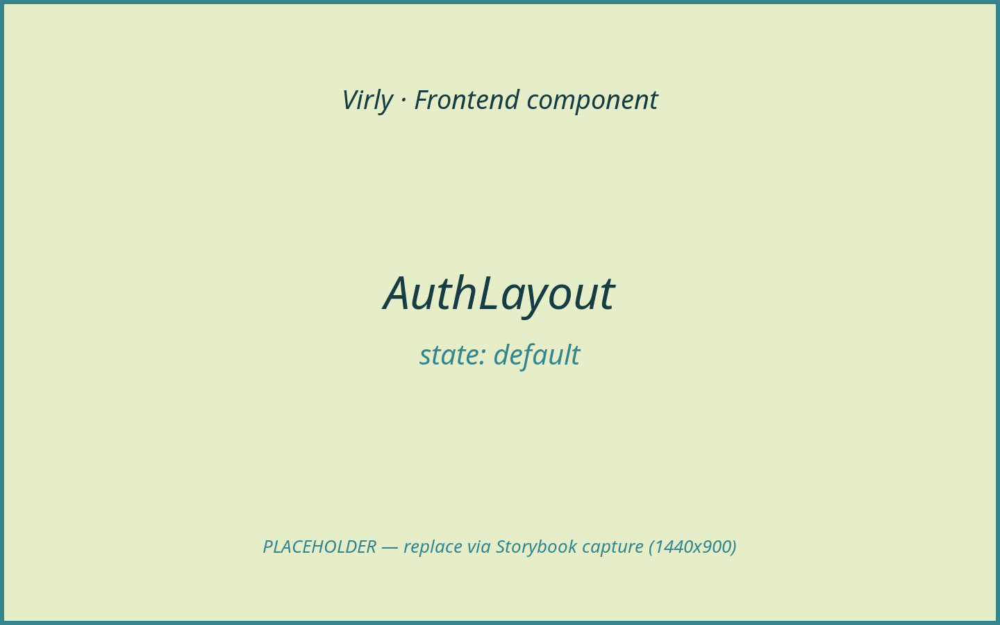
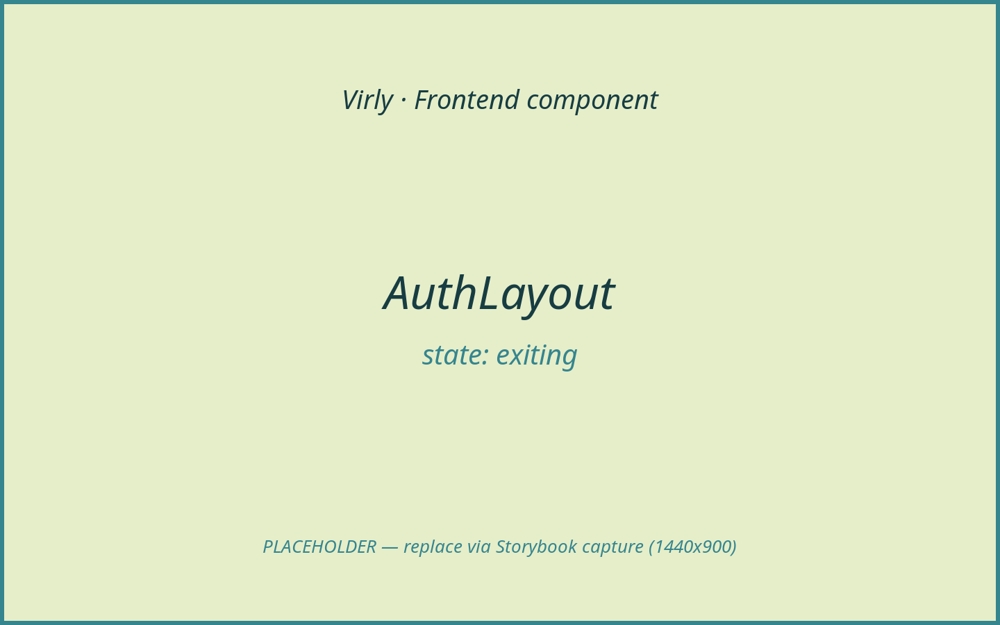
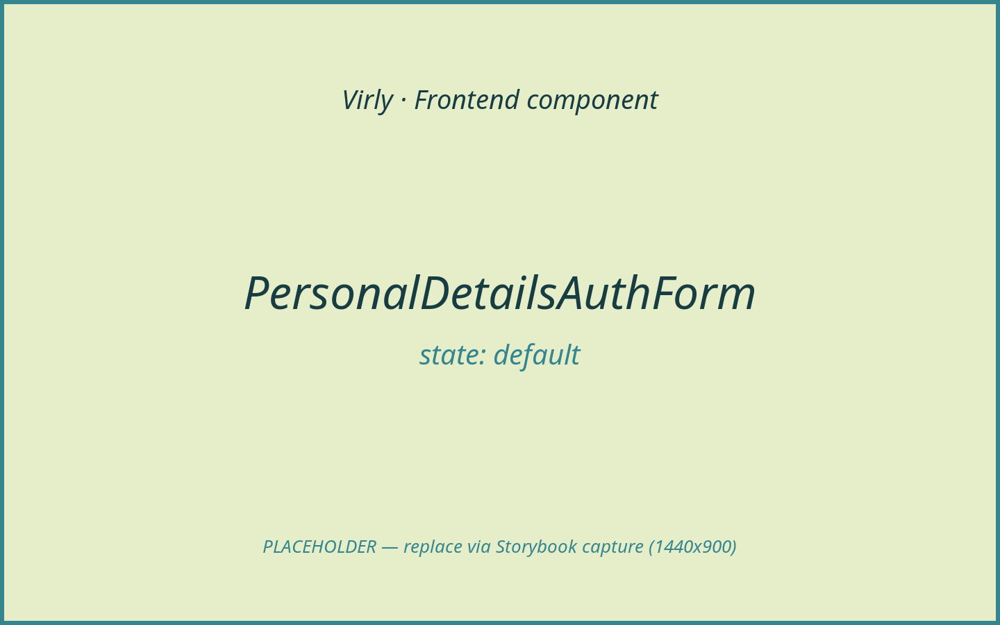
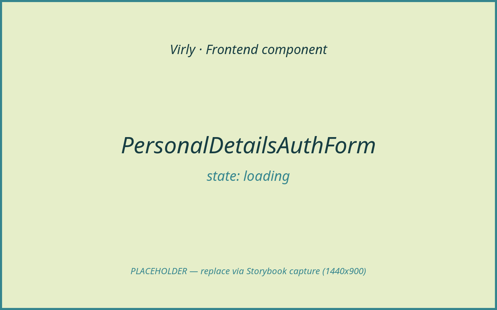
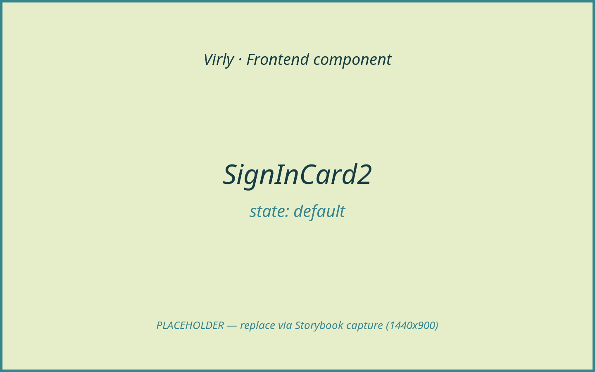
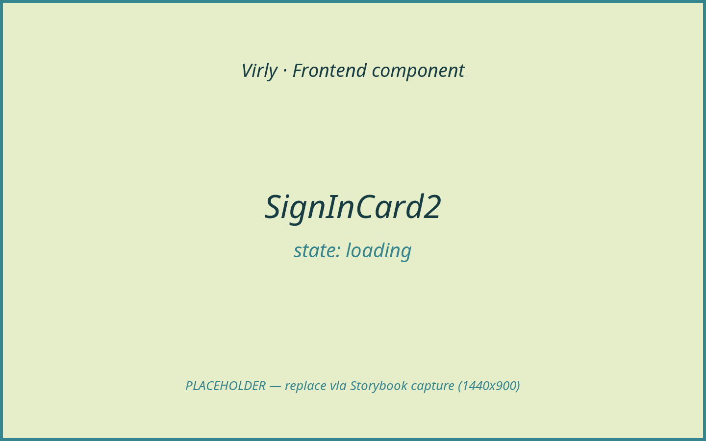

# Auth

The authentication area covers everything before a user reaches the
application shell: the split-screen auth layout, the registration/login card,
email verification, verification re-send, the post-auth "personal details"
capture step, and the `AuthProvider` context that holds the session. Every
network call here goes through `client/src/lib/api.ts`; the backend issues the
session cookie and CSRF token, and the frontend never trusts a client-set
identity. Screenshots below are placeholders (Storybook capture is in
progress); filenames already follow the final convention so real images drop in
with no edits.

## Components in this area

- [AuthLayout](#authlayout)
- [AuthProvider](#authprovider)
- [LoginPage](#loginpage)
- [PersonalDetailsAuthForm](#personaldetailsauthform)
- [RegisterPage](#registerpage)
- [ResendVerificationPage](#resendverificationpage)
- [SignInCard2](#signincard2)
- [VerifyPage](#verifypage)

---

### AuthLayout

- **Path:** `client/src/features/auth/AuthLayout.tsx`
- **Category:** layout | **Feature area:** Auth | **Tier:** Lite
- **Summary:** Split-screen auth shell with an animated brand/"visual" panel on
  one side and the form panel on the other, with a coordinated slide-out exit.

**Screenshot(s)**


*Default: brand visual panel beside the form panel.*


*`isExiting` — both panels blur and slide right as the app takes over.*

**Props / API**

| Prop | Type | Required | Default | Description |
|------|------|----------|---------|-------------|
| `title` | `string` | Yes | — | Heading shown when `barePanel` is false. |
| `subtitle` | `string` | Yes | — | Sub-heading; rendered only if non-empty. |
| `visualText` | `string` | No | — | If set, renders `AnimatedText` in the visual panel; otherwise a demo balance card. |
| `barePanel` | `boolean` | No | `false` | When true, renders `children` without the `.auth-card` wrapper. |
| `isExiting` | `boolean` | No | `false` | Drives the blur + slide-right exit animation on both panels. |
| `children` | `ReactNode` | Yes | — | Form content for the right panel. |

**States & variants**

- `default` — both panels visible (`isExiting=false`).
- `exiting` — `isExiting=true` blurs/translates both panels (used during the
  hand-off to the app shell).
- Responsive: panels stack on narrow viewports (handled in `global.css`).

**Usage example**

```tsx
<AuthLayout title="Sign in" subtitle="" visualText="Virly" barePanel isExiting={stage === "leaving"}>
  <SignInCard2 {...signInProps} />
</AuthLayout>
```

---

### AuthProvider

- **Path:** `client/src/features/auth/AuthProvider.tsx`
- **Category:** provider/context | **Feature area:** Auth | **Tier:** Full
- **Summary:** React context that owns the authenticated `User`, exposes session
  actions (login/register/verify/logout), and bootstraps the session from
  `GET /api/auth/me` on mount.

**Screenshot(s)**


*No own UI; this placeholder represents the gated app once a session resolves.*

**Purpose & context**

Wraps the entire app (mounted in `main.tsx` above `App`). On mount it calls
`api.me()` and either sets or clears the session, which is what
`RouteGuards` reads to decide between the auth pages and the app shell. It also
registers an unauthorized handler so any `401` from the API client clears the
session app-wide. It is the single client-side source of truth for "who is
signed in" — but the backend remains authoritative; the provider only mirrors
the server's session.

**Anatomy**

- `AuthContext` (nullable) + `useAuth()` hook guard.
- Internal `AuthState` (`user`, `isLoading`).
- Memoized context value exposing `isAuthenticated`, `login`, `register`,
  `verify`, `resendVerification`, `logout`, `setSession`, `updateBalance`.

**Props / API**

| Prop | Type | Required | Default | Description |
|------|------|----------|---------|-------------|
| `children` | `ReactNode` | Yes | — | The subtree that consumes auth context. |

Exposed context value (`useAuth()`):

| Member | Type | Description |
|--------|------|-------------|
| `user` | `User \| null` | Current session user (mirrors server). |
| `isLoading` | `boolean` | True until the initial `me()` resolves. |
| `isAuthenticated` | `boolean` | `Boolean(user)`. |
| `login` | `(payload: LoginRequest) => Promise<User>` | Calls `api.login`, sets session. |
| `register` | `(payload: RegisterRequest) => Promise<string>` | Calls `api.register`; returns server message. |
| `verify` | `(token: string) => Promise<User>` | Calls `api.verify`, sets session. |
| `resendVerification` | `(email: string) => Promise<string>` | Calls `api.resendVerification`. |
| `logout` | `() => Promise<void>` | Calls `api.logout` (if signed in), then clears. |
| `setSession` | `(user: User) => void` | Replace the session user locally. |
| `updateBalance` | `(balance: number) => void` | Patch only the balance on the current user. |

**State & data**

- Local state: `AuthState` via `useState`.
- Hooks: `useCallback`, `useEffect`, `useMemo`.
- Data: `api.me()` on mount; `api.login` / `api.register` / `api.verify` /
  `api.resendVerification` / `api.logout` via the exposed actions.
- Endpoints: `GET /api/auth/me`, `POST /api/auth/login`,
  `POST /api/auth/register`, `GET /api/auth/verify`,
  `POST /api/auth/resend-verification`, `POST /api/auth/logout`.

**Interactions & events**

- On mount → `me()` → `setSession` or `clearSession`.
- `setUnauthorizedHandler(clearSession)` so any `401` clears the session.
- `updateBalance` is called by transfer/AI flows after the server confirms a new
  balance — it never computes a balance itself.

**States & variants**

- `loading` — `isLoading=true` (guards render `null`).
- `authenticated` / `unauthenticated` — drive `RouteGuards`.
- error/empty/success/disabled: N/A (no own UI).

**Dependencies**

- Children: none rendered directly besides `AuthContext.Provider`.
- Libraries: React only. Uses `api`, `setUnauthorizedHandler` from `lib/api`.
- Styling: N/A.

**Accessibility**

N/A (no DOM). Consumers own their own a11y.

**Usage example**

```tsx
// main.tsx
<AuthProvider>
  <App />
</AuthProvider>

// any component
const { user, isAuthenticated, logout } = useAuth();
```

**Related / used by**

Mounted by `main.tsx`. Consumed by `RouteGuards`, `AppShell`, `ShellTopbar`,
`DashboardPage`, `TransferPage`, `SettingsPage`, `FloatingChatWidget`, and the
auth pages.

**Notes / gotchas**

`useAuth()` throws if used outside the provider. `updateBalance` is a no-op if
there is no current user.

---

### LoginPage

- **Path:** `client/src/features/auth/LoginPage.tsx`
- **Category:** page | **Feature area:** Auth | **Tier:** Full
- **Summary:** Sign-in page that orchestrates the `SignInCard2` form, the
  post-login "personal details" step, and the animated hand-off into the app.

**Screenshot(s)**


*Default sign-in card inside the auth layout.*


*Invalid credentials / form error surfaced on the card.*


*Submitting — spinner on the submit button, exit animation arming.*


*`needsPersonalDetails` users see `PersonalDetailsAuthForm` before the dashboard.*

**Purpose & context**

The entry point of the protected app for returning users. It validates email +
password locally, calls `auth.login`, and on success either advances to the
personal-details capture (if the server flags `needsPersonalDetails`) or
navigates to the originally-requested route (or `/dashboard`) with the
auth-transition flag set so the shell plays its entrance animation.

**Anatomy**

- `AuthLayout` wrapper (bare panel, `visualText="Virly"`).
- `AnimatePresence` switching between `login` and `personalDetails` stages.
- `SignInCard2` (controlled) for the credential form.
- `PersonalDetailsAuthForm` for the second stage.

**Props / API**

None. (Reads route `location.state.from` for post-login redirect.)

**State & data**

- Local state: `email`, `password`, `rememberMe`, `errors`, `isSubmitting`,
  `stage` (`"login" | "personalDetails" | "leaving"`).
- Hooks: `useAuth`, `useNavigate`, `useLocation`, `useState`.
- Data: `auth.login` → `POST /api/auth/login`.

**Interactions & events**

- Submit → `validateEmail`/`validatePassword` → `auth.login`.
- `403` (unverified) → redirects to `/resend-verification` with the email in
  route state.
- Other errors → `errors.form`.
- Success with `needsPersonalDetails` → stage `personalDetails`; otherwise
  `markAuthTransition()` + navigate to redirect target.

**States & variants**

- `default`, `loading` (`isSubmitting`), `error` (field/form), `personalDetails`
  stage, `leaving` (exit animation). Empty/disabled: N/A.

**Dependencies**

- Children: `AuthLayout`, `SignInCard2`, `PersonalDetailsAuthForm`.
- Libraries: `framer-motion`, `react-router-dom`.
- Helpers: `validateEmail`, `validatePassword`, `markAuthTransition`,
  `clearAuthTransition`, `authTransitionState`.

**Accessibility**

Form semantics and errors come from `SignInCard2` (`role="alert"` on form
error). Stage transitions use `AnimatePresence`; `MotionConfig reducedMotion`
in `App` respects reduced-motion. TODO: confirm focus moves to the
personal-details form on stage change.

**Usage example**

```tsx
<Route path="/login" element={<GuestRoute><LoginPage /></GuestRoute>} />
```

**Related / used by**

Routed by `App` inside `GuestRoute`. Pairs with `RegisterPage`,
`ResendVerificationPage`, `VerifyPage`.

**Notes / gotchas**

The `leaving` stage waits `authExitMs` (1000ms) in parallel with the login
request so the visual exit and the network call finish together.

---

### PersonalDetailsAuthForm

- **Path:** `client/src/features/profile/PersonalDetailsAuthForm.tsx`
- **Category:** form | **Feature area:** Auth | **Tier:** Full
- **Summary:** Post-authentication KYC-style form that captures name, date of
  birth, and address, with a "Skip for now" escape hatch.

**Screenshot(s)**


*Empty personal-details form (animated card).*


*Per-field and form-level validation errors.*


*Submitting — spinner in the primary button.*

**Purpose & context**

Shown by `LoginPage` and `VerifyPage` when the server marks a user
`needsPersonalDetails`. It collects the customer profile, persists it via
`api.updatePersonalDetails`, patches the local session, then calls `onComplete`
to continue into the app. The user may skip (`api.skipPersonalDetails`).

**Anatomy**

- Animated `signin-card` shell with logo + "Personal details" header.
- Two-column grids of icon-prefixed fields (`renderField`).
- Fields: firstName, lastName, dateOfBirth, country, stateRegion, city,
  postalCode, street, addressLine2.
- Primary "Save details" submit + secondary "Skip for now".

**Props / API**

| Prop | Type | Required | Default | Description |
|------|------|----------|---------|-------------|
| `onComplete` | `() => void` | Yes | — | Called after a successful save or skip. |

**State & data**

- Local state: `form` (`FormState`), `errors` (`FormErrors`), `focusedField`,
  `isSubmitting`, `isSkipping`.
- Hooks: `useAuth`, `useState`.
- Data: `api.updatePersonalDetails` → `PUT /api/accounts/personal-details`;
  `api.skipPersonalDetails` → `POST /api/accounts/personal-details/skip`.

**Interactions & events**

- Submit → `validateForm` (required text, DOB) → `updatePersonalDetails` →
  `auth.setSession({ ...needsPersonalDetails: false })` → `onComplete`.
- Skip → `skipPersonalDetails` → `onComplete`.
- Server field issues map back onto inputs (e.g. `address.country`).

**States & variants**

- `default`, `error` (field + `errors.form`), `loading` (`isSubmitting`),
  `skipping` (`isSkipping`). Empty/success/disabled handled inline (buttons
  disabled while busy).

**Dependencies**

- Libraries: `framer-motion`, `lucide-react` icons.
- Helpers: `validateRequiredText`, `validateDateOfBirth`.
- Styling: `signin-*` / `profile-auth-*` classes (`global.css`).

**Accessibility**

Inputs are labelled via `htmlFor`/`id`; `aria-invalid` reflects errors;
form-level error uses `role="alert"`. TODO: associate field errors with inputs
via `aria-describedby`.

**Usage example**

```tsx
<PersonalDetailsAuthForm onComplete={finishAuthFlow} />
```

**Related / used by**

Rendered by `LoginPage` and `VerifyPage`. Mirrors the editable details form in
`SettingsPage` (same validators, same endpoint).

**Notes / gotchas**

`stateRegion` and `addressLine2` are optional and are not validated client-side.

---

### RegisterPage

- **Path:** `client/src/features/auth/RegisterPage.tsx`
- **Category:** page | **Feature area:** Auth | **Tier:** Full
- **Summary:** Account-creation page driving the `SignInCard2` register variant
  (email, password, confirm password, phone).

**Screenshot(s)**


*Registration card with email/password/confirm/phone.*


*Validation and duplicate-email (`409`) errors.*


*Success message prompting the user to verify their email.*


*Submitting — spinner in the submit button.*

**Purpose & context**

Lets a new user create an account. Validates email, password (min 8), matching
confirmation, and phone, then calls `auth.register`. On success it shows the
server message (a "check your email to verify" prompt); the user does not log in
until they verify.

**Anatomy**

`AuthLayout` (bare panel) wrapping a single `SignInCard2` configured for
registration (confirm-password + phone fields, "Create account" labels).

**Props / API**

None.

**State & data**

- Local state: `email`, `password`, `confirmPassword`, `phone`, `message`,
  `errors`, `isSubmitting`.
- Hooks: `useAuth`, `useState`.
- Data: `auth.register` → `POST /api/auth/register`.

**Interactions & events**

- Submit → `validateEmail` / `validatePassword("register")` / confirm match /
  `validatePhone` → `auth.register` → `setMessage`.
- `409` → duplicate-email message on the email field.
- Other `ApiError` issues map onto fields.

**States & variants**

- `default`, `loading`, `error`, `success` (message banner). Empty/disabled: N/A.

**Dependencies**

- Children: `AuthLayout`, `SignInCard2`.
- Helpers: `validateEmail`, `validatePassword`, `validatePhone`.

**Accessibility**

Inherits `SignInCard2` semantics (labelled inputs, password show/hide button,
`role="status"` success, `role="alert"` form error).

**Usage example**

```tsx
<Route path="/register" element={<GuestRoute><RegisterPage /></GuestRoute>} />
```

**Related / used by**

Routed by `App` inside `GuestRoute`. Links to `/login` via the card footer.

**Notes / gotchas**

Passwords are sent over the API client (HTTPS in production) and never stored
client-side; the backend hashes them. The frontend must never persist or log
the password.

---

### ResendVerificationPage

- **Path:** `client/src/features/auth/ResendVerificationPage.tsx`
- **Category:** page | **Feature area:** Auth | **Tier:** Full
- **Summary:** Lets an unverified user request a fresh verification email,
  seeded from the email passed in route state.

**Screenshot(s)**


*Single email field + "Send verification link".*


*Confirmation that the link was sent.*


*Invalid email or server error.*

**Purpose & context**

Reached when login returns `403` (account not verified), or directly from the
verify-failure screen. Pre-fills the email from `location.state.email` and posts
to the resend endpoint.

**Anatomy**

`AuthLayout` wrapping a `form-stack`: success/error banners, a single `Field`,
a submit `Button`, and a "Sign in" link.

**Props / API**

None.

**State & data**

- Local state: `email` (seeded), `error`, `message`, `isSubmitting`.
- Hooks: `useAuth`, `useLocation`, `useState`.
- Data: `auth.resendVerification` → `POST /api/auth/resend-verification`.

**Interactions & events**

Submit → `validateEmail` → `auth.resendVerification` → success message (or
error string).

**States & variants**

- `default`, `loading` (button label "Sending..."), `success`, `error`.
  Empty/disabled: N/A.

**Dependencies**

- Children: `AuthLayout`, `Field`, `Button`, `ErrorBanner`, `SuccessBanner`.
- Helpers: `validateEmail`.

**Accessibility**

`Field` is labelled; banners carry `role="alert"` / `role="status"`.

**Usage example**

```tsx
<Route path="/resend-verification" element={<ResendVerificationPage />} />
```

**Related / used by**

Linked from `LoginPage` (`403` flow) and `VerifyPage` (failure). Not wrapped in
`GuestRoute` — reachable while logged out.

**Notes / gotchas**

Always shows the server's message verbatim; the endpoint is intentionally
non-committal about whether the address exists.

---

### SignInCard2

- **Path:** `client/src/components/ui/sign-in-card-2.tsx`
- **Category:** form | **Feature area:** Auth | **Tier:** Full
- **Summary:** The reusable, heavily-animated credential card used for both
  login and registration; fully controlled by its parent page.

**Screenshot(s)**


*Default login configuration (email, password, remember-me).*


*Field + form errors rendered under inputs / above the form.*


*Register variant showing the success message banner.*


*Submit button showing the spinner while `isLoading`.*

**Purpose & context**

A presentational, controlled form card with a 3D tilt-on-hover effect, animated
light beams, and password visibility toggle. The same component serves login
(`onSubmit`, remember-me) and registration (extra `confirmPassword` + `phone`
fields appear when their `onChange` handlers are provided). All state lives in
the parent (`LoginPage`/`RegisterPage`).

**Anatomy**

- Tilt wrapper (`useMotionValue`/`useTransform` from pointer position).
- Glow + light-frame beams (decorative).
- Header: logo "V" + title.
- Form: optional form-error + success banners; email; password (+ show/hide);
  optional confirm-password; optional phone; optional remember-me; animated
  submit; footer link.

**Props / API**

| Prop | Type | Required | Default | Description |
|------|------|----------|---------|-------------|
| `title` | `string` | No | `"Welcome Back"` | Card heading. |
| `submitLabel` | `string` | No | `"Sign In"` | Submit button text. |
| `footerLabel` | `string` | No | `"Create account"` | Footer link text. |
| `footerTo` | `string` | No | `"/register"` | Footer link target. |
| `email` | `string` | Yes | — | Controlled email value. |
| `password` | `string` | Yes | — | Controlled password value. |
| `rememberMe` | `boolean` | No | `false` | Remember-me checkbox state. |
| `showRememberMe` | `boolean` | No | `true` | Show the remember-me row (hidden when `onPhoneChange` is set). |
| `confirmPassword` | `string` | No | — | Controlled confirm value (register). |
| `phone` | `string` | No | — | Controlled phone value (register). |
| `emailError` / `passwordError` / `confirmPasswordError` / `phoneError` | `string` | No | — | Per-field error text. |
| `formError` | `string` | No | — | Form-level error banner. |
| `successMessage` | `string` | No | — | Success banner text. |
| `isLoading` | `boolean` | Yes | — | Disables submit and shows the spinner. |
| `onEmailChange` / `onPasswordChange` | `(value: string) => void` | Yes | — | Field change handlers. |
| `onRememberMeChange` | `(value: boolean) => void` | No | — | Remember-me handler. |
| `onConfirmPasswordChange` | `(value: string) => void` | No | — | Presence enables the confirm field (register mode). |
| `onPhoneChange` | `(value: string) => void` | No | — | Presence enables the phone field. |
| `onSubmit` | `(event: FormEvent<HTMLFormElement>) => void` | Yes | — | Form submit handler. |

**State & data**

- Local state: `showPassword`, `focusedInput`, motion values for tilt.
- No data fetching — purely controlled.

**Interactions & events**

- `onSubmit` bubbles to the parent (which calls the API).
- Show/hide password toggles `type` between `text`/`password`.
- Tilt follows the pointer but ignores movement over inputs/buttons/links.

**States & variants**

- `default` (login), register variant (confirm + phone), `loading`, `error`
  (field + form), `success`. Disabled: submit disabled while `isLoading`.

**Dependencies**

- Libraries: `framer-motion`, `lucide-react`, `react-router-dom` (footer link).
- Helpers: `cn`. Styling: `signin-*` classes (`global.css`).

**Accessibility**

Inputs are labelled (icon `aria-hidden`, real `htmlFor`/`id`); `aria-invalid`
on errored inputs; password toggle has `aria-label`; form error `role="alert"`,
success `role="status"`. TODO: link field errors to inputs via
`aria-describedby`.

**Usage example**

```tsx
<SignInCard2
  email={email}
  password={password}
  isLoading={isSubmitting}
  emailError={errors.email}
  onEmailChange={setEmail}
  onPasswordChange={setPassword}
  onSubmit={handleSubmit}
/>
```

**Related / used by**

Rendered by `LoginPage` and `RegisterPage`.

**Notes / gotchas**

Whether the card is in "register" mode is inferred from the presence of
`onConfirmPasswordChange` / `onPhoneChange` rather than an explicit flag.

---

### VerifyPage

- **Path:** `client/src/features/auth/VerifyPage.tsx`
- **Category:** page | **Feature area:** Auth | **Tier:** Full
- **Summary:** Consumes the `?token=` link from a verification email, verifies
  it, and routes to personal-details or the dashboard.

**Screenshot(s)**


*Checking token (spinner panel).*


*Verified — opening the dashboard.*


*Missing/invalid token with a "Resend verification" CTA.*

**Purpose & context**

Landing page for the email verification link. On mount it reads the `token`
query param and calls `auth.verify`. Success either advances to the
personal-details step (`needsPersonalDetails`) or briefly shows a success banner
and navigates to `/dashboard` with the auth-transition flag.

**Anatomy**

`AuthLayout` wrapping an `AnimatePresence` of two stages — the verify status
panel (spinner / success / error + resend link) and `PersonalDetailsAuthForm`.

**Props / API**

None. (Reads `token` from `useSearchParams`.)

**State & data**

- Local state: `error`, `done`, `stage` (`"verify" | "personalDetails" |
  "leaving"`).
- Hooks: `useAuth`, `useNavigate`, `useSearchParams`, `useEffect`, `useState`.
- Data: `auth.verify` → `GET /api/auth/verify?token=...`.

**Interactions & events**

- Mount with token → `verify`. No token → "token is missing" error.
- Success → either personal-details stage or success → navigate `/dashboard`.
- Failure → error + "Resend verification" link.

**States & variants**

- `default` (checking), `success` (`done`), `error`, `personalDetails` stage,
  `leaving`. Empty/disabled: N/A.

**Dependencies**

- Children: `AuthLayout`, `PersonalDetailsAuthForm`, `ErrorBanner`,
  `SuccessBanner`.
- Libraries: `framer-motion`, `react-router-dom`.

**Accessibility**

Banners carry `role` semantics; the checking state is a visible text panel. Not
wrapped in `GuestRoute` (verification can happen in any session state).

**Usage example**

```tsx
<Route path="/verify" element={<VerifyPage />} />
```

**Related / used by**

Routed by `App`. Hands off to `PersonalDetailsAuthForm`; links to
`ResendVerificationPage` on failure.

**Notes / gotchas**

The verify effect guards against double-invocation with an `active` flag and
ignores results after unmount.
