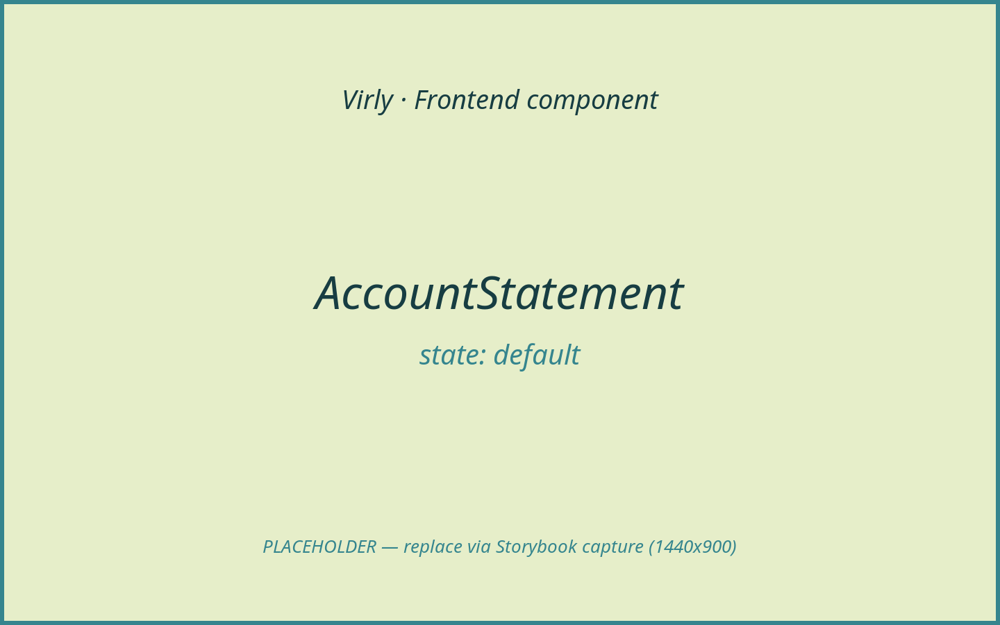
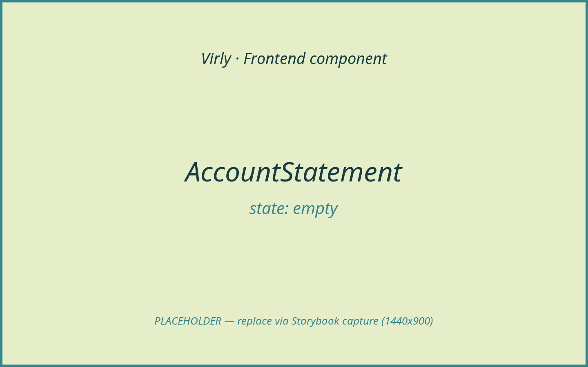
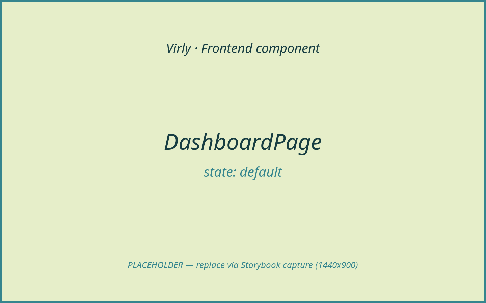
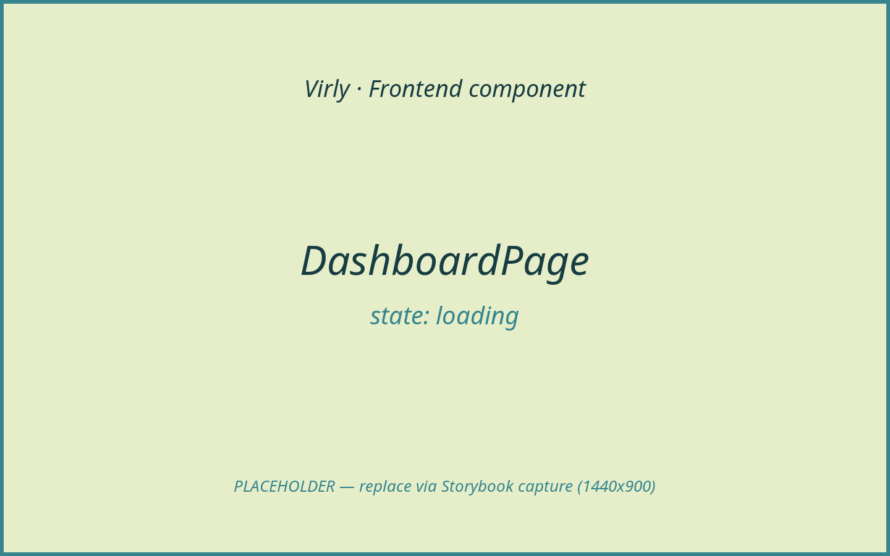
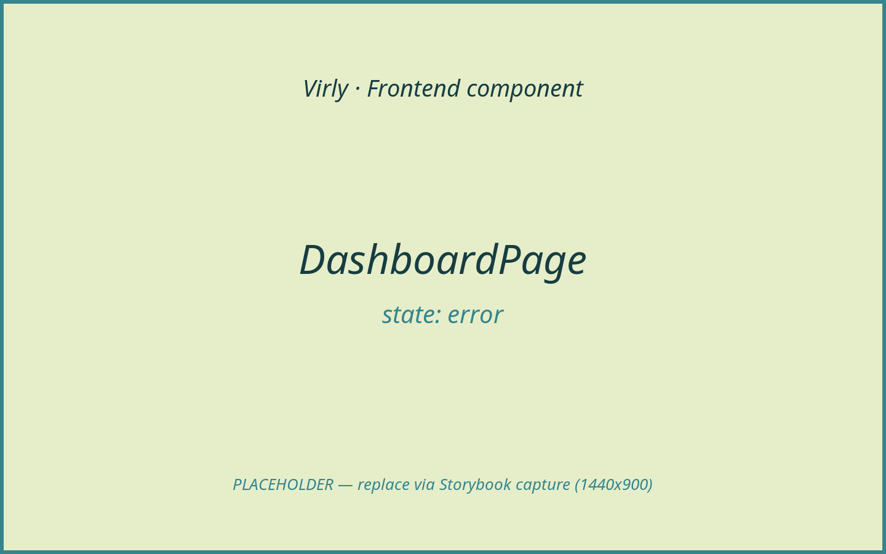
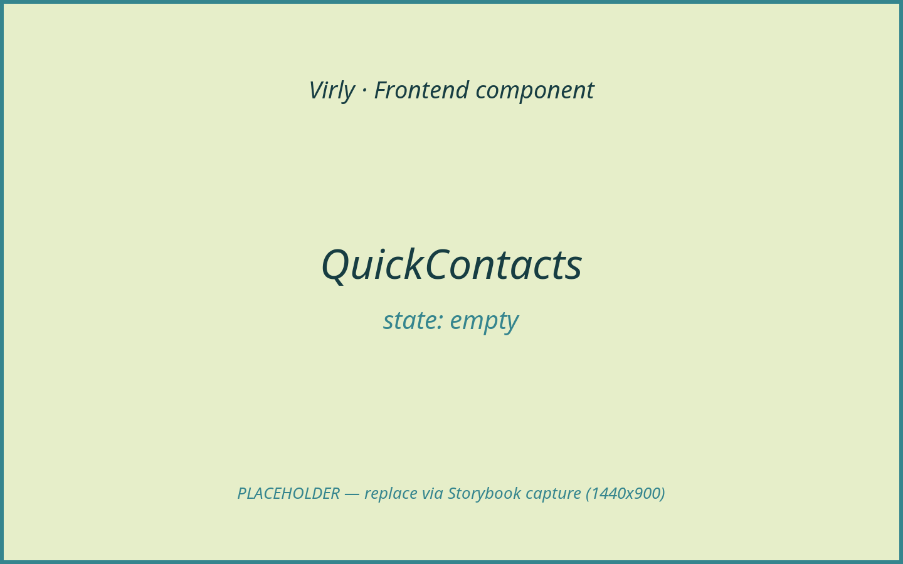

# Dashboard / Balance

The dashboard is the authenticated landing surface. It greets the user, fetches
the account summary (balance + recent ledger), and renders Virly's signature
"bank statement" alongside quick-send shortcuts and activity totals. The
displayed balance is always the server's figure: the page calls
`api.accountSummary` and pushes the returned balance into `AuthProvider` via
`updateBalance` — it never derives a balance from the transaction list.
Screenshots are placeholders pending Storybook capture.

## Components in this area

- [AccountStatement](#accountstatement)
- [DashboardPage](#dashboardpage)
- [QuickContacts](#quickcontacts)

---

### AccountStatement

- **Path:** `client/src/features/dashboard/AccountStatement.tsx`
- **Category:** feature | **Feature area:** Dashboard / Balance | **Tier:** Full
- **Summary:** A printed-statement rendering of the account: masthead, closing
  balance, money-in/out totals, and a clickable ledger of recent transactions.

**Screenshot(s)**


*Default statement with ledger rows and a closing balance.*


*No transactions — `EmptyState` with a "Make a transfer" CTA.*

**Purpose & context**

Renders the main dashboard column as a paper bank statement. It receives an
already-fetched `AccountSummary` and computes a running balance by walking the
closing balance backwards through the (newest-first) entries. Each ledger row is
a button that opens the shared `TransactionDetailsDialog`.

**Anatomy**

- Masthead: brand mark, "Account Statement", holder, masked account number,
  period.
- Summary band: closing balance + "as of" date; brought-forward, money-in,
  money-out figures.
- Ledger: header row + a button per transaction (date, counterparty + reason,
  paid-out/paid-in amount, running balance).
- Footer: entry count + "View all transactions" link.
- Empty branch: `EmptyState` with a transfer CTA.

**Props / API**

| Prop | Type | Required | Default | Description |
|------|------|----------|---------|-------------|
| `summary` | `AccountSummary` | Yes | — | Balance + transactions + pagination. |
| `holderName` | `string` | Yes | — | Display name in the masthead. |
| `accountNumber` | `string` | Yes | — | Decorative masked account number. |
| `formatAmount` | `(amountIls: number) => string` | Yes | — | Display-currency formatter (from `useCurrency`). |
| `onSelectTransaction` | `(transaction: Transaction) => void` | Yes | — | Opens the details dialog. |

**State & data**

- No local state; derives totals, `balanceAfter[]`, `broughtForward`, and the
  statement period from `summary.transactions`.
- No data fetching of its own (parent fetches `api.accountSummary`).

**Interactions & events**

- Clicking a ledger row → `onSelectTransaction(line)`.
- "View all transactions" → `/transactions`.

**States & variants**

- `default` (has entries), `empty` (no entries). Loading is owned by the parent
  (`Skeleton`). Error/success/disabled: N/A.

**Dependencies**

- Children: `EmptyState`, `Link`.
- Styling: `statement-*` classes (`global.css`); `Intl.DateTimeFormat`.

**Accessibility**

`aria-label="Account statement"` on the section; each ledger row is a `button`
with a descriptive `aria-label` (date, counterparty, direction, amount,
balance). Decorative flourishes are `aria-hidden`.

**Usage example**

```tsx
<AccountStatement
  summary={summary}
  holderName={greetingName}
  accountNumber={accountNumber}
  formatAmount={formatAmount}
  onSelectTransaction={setSelectedTransaction}
/>
```

**Related / used by**

Rendered by `DashboardPage`. Opens `TransactionDetailsDialog`.

**Notes / gotchas**

The running balance is a client-side reconstruction for display; the closing
balance (`summary.balance`) is the authoritative server figure.

---

### DashboardPage

- **Path:** `client/src/features/dashboard/DashboardPage.tsx`
- **Category:** page | **Feature area:** Dashboard / Balance | **Tier:** Full
- **Summary:** The authenticated home page: greeting, account statement, quick
  send, and activity stats, with an entrance animation after sign-in.

**Screenshot(s)**


*Loaded dashboard: statement + Quick Send + Activity Stats.*


*Initial load — `Skeleton` placeholder.*


*Account load failed — `ErrorBanner`.*

**Purpose & context**

The default route after login. On mount it fetches the account summary, mirrors
the balance into the auth context, and lays out the statement (main column)
beside Quick Send and Activity Stats (side column). When the user arrived from
the auth flow it plays a staggered entrance animation.

**Anatomy**

- `PageHeader` greeting ("Hello, {name}") + "Transfer" CTA.
- Main column: `AccountStatement`.
- Side column: Quick Send card (`QuickContacts`) + Activity Stats card
  (received/sent totals).
- `TransactionDetailsDialog` for the selected ledger row.

**Props / API**

None.

**State & data**

- Local state: `summary`, `selectedTransaction`, `error`, `isLoading`,
  `enteredFromAuth`.
- Hooks: `useAuth`, `useCurrency`, `useLocation`, `useNavigate`, `useMemo`.
- Data: `api.accountSummary(1, 10)` → `GET /api/accounts/me?page=1&limit=10`;
  pushes balance to `auth.updateBalance`.

**Interactions & events**

- Mount → fetch summary → `setSummary` + `auth.updateBalance`.
- Quick Send select → stores `virly-prefill-recipient` in `sessionStorage` and
  navigates to `/transfer`.
- Ledger row → `setSelectedTransaction` (opens dialog).

**States & variants**

- `default`, `loading` (`Skeleton`), `error` (`ErrorBanner`). The statement's
  own `empty` state shows when there are no transactions. Success/disabled: N/A.

**Dependencies**

- Children: `PageHeader`, `Card`, `ErrorBanner`, `Skeleton`, `QuickContacts`,
  `AccountStatement`, `TransactionDetailsDialog`.
- Libraries: `framer-motion`, `lucide-react`, `react-router-dom`.
- Helpers: `getQuickContacts`, `hasAuthTransition`, `clearAuthTransition`.

**Accessibility**

Section headings (`<h2>`) structure the side panels; activity direction marks
are `aria-hidden`. Entrance animation respects `MotionConfig reducedMotion`.

**Usage example**

```tsx
<Route path="/dashboard" element={<DashboardPage />} />
```

**Related / used by**

Routed inside the protected shell. Feeds `AccountStatement`, `QuickContacts`,
and the shared `TransactionDetailsDialog`.

**Notes / gotchas**

Received/sent totals are computed from the first page of transactions only (the
summary endpoint returns 10), so the "Activity Stats" numbers are a recent
snapshot, not lifetime totals.

---

### QuickContacts

- **Path:** `client/src/components/QuickContacts.tsx`
- **Category:** feature | **Feature area:** Dashboard / Balance | **Tier:** Full
- **Summary:** A "Quick Send" list of recent counterparties; each row selects a
  recipient and links to that user's profile.

**Screenshot(s)**


*List of recent contacts with initials avatars.*


*"No contacts" placeholder when the list is empty.*

**Purpose & context**

Renders the dashboard's Quick Send shortcuts from deduplicated recent
counterparties (`getQuickContacts`). Selecting a contact hands the recipient to
the transfer flow (the parent stores the prefill and navigates); a secondary
link opens the contact's profile.

**Anatomy**

- Empty branch: `quick-contact-empty`.
- Per contact: a select button (avatar initials + email) + a profile link
  (`/users/:email`).

**Props / API**

| Prop | Type | Required | Default | Description |
|------|------|----------|---------|-------------|
| `contacts` | `QuickContact[]` | Yes | — | `{ email, avatar }` items. |
| `onSelectContact` | `(email: string) => void` | Yes | — | Fired when a contact is chosen. |

**State & data**

None (presentational). Contacts are derived upstream from the account summary.

**Interactions & events**

- Contact button → `onSelectContact(email)` (dashboard prefills + navigates to
  `/transfer`).
- Profile link → `/users/:email`.

**States & variants**

- `default` (has contacts), `empty`. Loading/error/success/disabled: N/A.

**Dependencies**

- Children: `Link` (`react-router-dom`), `lucide-react` `UserRound`.
- Helper type: `QuickContact` from `lib/contacts`.

**Accessibility**

Profile links carry `aria-label`/`title` ("View …'s profile"); avatars are
`aria-hidden`.

**Usage example**

```tsx
<QuickContacts
  contacts={quickContacts}
  onSelectContact={(email) => {
    sessionStorage.setItem("virly-prefill-recipient", email);
    navigate("/transfer");
  }}
/>
```

**Related / used by**

Rendered by `DashboardPage`. The selection handoff feeds `TransferPage` (which
reads `virly-prefill-recipient`).

**Notes / gotchas**

`onSelectContact` only **prefills** a recipient — it does not initiate or
confirm a transfer. The user still completes amount entry, review, and the
explicit confirmation on `TransferPage`.
