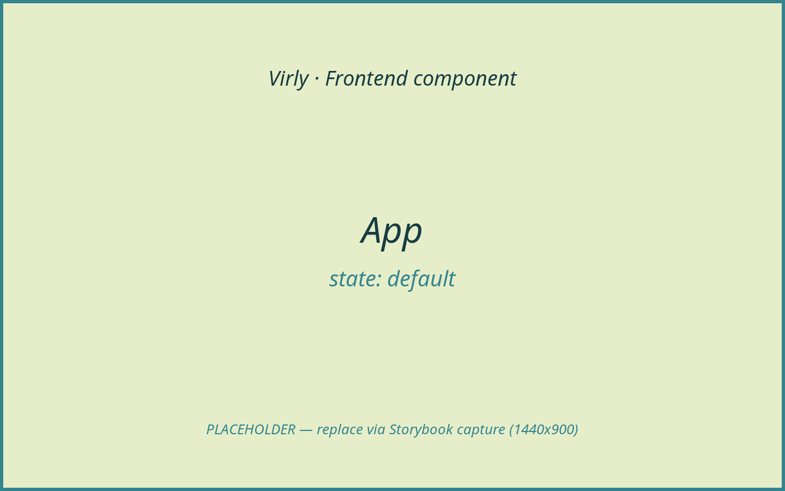
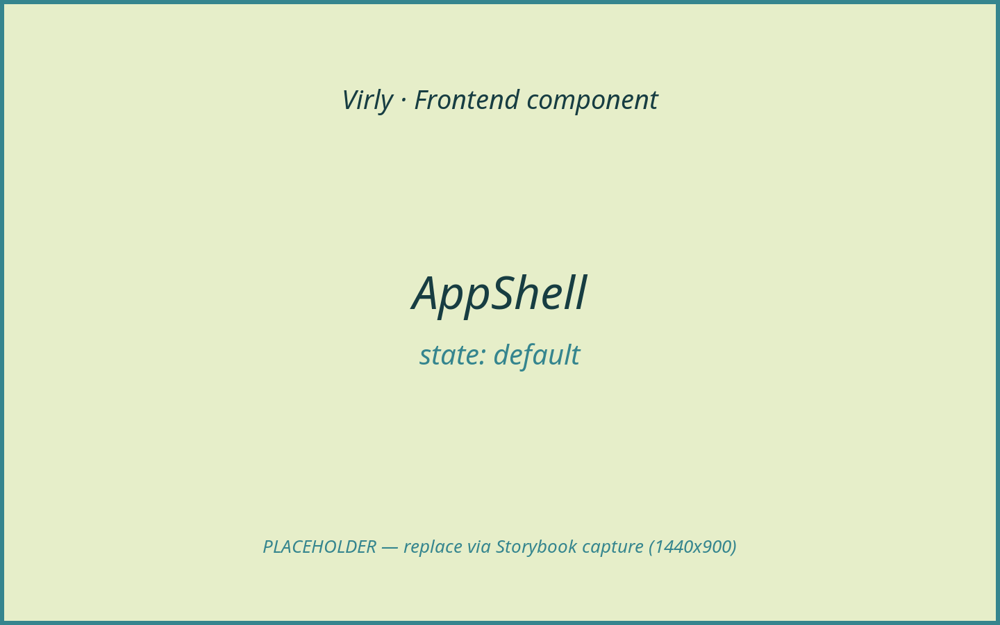
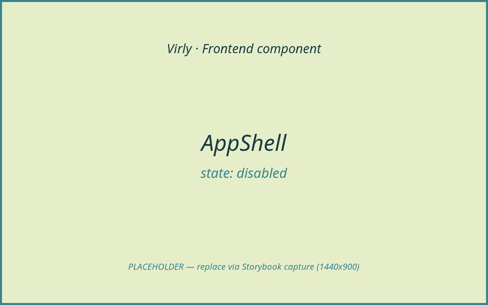
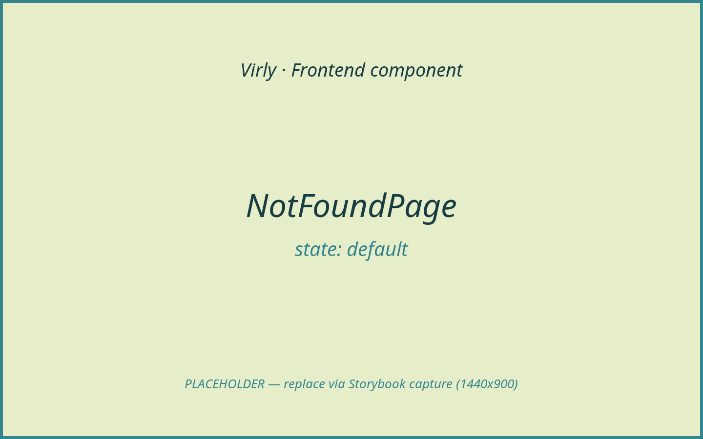
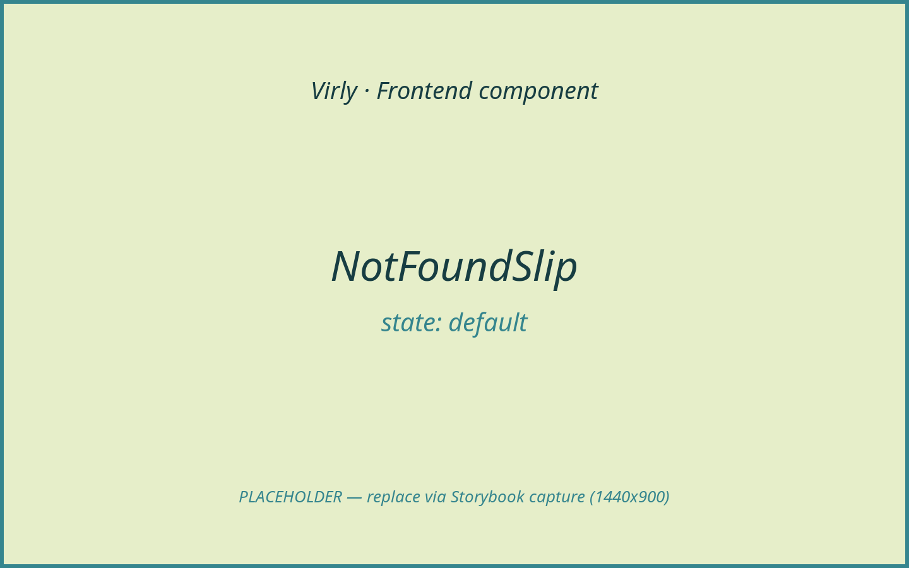
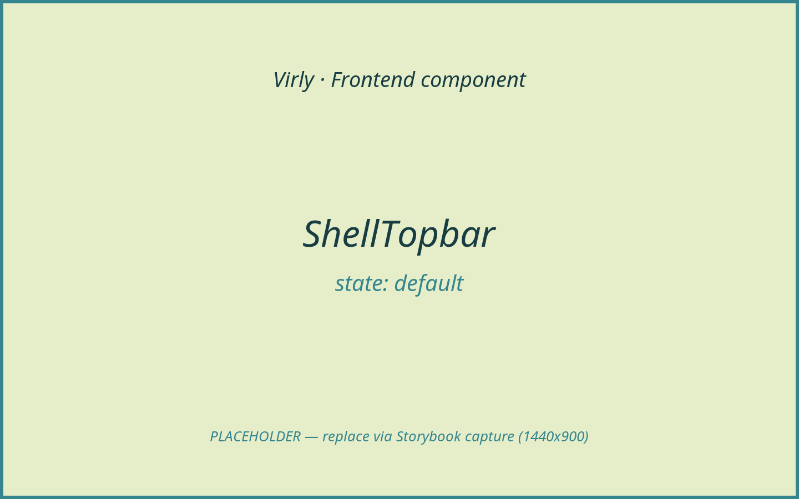
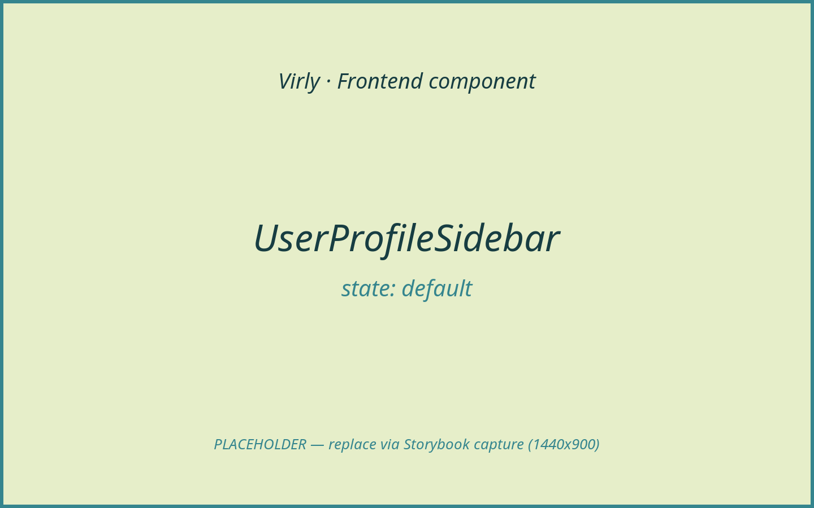
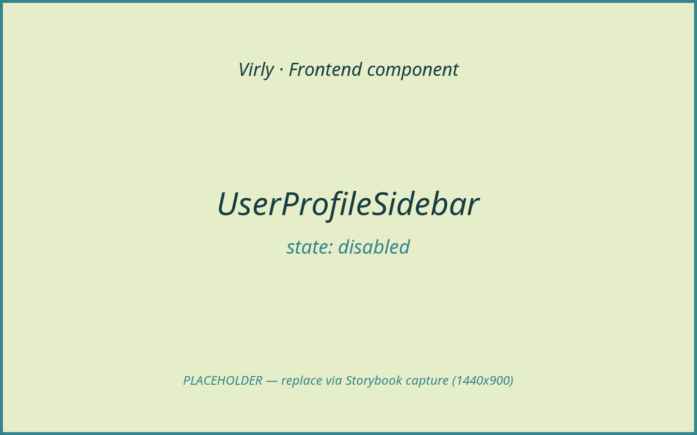

# Layout / Navigation

This area is the app frame: the router and route table, the authenticated shell
(sidebar + topbar + animated outlet + mobile nav), the route guards that gate
protected vs guest routes, and the 404 surface. None of these move money; they
compose the surfaces that do. Screenshots are placeholders pending Storybook
capture.

> The app entry point `client/src/main.tsx` (mounts `BrowserRouter` →
> `AuthProvider` → `App`) is a non-visual bootstrap file; see Appendix B in the
> index.

## Components in this area

- [App](#app)
- [AppShell](#appshell)
- [BootSplash](#bootsplash)
- [NotFoundPage](#notfoundpage)
- [NotFoundSlip](#notfoundslip)
- [RouteGuards](#routeguards)
- [ShellTopbar](#shelltopbar)
- [UserProfileSidebar](#userprofilesidebar)

---

### App

- **Path:** `client/src/app/App.tsx`
- **Category:** layout (router) | **Feature area:** Layout / Navigation | **Tier:** Full
- **Summary:** The route table: public auth routes, the protected shell branch
  (currency provider + `AppShell`), lazy routes, and the catch-all 404.

**Screenshot(s)**


*The app frame: shader background + routed content layer.*

**Purpose & context**

Defines all routes and the global frame. It renders the `ShaderBackground` and a
content layer, configures `MotionConfig reducedMotion="user"`, and splits routes
into guest routes (`/login`, `/register`), open routes (`/verify`,
`/resend-verification`), and a protected branch wrapping `CurrencyProvider` +
`AppShell` (dashboard, transfer, transactions, users, video, agent queue,
settings). `/` redirects to `/dashboard`; `*` renders the 404.

**Anatomy**

- `MotionConfig` + `ShaderBackground` + `BootSplash` (outside the route tree) + `.app-content-layer`.
- `Routes`: `GuestRoute`-wrapped auth pages; open verify pages; a
  `ProtectedRoute` → `CurrencyProvider` → `AppShell` layout route with child
  routes; lazy `UserProfilePage` / `VideoSessionPage` / `AgentVideoSessionsPage`
  under `Suspense`; redirect + catch-all.

**Props / API**

None.

**State & data**

- `useLocation` (passed to `Routes`). No data fetching.

**Interactions & events**

Routing only. Lazy routes use `Suspense` with a `RouteFallback` (`Skeleton`).

**States & variants**

- `default` (renders the matched route). Loading: lazy-route `Suspense`
  fallback. Empty/error/success/disabled: N/A.

**Dependencies**

- Children: `AppShell`, `BootSplash`, `RouteGuards`, `CurrencyProvider`, all page
  components, `ShaderBackground`, `Skeleton`.
- Libraries: `react-router-dom`, `framer-motion`.

**Accessibility**

`MotionConfig reducedMotion="user"` makes the whole app honour the user's
reduced-motion preference.

**Usage example**

```tsx
// main.tsx
<BrowserRouter><AuthProvider><App /></AuthProvider></BrowserRouter>
```

**Related / used by**

Mounted by `main.tsx`. Hosts every page.

**Notes / gotchas**

`CurrencyProvider` wraps only the protected branch, so currency conversion is
available inside the shell but not on the auth pages.

---

### BootSplash

- **Path:** `client/src/components/BootSplash.tsx`
- **Category:** modal/overlay | **Feature area:** Layout / Navigation | **Tier:** Lite
- **Summary:** A full-screen split-flap (Solari) board shown over the shader while
  the initial session check (`api.me()`) is in flight. Activates only on a slow
  response — a warm API call resolves before the 250 ms delay fires.

**Screenshot(s)**


*The flap board mid-animation, phrase centred on dark cells.*


*The overlay cross-fading out after the session resolves.*

**Purpose & context**

Virly is a static deploy; on a cold start the Render API may take a moment to
wake. `BootSplash` prevents a jarring flash of the wrong surface by covering the
shader with a branded loading board until `AuthProvider.isLoading` goes false.
It is mounted unconditionally inside `App` alongside `ShaderBackground`, outside
the route tree.

**Anatomy**

Two exported components:

- **`BootSplash({ active })`** — the stateful wrapper. Manages the three-phase
  lifecycle (`hidden` → `visible` → `exiting`) and renders nothing when `hidden`.
- **`BootSplashView({ phase })`** — the pure visual. A `.boot-splash` overlay
  containing:
  - `.boot-splash-slot` — a dark printer-slot bar at the top of the panel.
  - `.boot-flap-board` — a fixed-width row of `.boot-flap-cell` character tiles,
    each with a `.boot-flap-char` inner span.
  - `.boot-splash-dots` — a dotted rule below the board.

**Props / API**

| Prop | Type | Required | Default | Description |
|------|------|----------|---------|-------------|
| `active` | `boolean` | Yes | — | Pass `useAuth().isLoading`. `true` = session check in flight; `false` = resolved. |

(`BootSplashView` is an internal export used by the test harness; consuming code
uses only `BootSplash`.)

**State & data**

- Internal phase: `"hidden"` / `"visible"` / `"exiting"` (never exposed as a prop).
- No data fetching; driven entirely by the `active` prop.

**Timing behaviour**

| Constant | Value | Purpose |
|----------|-------|---------|
| `APPEAR_DELAY_MS` | 250 ms | Suppresses the overlay for fast API responses. |
| `MIN_VISIBLE_MS` | 600 ms | Once shown, stays up long enough to read. |
| `EXIT_MS` | 450 ms | CSS crossfade duration before the component unmounts. |

When `active` goes `false` the component waits until `MIN_VISIBLE_MS` has
elapsed since first show, then sets phase to `"exiting"` (crossfade starts) and
clears to `"hidden"` after `EXIT_MS`.

**Animation — split-flap board**

The board is always `COLS` characters wide, where `COLS` equals the length of the
longest phrase in the phrase pool (17 characters; set by `"COUNTING COINS..."`).
Each phrase is centred with space padding; blank-padding cells fade to 42 %
opacity (`.is-blank`).

The phrase sequence is: `"LOADING..."` first, then every third slot; the other
slots draw from a shuffled bag of 17 money-themed phrases so no phrase repeats
until all have been shown. During each transition each cell scrambles through
digit characters (`0–9`) at 65 ms intervals, then settles on the target letter
with a staggered delay of `480 + index * 85 ms`. The settle animation is a
95 ms `rotateX` flip via the Web Animations API. After all cells settle, the next
phrase fires after 1 700 ms.

Under `prefers-reduced-motion: reduce` the digit scramble is skipped; phrases
swap every 2 600 ms with no flip animation.

**Styles**

All CSS lives in `client/src/styles/global.css` (lines 5480–5592). Key classes:

| Class | Role |
|-------|------|
| `.boot-splash` | Fixed full-viewport overlay, `z-index: 80`, centred grid. |
| `.boot-splash-exiting` | Sets `opacity: 0; pointer-events: none` to crossfade out. |
| `.boot-splash-panel` | Glassmorphic card panel (`backdrop-filter: blur(10px)`). |
| `.boot-splash-slot` | Dark printer-slot bar above the board. |
| `.boot-flap-board` | Flex row of cells, `perspective: 520px`. |
| `.boot-flap-cell` | Individual dark tile with a mid-seam pseudo-element (`::after`). |
| `.boot-flap-cell.is-blank` | Blank padding cell at 42 % opacity. |
| `.boot-flap-char` | Monospace character span; `transform-origin: top center` for the flip. |
| `.boot-splash-dots` | Dotted rule below the board. |

**Accessibility**

The `.boot-splash` root carries `role="status"` and `aria-label="Loading"`. The
board and decorative elements are `aria-hidden="true"`.

**Dev latency preview**

To preview the splash on a warm API, set `VIRLY_THROTTLE_MS` in the server
environment — every response is delayed by that many milliseconds. See
[`../../configuration.md`](../../configuration.md) for details.

**Testing**

`client/tests/bootSplash.test.tsx` covers `BootSplashView` with `renderToStaticMarkup`
(no jsdom). It asserts:

- `role="status"` and `aria-label="Loading"` are present.
- `.boot-flap-board` is rendered.
- The board has at least 12 cells (full-width board).
- At least one cell contains a settled uppercase letter.
- The `"exiting"` phase adds `.boot-splash-exiting`.

See [`../../testing.md`](../../testing.md) for the client test harness conventions.

**Usage example**

```tsx
// App.tsx
const { isLoading } = useAuth();
// ...
<BootSplash active={isLoading} />
```

**Related / used by**

- Mounted by `App` (see [App](#app)).
- `active` driven by `AuthProvider.isLoading` (resolves after `GET /api/auth/me`).

**Notes / gotchas**

- `BootSplash` returns `null` immediately when `phase === "hidden"` so there is
  zero DOM cost when the session resolves quickly.
- The board width is fixed at compile time (`COLS = 17`); adding phrases longer
  than 17 characters will widen every cell row — keep new phrases to 17 chars or
  fewer.
- `BootSplashView` is exported separately for testing; it is not a public API.

---

### AppShell

- **Path:** `client/src/components/AppShell.tsx`
- **Category:** layout | **Feature area:** Layout / Navigation | **Tier:** Full
- **Summary:** The authenticated chrome: sidebar, topbar, animated route outlet,
  mobile nav, and the globally-mounted chat widget.

**Screenshot(s)**


*Sidebar + topbar + content, with the chat launcher.*


*Collapsed-sidebar variant.*

**Purpose & context**

The layout route element for every protected page. It builds the nav items (with
an extra "Queue" item for agent roles), renders the `UserProfileSidebar`,
`ShellTopbar`, the animated `AnimatedOutlet`, the mobile nav, and the always-on
`FloatingChatWidget`. It persists the sidebar collapsed state and plays an
entrance animation when arriving from the auth flow.

**Anatomy**

- `motion.aside` → `UserProfileSidebar` (user, nav items, logout, collapse).
- `shell-main` → `ShellTopbar` + `main.page-frame` → `AnimatePresence` over
  `AnimatedOutlet` (frozen outlet for exit animation).
- `nav.mobile-nav` (mobile tab bar).
- `FloatingChatWidget`.

**Props / API**

None.

**State & data**

- Local state: `isSidebarCollapsed` (persisted to `localStorage` via
  `virly-sidebar-collapsed`).
- Hooks: `useAuth`, `useLocation`, `useNavigate`, `useNavigationType`,
  `useOutlet`, `useState`, `useEffect`.
- Data: none directly (reads `auth.user`).

**Interactions & events**

- Nav links → route changes; forward navigation scrolls to top (POP keeps
  browser scroll restoration).
- Collapse toggle → persist preference.
- Logout → `auth.logout()` → navigate `/login`.

**States & variants**

- `default` (expanded), `disabled`/collapsed (sidebar collapsed), agent variant
  (extra "Queue" item). Entrance animation only when `enteredFromAuth`.

**Dependencies**

- Children: `UserProfileSidebar`, `ShellTopbar`, `FloatingChatWidget`,
  `AnimatedOutlet`.
- Libraries: `framer-motion`, `react-router-dom`, `lucide-react`.
- Helpers: `getDisplayName`, `getUserAvatarUrl`, `hasAuthTransition`.

**Accessibility**

Sidebar `aria-label="Primary"`; mobile nav `aria-label="Primary mobile"`; the
collapse toggle and links carry labels (in `UserProfileSidebar`).

**Usage example**

```tsx
<Route element={<ProtectedRoute><CurrencyProvider><AppShell /></CurrencyProvider></ProtectedRoute>}>
  <Route path="/dashboard" element={<DashboardPage />} />
</Route>
```

**Related / used by**

The layout route for all protected pages. Renders the nav, topbar, and chat
widget.

**Notes / gotchas**

`AnimatedOutlet` freezes the outlet captured at mount so the exiting route keeps
rendering during the `AnimatePresence` exit. The "Queue" nav item appears only
for `support_agent` / `sales_agent` / `support_manager` / `admin` roles.

---

### NotFoundPage

- **Path:** `client/src/features/not-found/NotFoundPage.tsx`
- **Category:** page | **Feature area:** Layout / Navigation | **Tier:** Full
- **Summary:** The 404 page: a "declined receipt" slip plus navigation actions.

**Screenshot(s)**


*404 slip with "Back to dashboard" / "Go back" actions.*

**Purpose & context**

The catch-all route. It derives a stable, deterministic "reference" from the
requested path and a print timestamp, then renders `NotFoundSlip` with delayed
navigation actions.

**Anatomy**

`nf-screen` → `nf-stage` → `NotFoundSlip` + animated actions (`Link` to `/`,
"Go back" `button` calling `navigate(-1)`).

**Props / API**

None.

**State & data**

- `useMemo` derives `printedAt` + `reference` from the requested path.
- Hooks: `useLocation`, `useNavigate`.

**Interactions & events**

- "Back to dashboard" → `/`.
- "Go back" → `navigate(-1)`.

**States & variants**

- `default` only. Loading/empty/error/success/disabled: N/A.

**Dependencies**

- Children: `NotFoundSlip`, `Link`, `lucide-react`.
- Libraries: `framer-motion`.

**Accessibility**

`aria-label="Page not found, error 404"` on the main; actions are real links /
buttons.

**Usage example**

```tsx
<Route path="*" element={<NotFoundPage />} />
```

**Related / used by**

Routed by `App` (catch-all). Wraps `NotFoundSlip`.

**Notes / gotchas**

The reference number is a deterministic hash of the path, so the same dead link
always "declines" with the same reference.

---

### NotFoundSlip

- **Path:** `client/src/components/NotFoundSlip.tsx`
- **Category:** feature | **Feature area:** Layout / Navigation | **Tier:** Full
- **Summary:** The presentational 404 surface rendered as a declined bank
  receipt (printed, tilted, stamped "Declined / No Such Route").

**Screenshot(s)**


*The declined receipt with request ledger + barcode.*

**Purpose & context**

A self-contained animated receipt used by `NotFoundPage`. It prints
top-to-bottom, settles at a tilt, slams down a "Declined" stamp, and lists the
failed request as ledger rows.

**Anatomy**

Merchant header, "404" headline + stamp, ledger rows (status, requested, method,
posted, reference), totals ("Pages found 0", "Balance of luck $0.00"), barcode,
footer.

**Props / API**

| Prop | Type | Required | Default | Description |
|------|------|----------|---------|-------------|
| `requested` | `string` | Yes | — | The dead path shown on the "Requested" line. |
| `printedAt` | `string` | Yes | — | Pre-formatted print timestamp. |
| `reference` | `string` | Yes | — | Deterministic "declined" reference number. |

**State & data**

None (deterministic barcode computed at module load).

**Interactions & events**

`whileHover` straightens the slip slightly. No callbacks (actions live in
`NotFoundPage`).

**States & variants**

- `default` only. Loading/empty/error/success/disabled: N/A.

**Dependencies**

- Libraries: `framer-motion`.

**Accessibility**

Decorative paper/stamp/barcode are `aria-hidden`; the host page provides the
`aria-label`. Content is visual text.

**Usage example**

```tsx
<NotFoundSlip requested={requested} printedAt={printedAt} reference={reference} />
```

**Related / used by**

Rendered by `NotFoundPage`.

**Notes / gotchas**

Pure presentation — pair it with navigation actions in the host page (it ships
none of its own).

---

### RouteGuards

- **Path:** `client/src/components/RouteGuards.tsx`
- **Category:** provider/container | **Feature area:** Layout / Navigation | **Tier:** Full
- **Summary:** `ProtectedRoute` and `GuestRoute` — the auth-aware redirect
  wrappers that gate the app shell vs the auth pages.

**Screenshot(s)**


*No own UI; this represents a guard resolving to its child or a redirect.*

**Purpose & context**

Two small wrappers used in the route table. `ProtectedRoute` renders children
only when authenticated (else redirects to `/login`, preserving `from`).
`GuestRoute` renders children only when unauthenticated (else redirects to
`/dashboard`, with a special case that keeps `/login` rendered for
personal-details / auth-transition continuations). Both render `null` while auth
is still loading.

**Anatomy**

- `ProtectedRoute({ children })` — loading → `null`; unauth → `Navigate
  /login`; else children.
- `GuestRoute({ children })` — loading → `null`; auth → `Navigate /dashboard`
  (with the login/needs-details exception); else children.

**Props / API**

| Component | Prop | Type | Required | Default | Description |
|-----------|------|------|----------|---------|-------------|
| `ProtectedRoute` | `children` | `ReactNode` | Yes | — | Protected subtree. |
| `GuestRoute` | `children` | `ReactNode` | Yes | — | Guest-only subtree. |

**State & data**

- Hooks: `useAuth`, `useLocation`. No data fetching.

**Interactions & events**

Redirect via `<Navigate>`; `ProtectedRoute` passes `state={{ from: location }}`
so login can return the user to the originally-requested route.

**States & variants**

- `loading` (`null`), authenticated, unauthenticated. Empty/error/success/
  disabled: N/A.

**Dependencies**

- Libraries: `react-router-dom`.
- Helper: `hasAuthTransition`, `useAuth`.

**Accessibility**

N/A (no DOM of their own).

**Usage example**

```tsx
<Route path="/login" element={<GuestRoute><LoginPage /></GuestRoute>} />
<Route element={<ProtectedRoute><CurrencyProvider><AppShell /></CurrencyProvider></ProtectedRoute>} />
```

**Related / used by**

Used throughout `App`'s route table.

**Notes / gotchas**

Returning `null` while `isLoading` prevents a flash of the wrong surface before
the session resolves.

---

### ShellTopbar

- **Path:** `client/src/components/ShellTopbar.tsx`
- **Category:** layout | **Feature area:** Layout / Navigation | **Tier:** Full
- **Summary:** The top bar: animated wordmark, currency selector, and the user's
  name + balance + avatar.

**Screenshot(s)**


*Wordmark, currency selector, user meta + balance.*

**Purpose & context**

Rendered by `AppShell` at the top of the content column. It shows the brand link
home, the global `CurrencySelector`, and the user's display name + balance
(formatted in the selected display currency).

**Anatomy**

Brand `Link` (`AnimatedText` "Virly") + `topbar-actions` (`CurrencySelector`,
user meta with name + balance, initials avatar).

**Props / API**

| Prop | Type | Required | Default | Description |
|------|------|----------|---------|-------------|
| `displayName` | `string` | Yes | — | User display name. |
| `email` | `string` | Yes | — | Used to derive the initials avatar. |
| `balance` | `number` | Yes | — | Authoritative ILS balance to format. |
| `enteredFromAuth` | `boolean` | Yes | — | Enables the slide-down entrance animation. |

**State & data**

- `useCurrency().formatAmount` for the balance. No data fetching.

**Interactions & events**

- Wordmark → `/dashboard`.
- Currency change handled by `CurrencySelector`/`CurrencyProvider`.

**States & variants**

- `default`. Entrance animation only when `enteredFromAuth`. Loading/empty/
  error/success/disabled: N/A.

**Dependencies**

- Children: `CurrencySelector`, `AnimatedText`, `Link`.
- Libraries: `framer-motion`.

**Accessibility**

Brand link `aria-label="Virly home"`; balance has an `sr-only` "Current balance"
prefix; avatar `aria-hidden`.

**Usage example**

```tsx
<ShellTopbar displayName={displayName} email={auth.user?.email ?? ""} balance={auth.user?.balance ?? 0} enteredFromAuth={enteredFromAuth} />
```

**Related / used by**

Rendered by `AppShell`. Hosts `CurrencySelector`.

**Notes / gotchas**

The balance comes from `auth.user.balance`, which is kept in sync with the server
by `updateBalance` after transfers — the topbar never computes it.

---

### UserProfileSidebar

- **Path:** `client/src/components/ui/menu.tsx`
- **Category:** layout | **Feature area:** Layout / Navigation | **Tier:** Full
- **Summary:** The primary sidebar: user identity, collapsible nav items (with
  separators and bottom-pinned items), and a logout button.

**Screenshot(s)**


*Expanded sidebar with nav links + logout.*


*Collapsed sidebar (icons only).*

**Purpose & context**

The desktop navigation. It renders the user header (avatar, name, auto-fit
email), a collapse toggle, the nav list (separators + bottom-pinned items like
Settings), and a logout action. All routing/state is provided by `AppShell`.

**Anatomy**

- User block: avatar, name, fit-to-width email, collapse toggle.
- Divider.
- Nav: main items + spacer + bottom-pinned items (`NavLink`s with chevrons,
  optional separators).
- Footer: logout button.

**Props / API**

| Prop | Type | Required | Default | Description |
|------|------|----------|---------|-------------|
| `user` | `UserProfile` (`{ name, email, avatarUrl }`) | Yes | — | Sidebar identity block. |
| `navItems` | `NavItem[]` | Yes | — | `{ icon, label, href, isSeparator?, pinToBottom? }`. |
| `logoutItem` | `{ icon, label, onClick }` | Yes | — | The logout action. |
| `collapsed` | `boolean` | No | `false` | Collapsed (icon-only) state. |
| `onToggleCollapse` | `() => void` | No | — | Collapse toggle handler. |
| `className` | `string` | No | — | Extra classes (merged via `cn`). |

**State & data**

- `useFitText` (custom `useLayoutEffect` hook) shrinks the email to fit. No data
  fetching.

**Interactions & events**

- Nav `NavLink`s → routes.
- Collapse toggle → `onToggleCollapse`.
- Logout → `logoutItem.onClick`.

**States & variants**

- `default` (expanded), `disabled`/collapsed. Loading/empty/error/success: N/A.

**Dependencies**

- Libraries: `framer-motion`, `react-router-dom`, `lucide-react`.
- Helper: `cn`, `useFitText`.

**Accessibility**

`aria-label="User profile menu"`; collapse toggle has `aria-expanded` +
`aria-controls` + `aria-label`; nav region has `role="navigation"`; links carry
`aria-label` and (collapsed) `title`.

**Usage example**

```tsx
<UserProfileSidebar
  user={{ name, email, avatarUrl }}
  navItems={items}
  logoutItem={{ label: "Log out", icon: <LogOut />, onClick: handleLogout }}
  collapsed={isSidebarCollapsed}
  onToggleCollapse={toggleSidebar}
/>
```

**Related / used by**

Rendered by `AppShell` (forwarded ref).

**Notes / gotchas**

`useFitText` observes the parent's size and rescales the email font down to a
floor of 8px, so long emails never overflow the collapsed/expanded rail.
