# Shared UI

This area holds reusable primitives (the hand-rolled `Primitives` toolkit and
the shadcn-style `components/ui/*` set), the currency context + selector, and
the decorative background. It also hosts three feature surfaces that genuinely
do not fit any of the seven fixed areas — `SettingsPage` and the video-session
pages — placed here per the documentation rules with an explicit note (flagged
for human review in the inventory). Video sessions are **human-agent (Jitsi)
calls**, distinct from the AI Assistant; the assistant only links into them via
its `video_session_cta` block.

Most entries are **Lite** (primitives). The `Primitives.tsx` file exports
multiple primitives and is documented as a single grouped entry. Screenshots are
placeholders pending Storybook capture.

## Components in this area

- [AgentVideoSessionsPage](#agentvideosessionspage) *(fits none — video)*
- [AnimatedText](#animatedtext)
- [Avatar](#avatar)
- [BentoCard](#bentocard)
- [Button (shadcn/ui)](#button-shadcnui)
- [CurrencyProvider](#currencyprovider)
- [CurrencySelector](#currencyselector)
- [JitsiMeeting](#jitsimeeting) *(fits none — video)*
- [OrderConfirmationCard](#orderconfirmationcard)
- [Primitives (UI toolkit)](#primitives-ui-toolkit)
- [Select (shadcn/ui)](#select-shadcnui)
- [SettingsPage](#settingspage) *(fits none)*
- [ShaderBackground](#shaderbackground)
- [VideoSessionPage](#videosessionpage) *(fits none — video)*

---

### AgentVideoSessionsPage

- **Path:** `client/src/features/video/AgentVideoSessionsPage.tsx`
- **Category:** page | **Feature area:** Shared UI (does not fit the seven fixed areas) | **Tier:** Full
- **Summary:** Internal agent queue for video sessions: filter, assign, join, and
  end support/sales calls. *(No matching fixed area; placed here per the rules.)*

**Screenshot(s)**

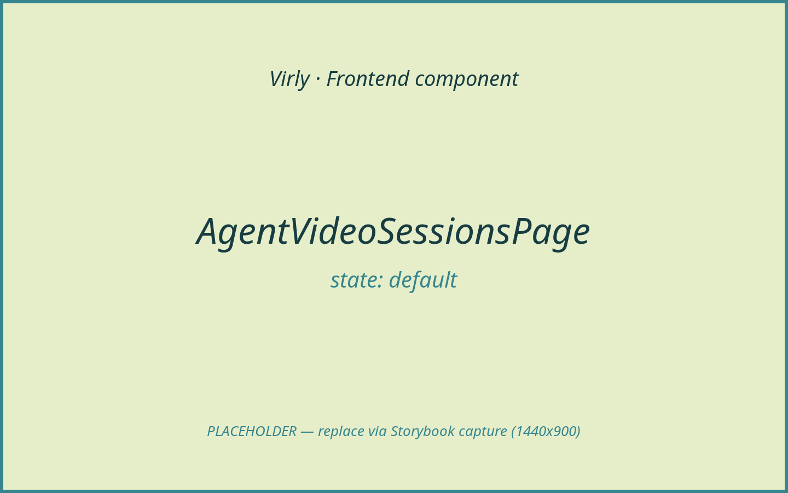
*Queue list + join stage for agents.*

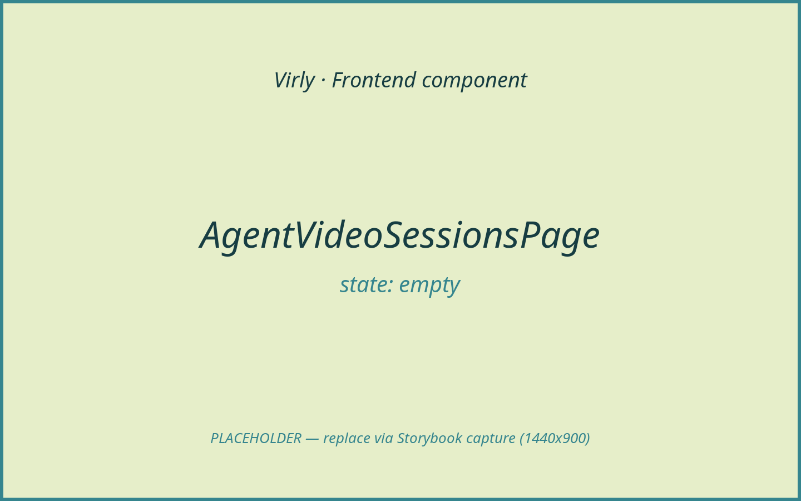
*No sessions match the filters.*

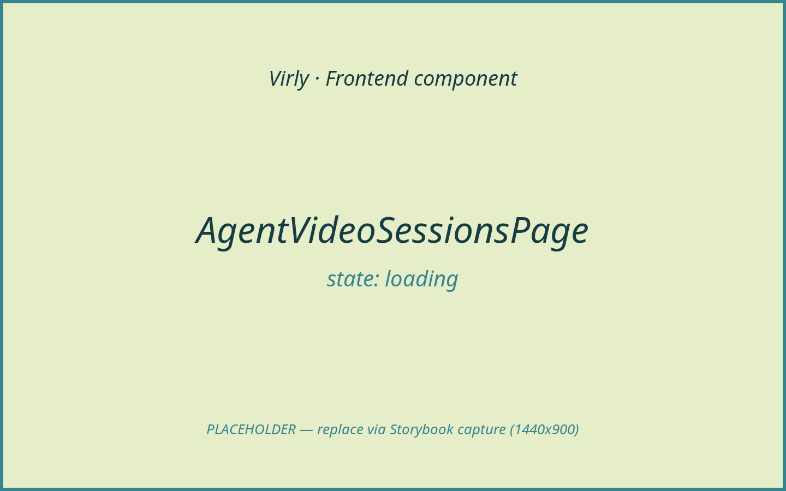
*Skeleton while sessions load.*

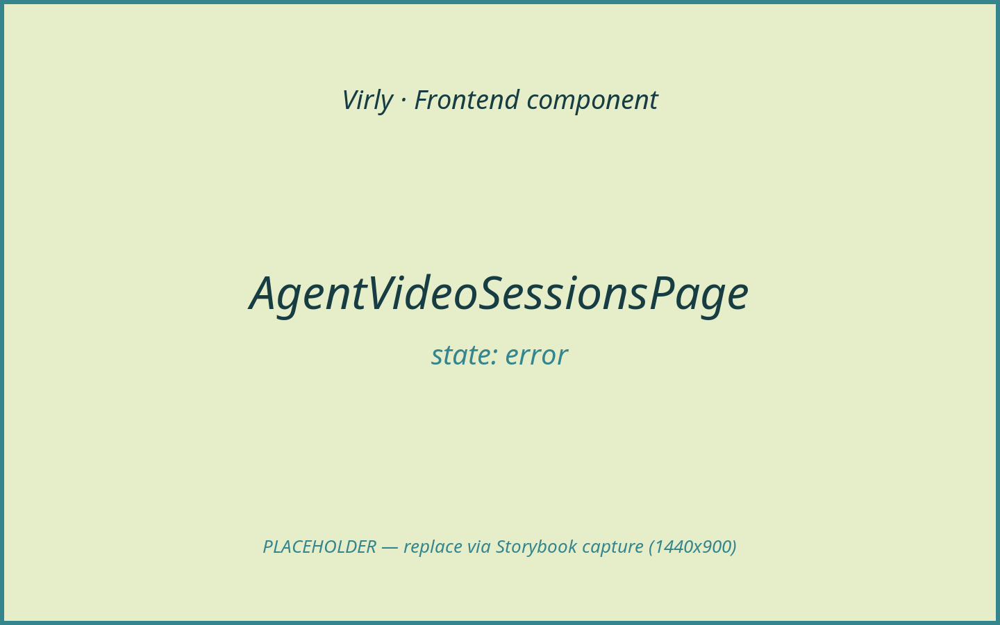
*Non-agent access denied / load error.*

**Purpose & context**

A role-gated internal tool (support/sales agents, support managers, admins) for
working the video queue. It lists sessions filtered by type/status, lets an agent
assign and join (opening a `JitsiMeeting`), and end the active session. Customer
financial details are intentionally **not** shown here.

**Anatomy**

- Access-denied branch for non-agents (`ShieldAlert`).
- `PageHeader` + Refresh; type/status filter card; session list (assign/join per
  row); agent stage card hosting `JitsiMeeting`.

**Props / API**

None. (Reads `auth.user.role`.)

**State & data**

- Local state: `sessions`, `status`, `type`, `activeSession`, `jitsi`,
  `isLoading`, `isBusy`, `error`.
- Hooks: `useAuth`, `useCallback`, `useEffect`, `useMemo`, `useState`.
- Data: `api.adminVideoSessions` (`GET /api/admin/video-sessions`),
  `api.assignVideoSession` (`POST …/:id/assign`), `api.adminVideoJoinToken`
  (`POST …/:id/join-token`), `api.adminEndVideoSession` (`POST …/:id/end`).

**Interactions & events**

Refresh → reload; Assign → assign + reload; Join → join token + open meeting;
End → end + reload. Type filter is locked for single-type roles.

**States & variants**

- `default`, `loading`, `empty`, `error`, access-denied, active-meeting.
  Success/disabled: buttons disable while busy or for terminal statuses.

**Dependencies**

- Children: `JitsiMeeting`, `Primitives` (`Button`, `Card`, `ErrorBanner`,
  `PageHeader`, `PageStack`, `ResponsiveGrid`, `Skeleton`), `lucide-react`.

**Accessibility**

`PageHeader` heading; status pills are text; filters are labelled selects.

**Usage example**

```tsx
<Route path="/agent/video-sessions" element={<Suspense fallback={<RouteFallback />}><AgentVideoSessionsPage /></Suspense>} />
```

**Related / used by**

Lazy-routed by `App`; reachable via the "Queue" sidebar item (agent roles).
Pairs with `VideoSessionPage` (customer side) and `JitsiMeeting`.

**Notes / gotchas**

The "Queue" nav entry and this page are both gated to agent roles; the page also
re-checks the role and renders an access-denied card defensively.

---

### AnimatedText

- **Path:** `client/src/components/ui/animated-text.tsx`
- **Category:** primitive/ui | **Feature area:** Shared UI | **Tier:** Lite
- **Summary:** Letter-by-letter reveal with an animated underline, used for the
  brand wordmark.

**Screenshot(s)**

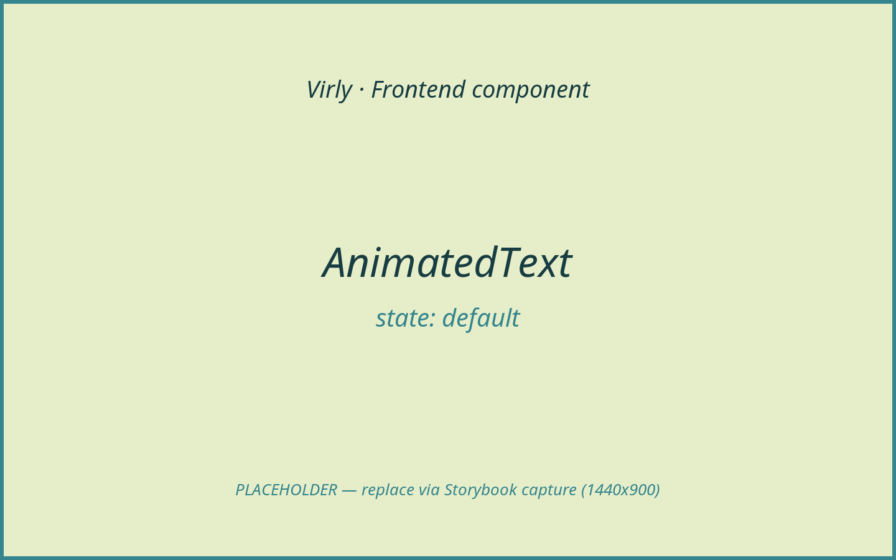
*"Virly" revealing letter by letter with an underline sweep.*

**Props / API**

| Prop | Type | Required | Default | Description |
|------|------|----------|---------|-------------|
| `text` | `string` | Yes | — | Text to animate. |
| `duration` | `number` | No | `0.19` | Per-letter stagger. |
| `delay` | `number` | No | `0.18` | Delay before children. |
| `replay` | `boolean` | No | `true` | Whether to animate to visible. |
| `as` | `"h1"…"h6" \| "p" \| "span"` | No | `"h1"` | Rendered element. |
| `className` / `textClassName` / `underlineClassName` | `string` | No | — | Style hooks. |
| `underlineGradient` / `underlineHeight` / `underlineOffset` | `string` | No | — | Underline style classes. |

**States & variants**

`default` (visible/animating). When `replay=false` it stays hidden. Honors
reduced-motion via the app `MotionConfig`. Loading/empty/error/disabled: N/A.

**Usage example**

```tsx
<AnimatedText text="Virly" as="span" duration={0.07} textClassName="topbar-wordmark-text" />
```

---

### Avatar

- **Path:** `client/src/components/ui/avatar.tsx`
- **Category:** primitive/ui | **Feature area:** Shared UI | **Tier:** Lite
- **Summary:** Radix-based avatar set (`Avatar`, `AvatarImage`, `AvatarFallback`).

**Screenshot(s)**

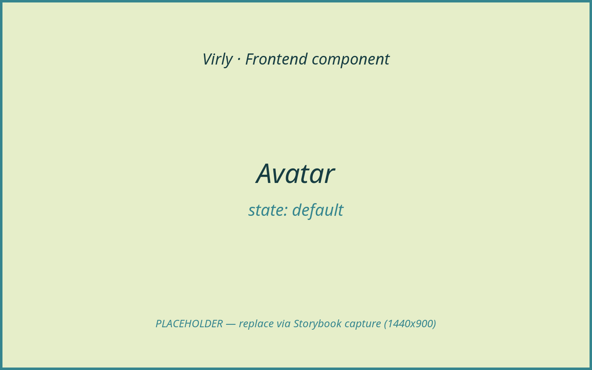
*Image avatar with an initials fallback.*

**Props / API**

Thin wrappers over `@radix-ui/react-avatar` primitives; all accept the
underlying Radix props plus `className` (merged via `cn`). No custom props.

| Export | Wraps | Notes |
|--------|-------|-------|
| `Avatar` | `AvatarPrimitive.Root` | Round, fixed `h-10 w-10` by default. |
| `AvatarImage` | `AvatarPrimitive.Image` | `object-cover`. |
| `AvatarFallback` | `AvatarPrimitive.Fallback` | Shown until the image loads. |

**States & variants**

`default` (image), fallback (no/failed image). Loading is handled by Radix.

**Usage example**

```tsx
<Avatar><AvatarImage src={url} alt="" /><AvatarFallback>AI</AvatarFallback></Avatar>
```

---

### BentoCard

- **Path:** `client/src/components/ui/bento-card.tsx`
- **Category:** primitive/ui | **Feature area:** Shared UI | **Tier:** Lite
- **Summary:** A self-contained, tabbed "project dashboard" showcase card
  (decorative/sample content).

**Screenshot(s)**

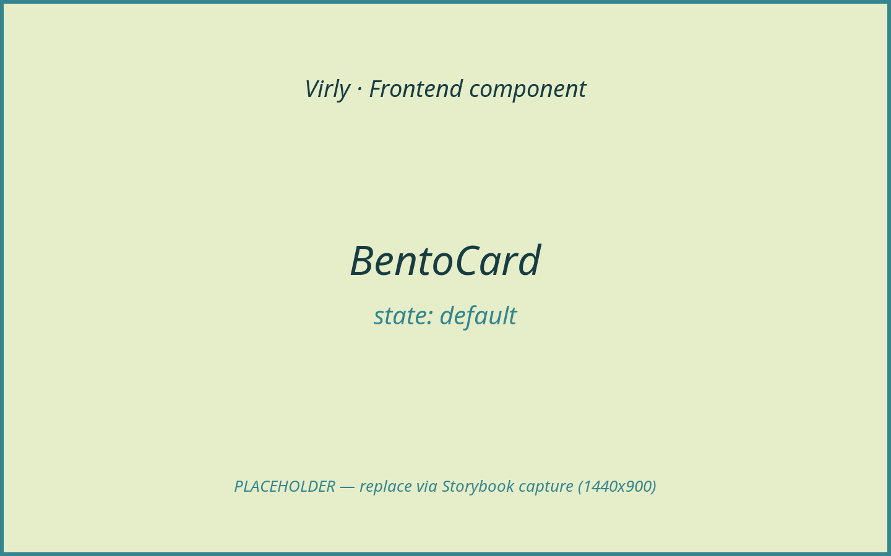
*Tabbed bento showcase (Dashboard / Management / Threads / Resources).*

**Props / API**

None. (Internal `activeTab` state; sample data hard-coded.)

**States & variants**

`default` plus the four tab variants. Loading/empty/error/success/disabled: N/A.

**Usage example**

```tsx
<BentoCard />
```

> **Note:** This appears to be a showcase/sample component (Hugeicons + hard-coded
> demo content) and is not part of the money flows. Verify whether it is still
> referenced before relying on it.

---

### Button (shadcn/ui)

- **Path:** `client/src/components/ui/button.tsx`
- **Category:** primitive/ui | **Feature area:** Shared UI | **Tier:** Lite
- **Summary:** The shadcn/CVA button used by the chat widget and shadcn-style
  cards (distinct from the `Primitives` `Button`).

**Screenshot(s)**

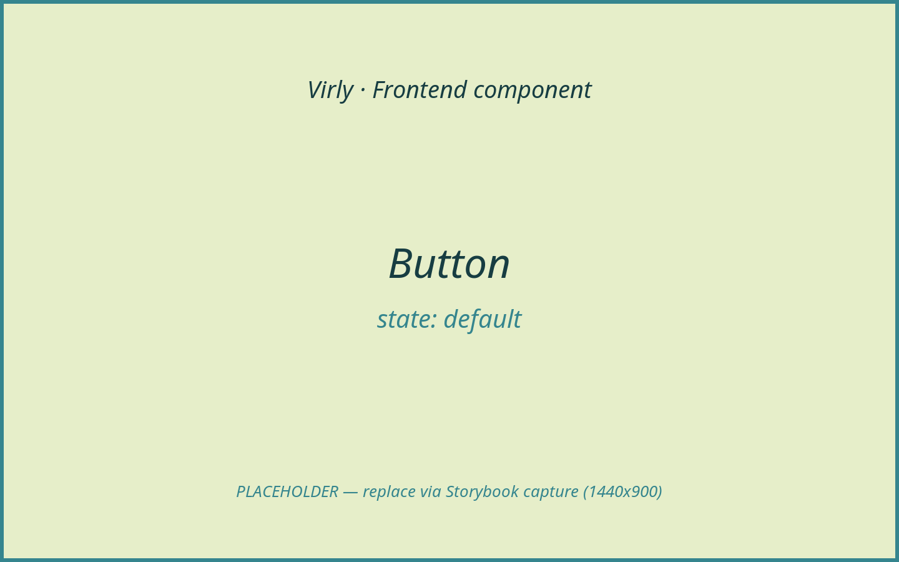
*Variant/size matrix (default, secondary, outline, ghost, destructive, link).*

**Props / API**

| Prop | Type | Required | Default | Description |
|------|------|----------|---------|-------------|
| `variant` | `"default" \| "destructive" \| "outline" \| "secondary" \| "ghost" \| "link"` | No | `"default"` | CVA variant. |
| `size` | `"default" \| "sm" \| "lg" \| "icon"` | No | `"default"` | CVA size. |
| `asChild` | `boolean` | No | `false` | Render via Radix `Slot`. |
| …`ButtonHTMLAttributes` | — | — | — | Standard button attributes. |

**States & variants**

All CVA `variant`/`size` combinations; `disabled` lowers opacity + blocks
pointer events. Loading/empty/error/success: caller-driven.

**Usage example**

```tsx
<Button variant="ghost" size="icon" aria-label="Close chat"><X /></Button>
```

> **Note:** Two `Button`s exist. This shadcn/CVA one (Tailwind) is used by
> `FloatingChatWidget` / `OrderConfirmationCard`; the `Primitives` `Button`
> (classic CSS) is used by pages/forms. Pick by surrounding style system.

---

### CurrencyProvider

- **Path:** `client/src/features/currency/CurrencyProvider.tsx`
- **Category:** provider/context | **Feature area:** Shared UI | **Tier:** Full
- **Summary:** Context that holds the selected display currency + daily exchange
  rates and exposes an ILS-aware `formatAmount`.

**Screenshot(s)**

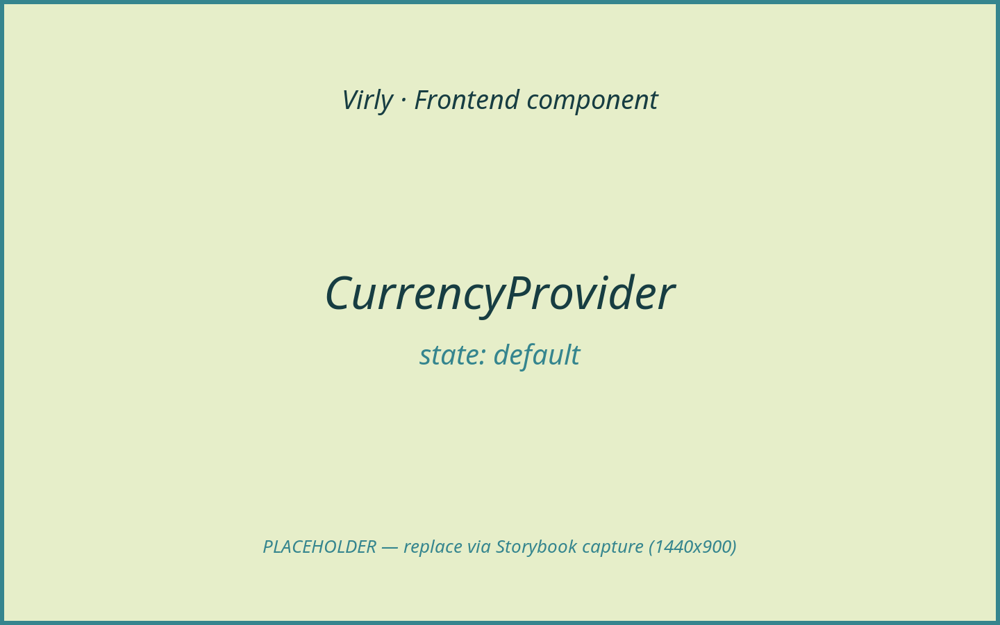
*No own UI; represents currency-formatted amounts across the shell.*

**Purpose & context**

Wraps the protected app branch. It reads the stored display currency, fetches
the daily rates (`api.exchangeRates`), and exposes `formatAmount(amountIls)` plus
`setCurrency`. When rates are unavailable, amounts degrade gracefully to plain
ILS. Ledger values remain authoritative ILS underneath; this only affects
display.

**Anatomy**

`CurrencyContext` (+ `useCurrency`) exposing `currency`, `setCurrency`, `rates`,
`conversionAvailable`, `formatAmount`. Accepts test/seed overrides.

**Props / API**

| Prop | Type | Required | Default | Description |
|------|------|----------|---------|-------------|
| `children` | `ReactNode` | Yes | — | Subtree consuming currency. |
| `initialCurrency` | `DisplayCurrency` | No | — | Test/seed override (else reads storage). |
| `initialRates` | `ExchangeRatesResponse \| null` | No | `null` | Test/seed override (skips fetch). |

Context value: `currency`, `setCurrency(c)`, `rates`, `conversionAvailable`,
`formatAmount(amountIls) => string`.

**State & data**

- Local state: `currency`, `rates`.
- Data: `api.exchangeRates()` → `GET /api/exchange-rates/current` (skipped when
  `initialRates` is provided).
- Persistence: `storeCurrency` / `readStoredCurrency` (localStorage).

**Interactions & events**

`setCurrency` updates state + persists; `formatAmount` reformats based on
`currency` + `rates`.

**States & variants**

- `default` (rates loaded), no-rates fallback (ILS only,
  `conversionAvailable=false`). Loading/empty/error/disabled: N/A (no own UI).

**Dependencies**

- Helpers: `formatIlsAmount`, `readStoredCurrency`, `storeCurrency`.

**Accessibility**

N/A (no DOM). Consumers render the amounts.

**Usage example**

```tsx
<CurrencyProvider><AppShell /></CurrencyProvider>
// const { formatAmount } = useCurrency();
```

**Related / used by**

Wraps the protected branch in `App`. Consumed by `ShellTopbar`, `TransferPage`,
`AccountStatement`, `TransactionList`, `TransactionReceipt`,
`RelationshipSummaryCard`, `SettingsPage`, `CurrencySelector`, etc.

**Notes / gotchas**

The default context value formats in ILS, so `useCurrency` is safe even outside
the provider (degrades to ILS) — though in practice it is always provided inside
the shell.

---

### CurrencySelector

- **Path:** `client/src/features/currency/CurrencySelector.tsx`
- **Category:** primitive/ui | **Feature area:** Shared UI | **Tier:** Lite
- **Summary:** The display-currency dropdown (ILS / USD / EUR) for the topbar.

**Screenshot(s)**

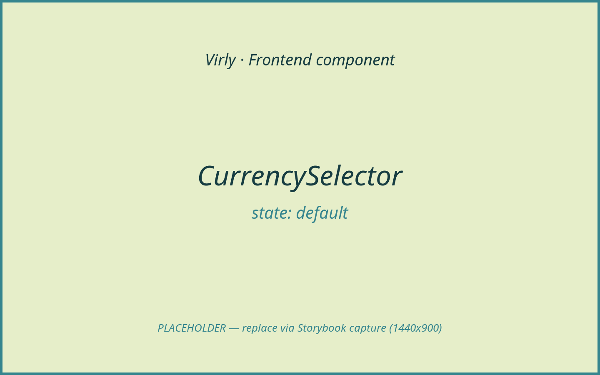
*Native select bound to the currency context.*

**Props / API**

| Prop | Type | Required | Default | Description |
|------|------|----------|---------|-------------|
| `currency` | `DisplayCurrency` | No | context value | Controlled value override. |
| `onCurrencyChange` | `(currency: DisplayCurrency) => void` | No | context `setCurrency` | Change handler override. |

**States & variants**

`default`. Binds to `useCurrency` by default; both props are optional overrides.
Loading/empty/error/success/disabled: N/A.

**Usage example**

```tsx
<CurrencySelector />
```

---

### JitsiMeeting

- **Path:** `client/src/features/video/JitsiMeeting.tsx`
- **Category:** feature | **Feature area:** Shared UI (does not fit the seven fixed areas) | **Tier:** Full
- **Summary:** Mounts a Jitsi external-API meeting into a container and bridges
  its join/leave/error events. *(No matching fixed area; placed here per the rules.)*

**Screenshot(s)**

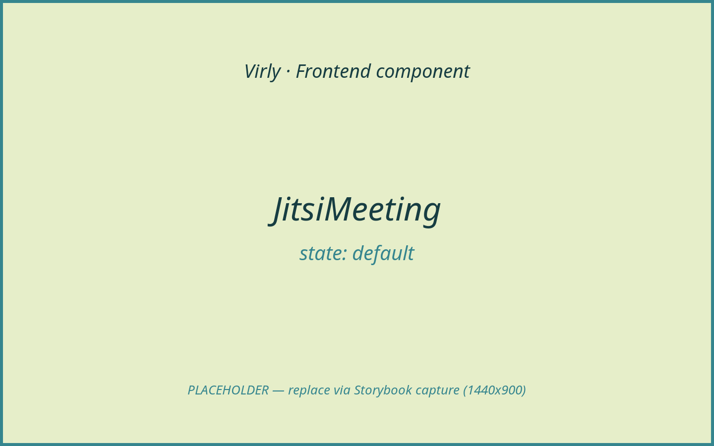
*Embedded Jitsi meeting frame.*

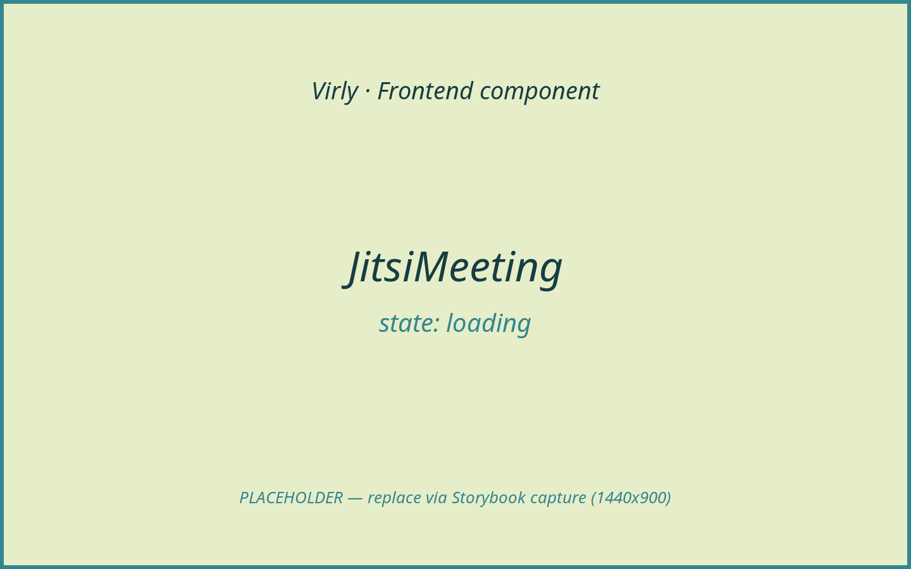
*"Preparing secure video…" while the runtime loads.*

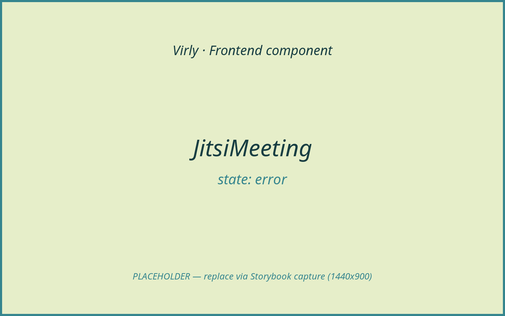
*Runtime failed to load (reported via `onError`).*

**Purpose & context**

A thin wrapper around the Jitsi `external_api.js` runtime. It lazily injects the
script for the configured domain, instantiates the meeting with the
server-issued join config (room, JWT, overrides), and forwards lifecycle events.

**Anatomy**

A loading overlay + a container `div` that Jitsi renders into. Script loading is
deduplicated per domain.

**Props / API**

| Prop | Type | Required | Default | Description |
|------|------|----------|---------|-------------|
| `jitsi` | `JitsiJoinConfig` | Yes | — | Server-issued join config (domain, room, JWT, overrides). |
| `displayName` | `string` | Yes | — | Name shown in the meeting. |
| `onJoined` | `() => void` | No | — | Fired on `videoConferenceJoined`. |
| `onLeft` | `() => void` | No | — | Fired on leave / `readyToClose`. |
| `onError` | `(message: string) => void` | No | — | Script/init failure message. |

**State & data**

- Local state: `loading`; refs for the container + API instance.
- No app API calls; loads the external Jitsi script.

**Interactions & events**

- Mount → load script → instantiate → add listeners.
- Unmount → `dispose()` the API instance.

**States & variants**

- `default` (joined), `loading`, `error` (via `onError`). Empty/success/disabled:
  N/A.

**Dependencies**

- External: Jitsi `external_api.js` (`window.JitsiMeetExternalAPI`).

**Accessibility**

Relies on the embedded Jitsi UI for in-call a11y; the wrapper shows a visible
loading message.

**Usage example**

```tsx
<JitsiMeeting jitsi={jitsi} displayName={displayName} onError={setError} onLeft={endSession} />
```

**Related / used by**

Rendered by `VideoSessionPage` (customer) and `AgentVideoSessionsPage` (agent).

**Notes / gotchas**

The join config (including any JWT) is issued by the backend per session; the
component never mints credentials itself.

---

### OrderConfirmationCard

- **Path:** `client/src/components/ui/order-confirmation-card.tsx`
- **Category:** primitive/ui | **Feature area:** Shared UI | **Tier:** Lite
- **Summary:** A generic success/confirmation card (icon, title, detail rows, CTA)
  in the shadcn style.

**Screenshot(s)**

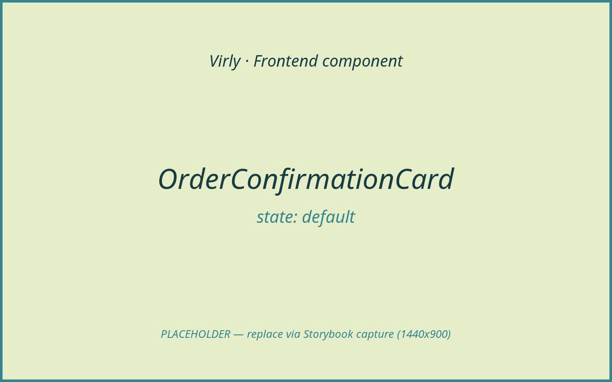
*Transaction-completed card with detail rows + a CTA.*

**Props / API**

| Prop | Type | Required | Default | Description |
|------|------|----------|---------|-------------|
| `orderId` | `string` | Yes | — | Shown as "Transaction ID". |
| `paymentMethod` | `string` | Yes | — | Shown as "Counterparty". |
| `dateTime` | `string` | Yes | — | Shown as "Date & Time". |
| `totalAmount` | `string` | Yes | — | Total (debit if it starts with `-`). |
| `onGoToAccount` | `() => void` | Yes | — | CTA handler. |
| `reason` | `string \| null` | No | — | Optional reason row. |
| `title` | `string` | No | `"Transaction completed successfully"` | Heading. |
| `buttonText` | `string` | No | `"Close"` | CTA label. |
| `icon` | `ReactNode` | No | `CheckCircle2` | Header icon. |
| `className` | `string` | No | — | Extra classes. |

**States & variants**

`default`; debit vs credit styling on the total. `aria-live="polite"`.
Loading/empty/error/disabled: N/A.

**Usage example**

```tsx
<OrderConfirmationCard orderId={id} paymentMethod={email} dateTime={when} totalAmount={amount} onGoToAccount={close} />
```

> **Note:** A generic, presentational confirmation card. The live transfer/AI
> flows use `TransferCheque` (success) and the assistant confirmation card;
> verify where this one is wired before relying on it.

---

### Primitives (UI toolkit)

- **Path:** `client/src/components/Primitives.tsx`
- **Category:** primitive/ui | **Feature area:** Shared UI | **Tier:** Lite
- **Summary:** The hand-rolled, CSS-class-based building blocks used across the
  pages and forms (distinct from the shadcn `components/ui/*` set).

**Screenshot(s)**

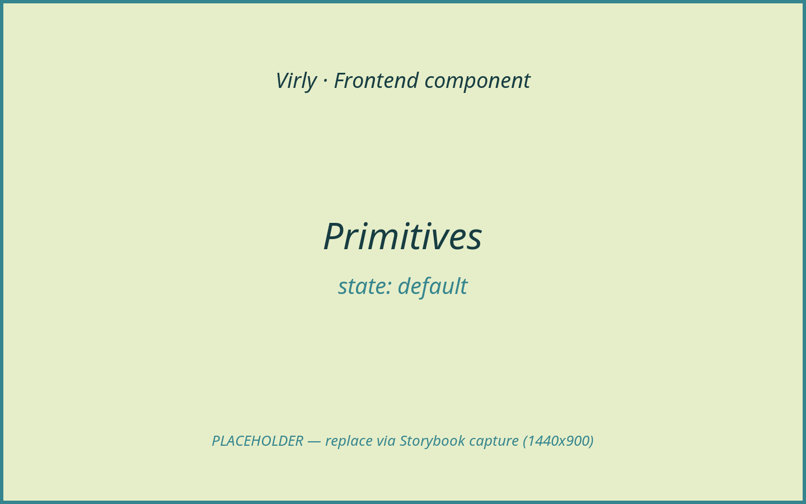
*Gallery: buttons, fields, banners, empty state, skeleton.*

**Exports (each a small primitive)**

| Export | Key props | Notes |
|--------|-----------|-------|
| `Button` | `variant` (`primary`\|`secondary`\|`ghost`\|`danger`), …button attrs | Classic CSS button. |
| `Card` | `children`, `className` | `section.card` wrapper. |
| `PageStack` | `children`, `className` | Vertical page stack. |
| `ResponsiveGrid` | `variant` (`sidebar`\|`dashboard`\|`split`\|`filters`), `children` | Layout grid. |
| `Field` | `label`, `error`, `hint`, …input attrs | Labelled input + error/hint. |
| `TextareaField` | `label`, `name`, `value`, `onChange`, `error`, `hint`, `maxLength` | Labelled textarea. |
| `PageHeader` | `eyebrow`, `title`, `children` (actions) | Page heading + actions slot. |
| `ErrorBanner` | `message` | `role="alert"` banner. |
| `SuccessBanner` | `message` | `role="status"` banner. |
| `EmptyState` | `title`, `message`, `icon`, `children` | Empty placeholder + actions. |
| `Skeleton` | `rows` (default 3) | "Printing…" loading placeholder. |

**States & variants**

- `Button`: variants + disabled.
- `Field`/`TextareaField`: default, error (`aria-invalid`), hint.
- `EmptyState`: empty placeholder (used as the `empty` state elsewhere).
- `Skeleton`: loading (`aria-busy`).

**Accessibility**

`Field`/`TextareaField` label via `htmlFor`/`id` and set `aria-invalid`; banners
carry `role`; `Skeleton` is `role="status"` `aria-busy`. TODO: link field errors
via `aria-describedby`.

**Usage example**

```tsx
<PageStack>
  <PageHeader eyebrow="" title="Transactions" />
  <Card><Field label="Email" name="email" error={err} onChange={...} /></Card>
  {isLoading ? <Skeleton rows={6} /> : <List />}
</PageStack>
```

**Related / used by**

Used by nearly every page/form in the app (Auth, Dashboard, Transfers,
Transactions, Settings, Video).

> **Note:** Documented as one grouped entry because the file exports many small
> primitives. The shadcn `Button` (`ui/button.tsx`) is separate — see above.

---

### Select (shadcn/ui)

- **Path:** `client/src/components/ui/select.tsx`
- **Category:** primitive/ui | **Feature area:** Shared UI | **Tier:** Lite
- **Summary:** The Radix-based select set (`Select`, `SelectTrigger`,
  `SelectContent`, `SelectItem`, …) used for the chat agent picker.

**Screenshot(s)**

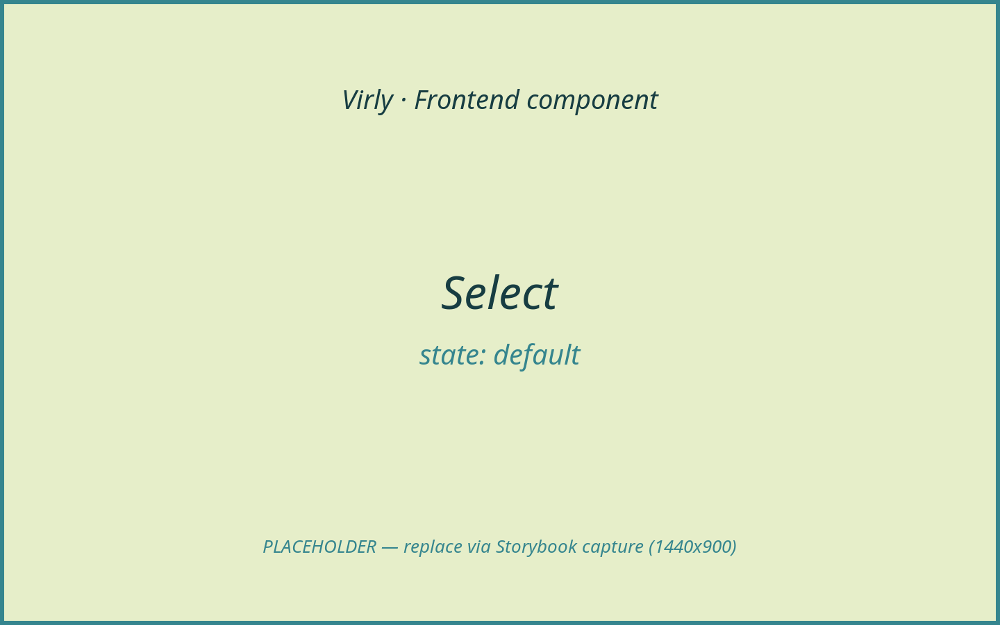
*Open select with items + check indicator.*

**Props / API**

Re-exports of `@radix-ui/react-select` parts, styled via `cn`. No custom props
beyond the Radix component props (+ `className`). Exports: `Select`,
`SelectGroup`, `SelectValue`, `SelectTrigger`, `SelectContent`, `SelectLabel`,
`SelectItem`, `SelectSeparator`, `SelectScrollUpButton`, `SelectScrollDownButton`.

**States & variants**

`default`, open/closed (Radix data-state animations), `disabled`. Loading/empty/
error/success: N/A.

**Usage example**

```tsx
<Select value={agent} onValueChange={setAgent}>
  <SelectTrigger aria-label="Choose an assistant">…</SelectTrigger>
  <SelectContent><SelectItem value="oshri">Oshri</SelectItem></SelectContent>
</Select>
```

---

### SettingsPage

- **Path:** `client/src/features/settings/SettingsPage.tsx`
- **Category:** page | **Feature area:** Shared UI (does not fit the seven fixed areas) | **Tier:** Full
- **Summary:** Account settings: view/edit personal details, see account email +
  balance, and sign out. *(No matching fixed area; placed here per the rules.)*

**Screenshot(s)**

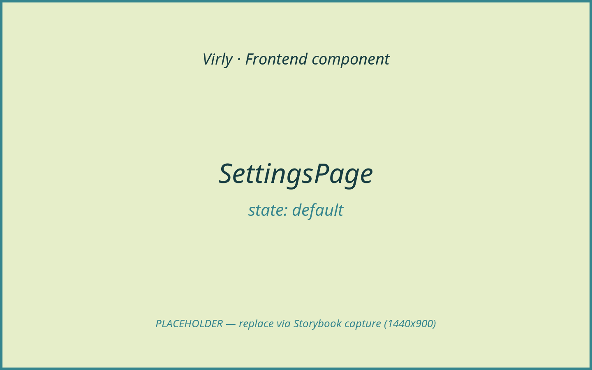
*Personal details (read mode) + account + session cards.*

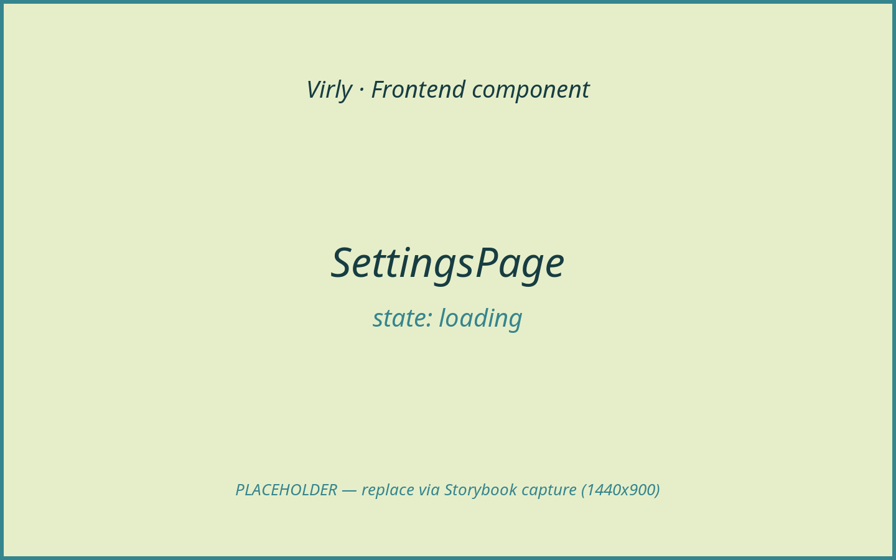
*Skeleton while details load.*

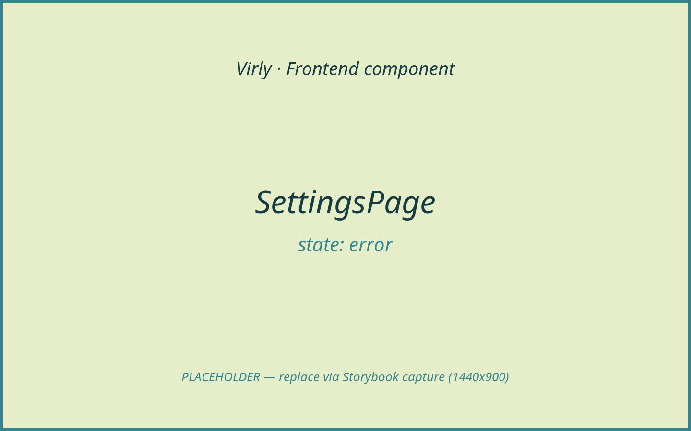
*Load/save error banner.*

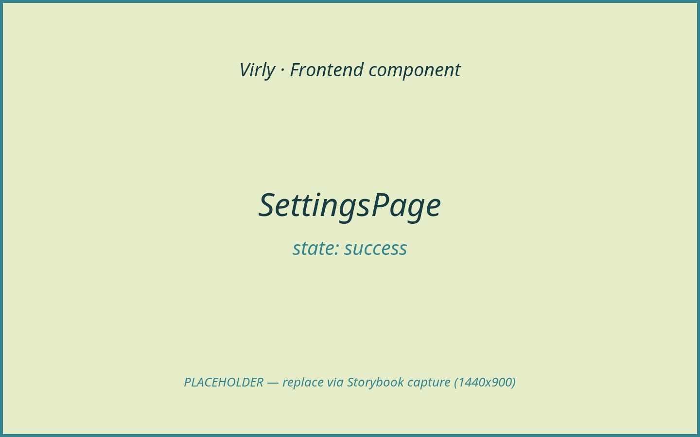
*"Personal details updated." success banner after saving.*

**Purpose & context**

The post-auth account hub. It loads personal details, toggles between a
read-only summary and an editable form (reusing the same validators as
`PersonalDetailsAuthForm`), saves via the same endpoint, shows the account email
+ balance, and provides sign-out.

**Anatomy**

- `PageHeader` ("Settings").
- Details card: header + Edit; `Skeleton` / read `<dl>` / edit `form`
  (`Field`s, Save/Cancel); error + success banners.
- Side stack: Account card (email, balance) + Session card (Sign out).

**Props / API**

None.

**State & data**

- Local state: `details`, `form`, `errors`, `isLoadingDetails`,
  `isEditingDetails`, `isSavingDetails`, `successMessage`.
- Hooks: `useAuth`, `useCurrency`, `useNavigate`, `useEffect`, `useState`.
- Data: `api.personalDetails` (`GET /api/accounts/personal-details`),
  `api.updatePersonalDetails` (`PUT /api/accounts/personal-details`).

**Interactions & events**

Edit → populate form; Save → validate → update → patch session + success; Cancel
→ revert; Sign out → `auth.logout` → `/login`.

**States & variants**

- `default` (read), edit, `loading`, `error`, `success`, saving (button
  disabled). Empty/disabled: fields show "Not provided" when empty.

**Dependencies**

- Children: `Primitives` (`Button`, `Card`, `ErrorBanner`, `Field`, `PageHeader`,
  `PageStack`, `ResponsiveGrid`, `Skeleton`, `SuccessBanner`).
- Helpers: `validateRequiredText`, `validateDateOfBirth`, `useCurrency`.

**Accessibility**

Fields are labelled (`Field`); banners carry `role`. Read mode uses `<dl>`.

**Usage example**

```tsx
<Route path="/settings" element={<SettingsPage />} />
```

**Related / used by**

Routed inside the protected shell; reached from the bottom-pinned sidebar item.
Shares validators + endpoint with `PersonalDetailsAuthForm`.

**Notes / gotchas**

Does not fit the seven fixed feature areas; placed in Shared UI per the rules and
flagged for human review in `_inventory.md`. A human may prefer to relocate it
(e.g. to Dashboard / Balance as an "account" surface).

---

### ShaderBackground

- **Path:** `client/src/components/ui/shader-background.tsx`
- **Category:** primitive/ui | **Feature area:** Shared UI | **Tier:** Lite
- **Summary:** A full-viewport WebGL plasma/grid background, mounted globally by
  `App`, that pauses on hidden tabs and respects reduced-motion.

**Screenshot(s)**

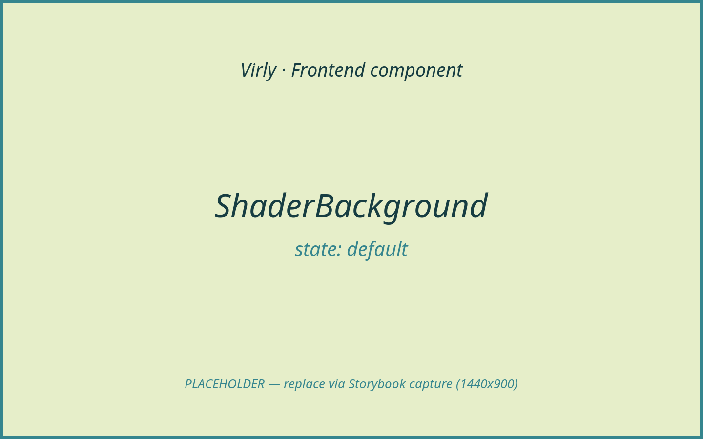
*Animated WebGL background behind the app content layer.*

**Props / API**

None.

**States & variants**

- `default` (animating). Paused when the tab is hidden or the user prefers
  reduced motion (renders a single static frame). Falls back silently if WebGL
  is unavailable. Loading/empty/error/success/disabled: N/A.

**Usage example**

```tsx
// App.tsx
<ShaderBackground />
```

> **Note:** Categorised as a `primitive/ui` (decorative) so it is Lite, but it
> carries real behaviour (WebGL lifecycle, visibility + reduced-motion handling)
> — see the source for details.

---

### VideoSessionPage

- **Path:** `client/src/features/video/VideoSessionPage.tsx`
- **Category:** page | **Feature area:** Shared UI (does not fit the seven fixed areas) | **Tier:** Full
- **Summary:** Customer-facing page to start/join a secure support or sales video
  session. *(No matching fixed area; placed here per the rules.)*

**Screenshot(s)**

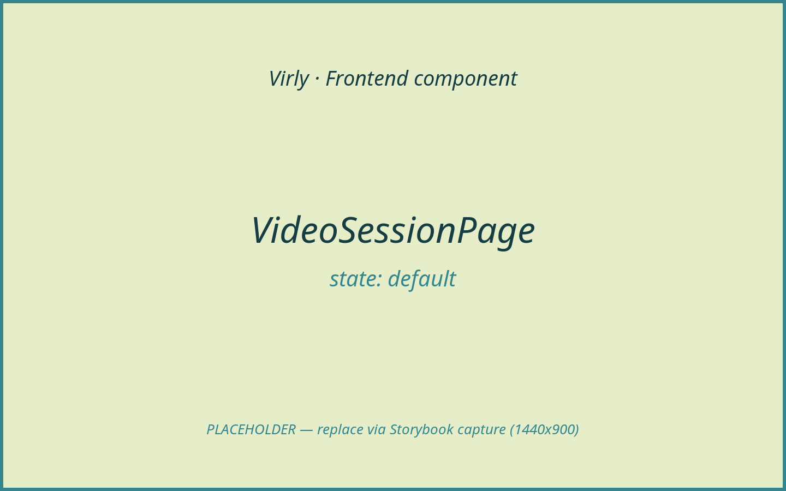
*Start panel (topic + support/sales) beside the meeting stage.*

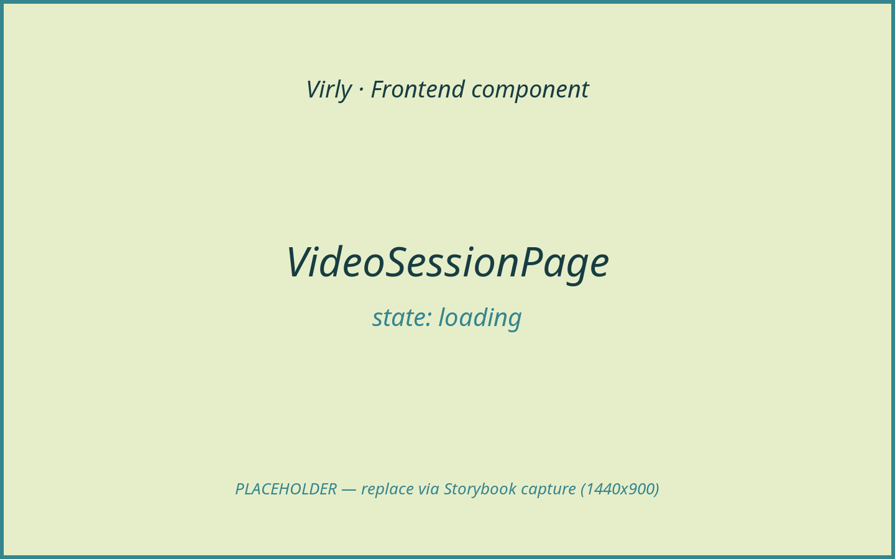
*Busy while creating/joining a session.*

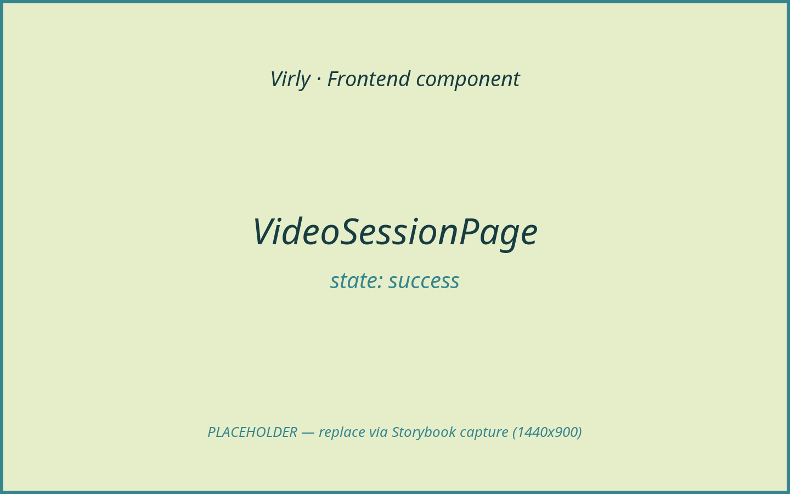
*Active meeting in the stage (`JitsiMeeting`).*

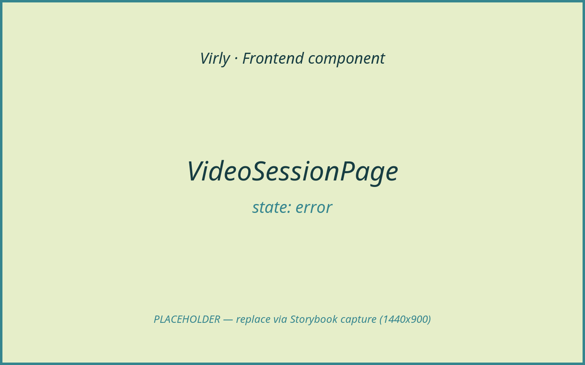
*Unable to start/open the session.*

**Purpose & context**

Lets a customer start a support or sales video call (or resume one via
`?sessionId=`). It creates the session, fetches a join token, and renders the
meeting. The intro copy explicitly states that video can guide the user but
**money movement still requires the normal in-app confirmation flow** — agents
cannot move money through the call.

**Anatomy**

- `PageHeader` + status pill.
- Control panel: secure-session intro, optional topic `TextareaField`,
  support/sales choice buttons.
- Stage card: `JitsiMeeting` when active, else an empty stage with status copy.

**Props / API**

None. (Reads `?sessionId` from `useSearchParams`.)

**State & data**

- Local state: `session`, `jitsi`, `topic`, `error`, `isBusy`.
- Hooks: `useAuth`, `useSearchParams`, `useCallback`, `useEffect`, `useMemo`,
  `useState`.
- Data: `api.createVideoSession` (`POST /api/video-sessions`),
  `api.videoSession` (`GET /api/video-sessions/:id`), `api.videoJoinToken`
  (`POST …/:id/join-token`), `api.endVideoSession` (`POST …/:id/end`).

**Interactions & events**

Start (support/sales) → create + join → show meeting; End → end session;
`?sessionId` → load + join an existing session.

**States & variants**

- `default` (ready), `loading` (`isBusy`), `success` (active meeting), `error`,
  terminal-status empty stages. Disabled: choice buttons while busy.

**Dependencies**

- Children: `JitsiMeeting`, `Primitives` (`Button`, `Card`, `ErrorBanner`,
  `PageHeader`, `PageStack`, `ResponsiveGrid`, `TextareaField`), `lucide-react`.

**Accessibility**

`PageHeader` heading + status pill; the topic field is labelled and hints against
sharing secrets; choice buttons are real buttons.

**Usage example**

```tsx
<Route path="/video" element={<Suspense fallback={<RouteFallback />}><VideoSessionPage /></Suspense>} />
```

**Related / used by**

Lazy-routed by `App`; reachable from the "Video" nav item and the assistant's
`video_session_cta`. Agent side: `AgentVideoSessionsPage`.

**Notes / gotchas**

Does not fit the seven fixed areas; placed in Shared UI per the rules and flagged
for human review. The topic hint warns users not to share passwords or card
numbers on the call.
