# Transactions / History

This area covers viewing past activity: the filterable transactions page, the
reusable transaction list with pagination, the receipt dialog, and the
profile-scoped "shared activity" container. All amounts are formatted in the
user's display currency but the underlying ledger figures are the server's
authoritative ILS values; nothing here mutates state. Screenshots are
placeholders pending Storybook capture.

## Components in this area

- [RecentRelationshipTransactions](#recentrelationshiptransactions)
- [TransactionDetailsDialog](#transactiondetailsdialog)
- [TransactionList](#transactionlist)
- [TransactionReceipt](#transactionreceipt)
- [TransactionsPage](#transactionspage)

---

### RecentRelationshipTransactions

- **Path:** `client/src/features/users/RecentRelationshipTransactions.tsx`
- **Category:** hook-bound container | **Feature area:** Transactions / History | **Tier:** Full
- **Summary:** "Shared activity" list on a user profile — paginates the
  transactions between you and the viewed user and opens the receipt dialog.

**Screenshot(s)**

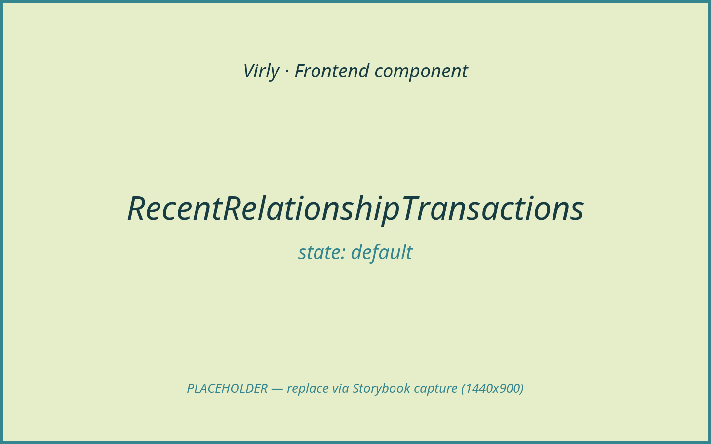
*Initial shared transactions with a "View all" affordance.*

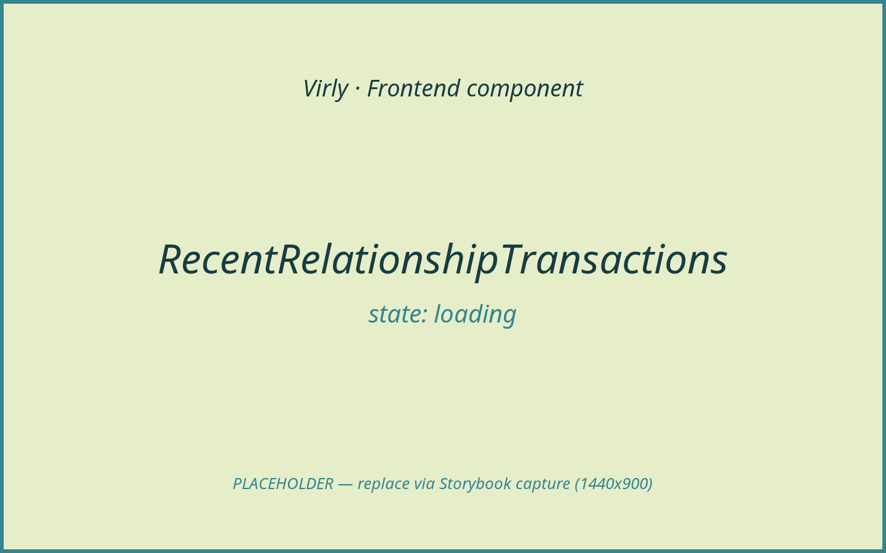
*Skeleton while a page loads.*

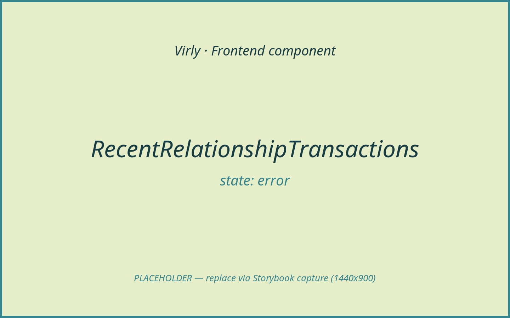
*Inline error when shared transactions fail to load.*

**Purpose & context**

Rendered by `UserProfilePage` (Transfers area) when there is shared history. It
seeds from the profile response's `recentTransactions`, then lazily paginates
via the relationship-transactions endpoint when the user pages or expands. Each
row is reshaped into the viewer-relative `Transaction` shape the shared receipt
dialog expects.

**Anatomy**

- Section heading ("Shared activity") + inline error.
- `TransactionRows` (direction icon, "Sent to / Received from {name}", amount,
  status).
- Pagination nav, or a "View all {n} transactions" expander.
- `TransactionDetailsDialog` for the selected row.

**Props / API**

| Prop | Type | Required | Default | Description |
|------|------|----------|---------|-------------|
| `idOrEmail` | `string` | Yes | — | The viewed user's id or email. |
| `initialTransactions` | `RelationshipTransaction[]` | Yes | — | Seed rows from the profile response. |
| `totalCount` | `number` | Yes | — | Total shared transactions (drives "View all"). |
| `viewedName` | `string` | Yes | — | Display name for row copy. |
| `viewedEmail` | `string` | No | — | Counterparty email for the receipt. |

**State & data**

- Local state: `page` (`number | null`), `transactions`, `pagination`,
  `isLoading`, `error`, `selectedTransaction`.
- Hooks: `useState`, `useEffect`, `useCurrency`.
- Data: `api.userRelationshipTransactions(idOrEmail, page, 10)` →
  `GET /api/users/:idOrEmail/transactions?page&limit`.

**Interactions & events**

- "View all {n}" → `setPage(1)` (triggers the first server fetch).
- Pagination → `setPage`.
- Row click/Enter/Space → `setSelectedTransaction` (mapped via
  `toDialogTransaction`).

**States & variants**

- `default` (seed rows), `loading` (`Skeleton`), `error` (inline),
  paginated/expanded variants. Empty: when there is no history the parent renders
  `EmptyRelationshipState` instead. Success/disabled: N/A.

**Dependencies**

- Children: `TransactionDetailsDialog`, `Button`, `Skeleton`, `lucide-react`.
- Helper: `formatRelativeDate`, `useCurrency`.

**Accessibility**

`aria-label="Shared transactions with {name}"`; rows are `role="button"`,
`tabIndex={0}`, keyboard-activatable; pagination nav is labelled.

**Usage example**

```tsx
<RecentRelationshipTransactions
  idOrEmail={userId}
  initialTransactions={recentTransactions}
  totalCount={relationship.transactionCount}
  viewedName={user.displayName}
  viewedEmail={user.email}
/>
```

**Related / used by**

Rendered by `UserProfilePage` (Transfers area). Reuses `TransactionDetailsDialog`
/ `TransactionReceipt`.

**Notes / gotchas**

Relationship transactions carry a positive `amount` + `direction`; the container
signs the amount (`received` → positive, `sent` → negative) before handing it to
the shared receipt.

---

### TransactionDetailsDialog

- **Path:** `client/src/components/TransactionDetailsDialog.tsx`
- **Category:** modal/overlay | **Feature area:** Transactions / History | **Tier:** Full
- **Summary:** Accessible modal overlay that hosts the `TransactionReceipt` for a
  selected transaction, with focus trapping and scroll lock.

**Screenshot(s)**

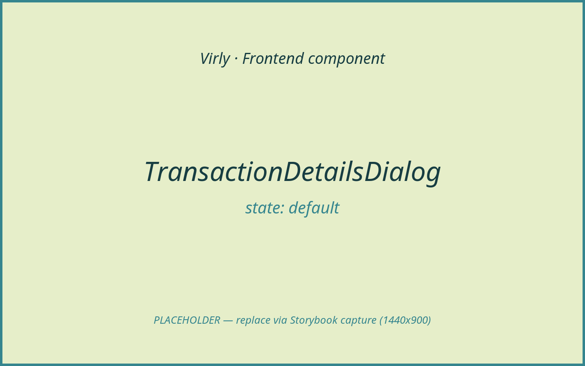
*Open dialog with the receipt centred over a dimmed page.*

**Purpose & context**

The shared "view this transaction" overlay used by the dashboard, transactions
page, and profile shared-activity list. It opens whenever a non-null
`transaction` is passed, traps focus, locks body scroll, closes on Escape /
backdrop click, and restores focus to the previously-focused element on close.

**Anatomy**

- Backdrop (`role="presentation"`, closes on click).
- Dialog (`role="dialog"`, `aria-modal`, `aria-label="Transaction details"`)
  containing `TransactionReceipt`.

**Props / API**

| Prop | Type | Required | Default | Description |
|------|------|----------|---------|-------------|
| `transaction` | `Transaction \| null` | Yes | — | The transaction to show; `null` closes the dialog. |
| `onClose` | `() => void` | Yes | — | Called on Escape, backdrop click, or receipt actions. |

**State & data**

- Refs only (`dialogRef`, `previouslyFocusedRef`). No data fetching.

**Interactions & events**

- Open → focus first focusable; lock `body` scroll.
- Escape → `onClose`; Tab/Shift+Tab → wrap focus within the dialog.
- Backdrop click → `onClose`; inner click stops propagation.
- Close → restore previous focus + scroll.

**States & variants**

- `default` (open). Closed renders nothing (`AnimatePresence` exit).
  Loading/empty/error/success/disabled: N/A.

**Dependencies**

- Children: `TransactionReceipt`.
- Libraries: `framer-motion`.

**Accessibility**

Full modal semantics: `role="dialog"`, `aria-modal="true"`, focus trap, Escape
to close, focus restoration, body scroll lock. A strong reference example for
the rest of the app.

**Usage example**

```tsx
<TransactionDetailsDialog
  transaction={selectedTransaction}
  onClose={() => setSelectedTransaction(null)}
/>
```

**Related / used by**

Used by `DashboardPage`, `TransactionsPage`, `AccountStatement`, and
`RecentRelationshipTransactions`. Wraps `TransactionReceipt`.

**Notes / gotchas**

The focus trap re-focuses the dialog itself if no focusable children exist,
preventing focus escaping to the page behind.

---

### TransactionList

- **Path:** `client/src/components/TransactionList.tsx`
- **Category:** feature | **Feature area:** Transactions / History | **Tier:** Full
- **Summary:** The reusable transaction list: directional rows, counterparty
  links, amounts, optional pagination, and an empty state.

**Screenshot(s)**

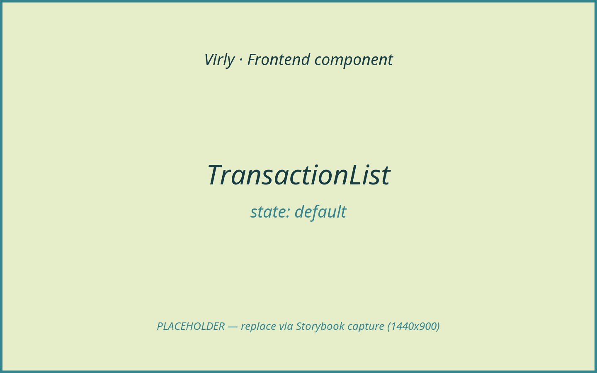
*Rows with credit/debit marks, counterparty links, and pagination.*

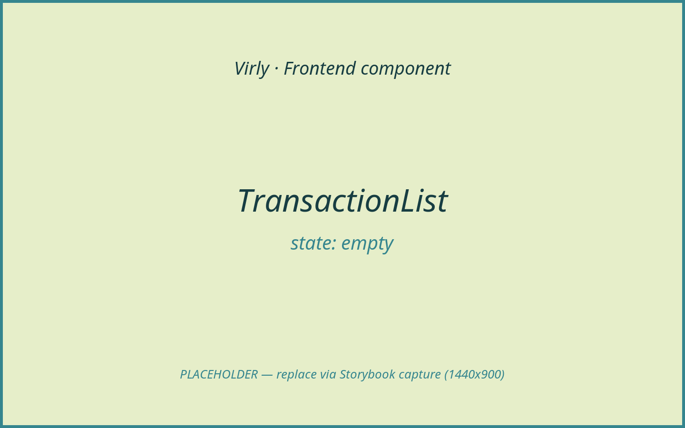
*Empty state with a "Transfer" CTA.*

**Purpose & context**

Renders a list of `Transaction`s with credit/debit styling. Each row links the
counterparty to their profile and (when selectable) opens the receipt dialog. It
supports compact mode and optional pagination controls.

**Anatomy**

- Empty branch: `EmptyState` + transfer CTA.
- Per row: direction mark, counterparty link + reason/relative date, signed
  amount + "Completed".
- Optional pagination nav (Previous / page indicator / Next).

**Props / API**

| Prop | Type | Required | Default | Description |
|------|------|----------|---------|-------------|
| `transactions` | `Transaction[]` | Yes | — | Rows to render. |
| `pagination` | `Pagination` | No | — | Enables the pager (with `page`/`onPageChange`). |
| `page` | `number` | No | — | Current page (for the pager). |
| `onPageChange` | `(page: number) => void` | No | — | Page change handler. |
| `compact` | `boolean` | No | `false` | Compact spacing variant. |
| `onTransactionSelect` | `(transaction: Transaction) => void` | No | — | Makes rows selectable (opens the dialog). |

**State & data**

- No local state; uses `useCurrency().formatAmount`.

**Interactions & events**

- Row click/Enter/Space (when `onTransactionSelect`) → select; clicks on the
  inner counterparty link are excluded from selection.
- Pager → `onPageChange`.

**States & variants**

- `default`, `empty`, `compact`, paginated. Loading is owned by the parent.
  Error/success/disabled: N/A (pager buttons disable at bounds).

**Dependencies**

- Children: `Button`, `EmptyState`, `Link`, `lucide-react`.
- Helper: `formatRelativeDate`, `useCurrency`.

**Accessibility**

Selectable rows are `role="button"`, `tabIndex={0}`, keyboard-activatable;
counterparty links carry `aria-label`; pager nav is labelled. Direction marks
are `aria-hidden`.

**Usage example**

```tsx
<TransactionList
  transactions={response?.transactions ?? []}
  pagination={response?.pagination}
  page={page}
  onPageChange={setPage}
  onTransactionSelect={setSelectedTransaction}
/>
```

**Related / used by**

Rendered by `TransactionsPage`. (The dashboard uses `AccountStatement` instead.)

**Notes / gotchas**

A positive `amount` is treated as a credit (received); negative as a debit
(sent). The "Completed" label is static — the list only renders settled ledger
entries.

---

### TransactionReceipt

- **Path:** `client/src/components/TransactionReceipt.tsx`
- **Category:** feature | **Feature area:** Transactions / History | **Tier:** Full
- **Summary:** A printed-receipt rendering of a single transaction (amount,
  parties, memo, auth code, barcode) with an animated "Paid/Received" stamp.

**Screenshot(s)**

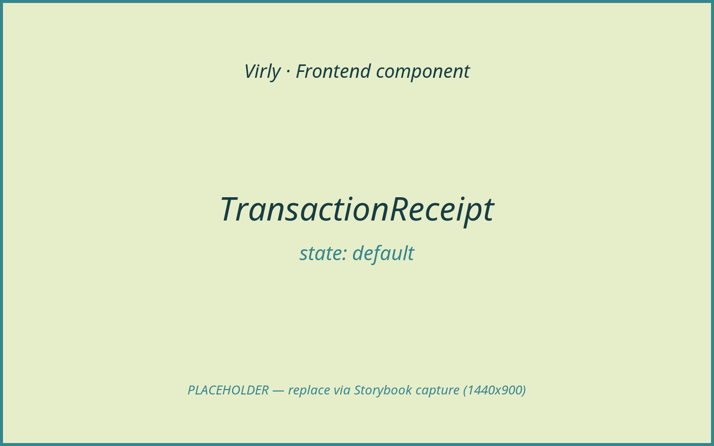
*Receipt for a debit ("Paid") with rows + barcode.*

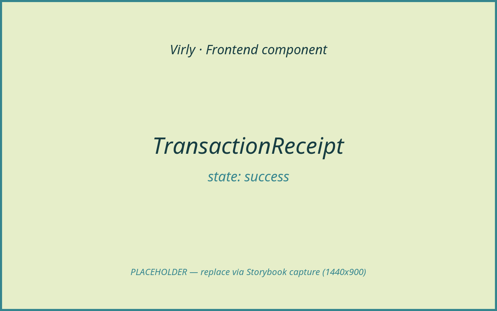
*Credit variant ("Received") stamp.*

**Purpose & context**

The content of `TransactionDetailsDialog`. It presents a transaction as a paper
receipt: hero amount, "money sent/received" direction, a rows section
(from/to, memo, date, optional FX "entered as", auth code), a totals block (no
fees), a deterministic barcode derived from the transaction id, and actions
(Done / View profile).

**Anatomy**

- Close button + animated paper (`paper`/`line`/`stamp` variants).
- Stamp ("Paid"/"Received"), merchant header, hero amount, rows, totals,
  barcode, footer, actions.

**Props / API**

| Prop | Type | Required | Default | Description |
|------|------|----------|---------|-------------|
| `transaction` | `Transaction` | Yes | — | The transaction to render. |
| `onClose` | `() => void` | Yes | — | Closes the dialog (Done / View profile). |

**State & data**

- `useMemo` for the deterministic barcode widths; `useCurrency().formatAmount`.
  No data fetching.

**Interactions & events**

- "Done" → `onClose`.
- "View profile" → `/users/:counterparty` (also calls `onClose`).

**States & variants**

- `default` (debit "Paid"), `success` (credit "Received"), FX variant (shows
  "Entered as"). Loading/empty/error/disabled: N/A.

**Dependencies**

- Libraries: `framer-motion`, `react-router-dom`, `lucide-react`.
- Helper: `formatDate`, `useCurrency`.

**Accessibility**

Close button has `aria-label`; decorative paper/stamp/barcode are `aria-hidden`.
The receipt is mounted inside the dialog's focus trap. TODO: ensure the amount
and parties are announced (currently visual text).

**Usage example**

```tsx
<TransactionReceipt transaction={transaction} onClose={onClose} />
```

**Related / used by**

Rendered by `TransactionDetailsDialog`.

**Notes / gotchas**

The barcode is derived from the transaction id, so every receipt prints a unique
but reproducible pattern. Fees are always shown as zero ("No fees, ever").

---

### TransactionsPage

- **Path:** `client/src/features/transactions/TransactionsPage.tsx`
- **Category:** page | **Feature area:** Transactions / History | **Tier:** Full
- **Summary:** The full transaction history page with a counterparty filter and
  server pagination.

**Screenshot(s)**

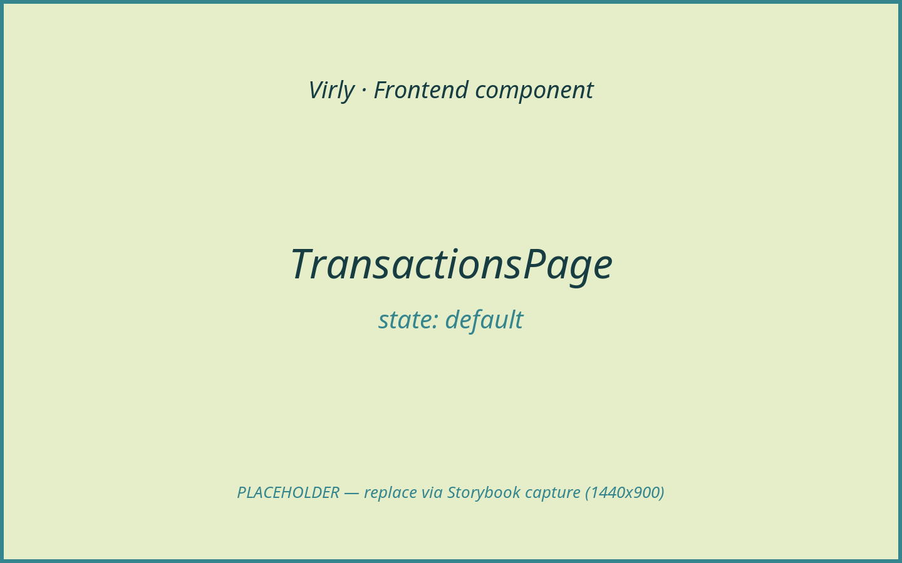
*Filter bar + paginated transaction list.*

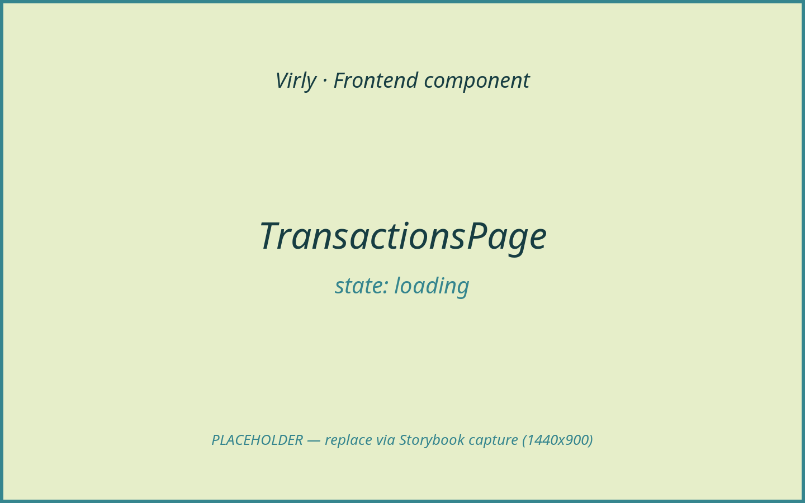
*Skeleton while a page loads.*


*No results for the current filter.*

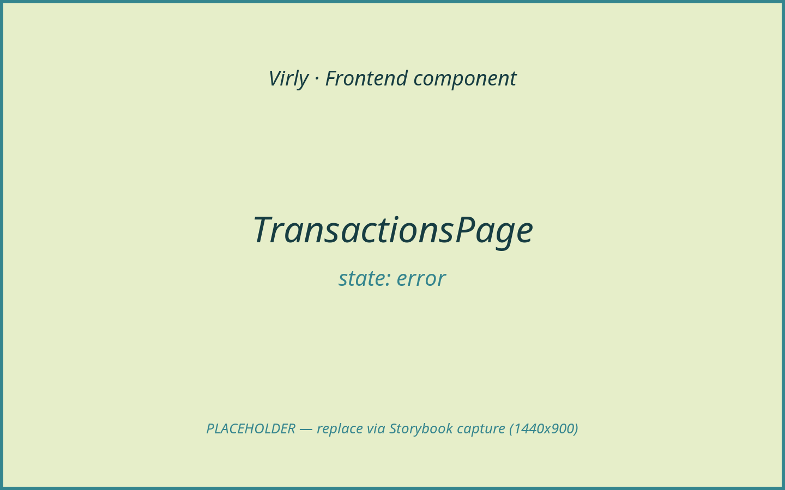
*Load error (`ErrorBanner`).*

**Purpose & context**

The dedicated history view. It fetches a page of transactions (optionally
filtered by counterparty email), renders them via `TransactionList`, and opens
the receipt dialog on row selection. Filtering and paging re-fetch from the
server.

**Anatomy**

- `PageHeader` ("Transactions").
- Filter card: counterparty `Field` + Filter / Reset buttons.
- Error banner.
- List card: `Skeleton` while loading, else `TransactionList`.
- `TransactionDetailsDialog`.

**Props / API**

None.

**State & data**

- Local state: `response`, `page`, `counterparty`, `activeCounterparty`,
  `error`, `filterError`, `isLoading`, `selectedTransaction`.
- Hooks: `useState`, `useEffect`.
- Data: `api.transactions({ page, limit, counterparty })` →
  `GET /api/transactions?page&limit&counterparty`.

**Interactions & events**

- Filter submit → `validateEmail` (if filled) → set active filter + reset to
  page 1.
- Reset → clear filter + page.
- Row select → open dialog.
- Pager (in `TransactionList`) → `setPage`.

**States & variants**

- `default`, `loading` (`Skeleton`), `empty` (list empty state), `error`. Filter
  validation error shows under the field. Success/disabled: N/A.

**Dependencies**

- Children: `TransactionList`, `TransactionDetailsDialog`, plus `Primitives`
  (`Button`, `Card`, `ErrorBanner`, `Field`, `PageHeader`, `PageStack`,
  `Skeleton`).
- Helper: `validateEmail`.

**Accessibility**

Filter is a labelled `Field`; the list and pager provide their own semantics;
errors use `ErrorBanner`.

**Usage example**

```tsx
<Route path="/transactions" element={<TransactionsPage />} />
```

**Related / used by**

Routed inside the protected shell. Reached from nav, the dashboard "View all",
and post-transfer success.

**Notes / gotchas**

The filter normalises the counterparty email server-side; an invalid email is
caught client-side before the request is issued.
