# Transfers

The transfers area is where money is prepared and sent. Its centrepiece is the
cheque metaphor: the user "writes a cheque" (form), "reviews" it (with an
authoritative server quote for non-ILS amounts), then "signs & sends". This
area also includes the user-profile / recipient cluster (`features/users/*`),
which is the recipient-context surface — verification status, relationship
history, and a "Transfer" CTA that prefills the recipient into the same cheque
flow.

**Architecture, in one line:** the UI only *prepares and initiates* a transfer.
The Node/Express + MongoDB backend is authoritative for balances and is the only
thing that moves money. A transfer executes solely when the user confirms and
the client calls the execution endpoint (`POST /api/transactions`); the
recipient cards and profile page never debit a balance — they only seed the
form. Every component below carries the **Architecture constraints** callout.

> Screenshots are placeholders pending Storybook capture; filenames follow the
> final convention.

## Components in this area

- [EmptyRelationshipState](#emptyrelationshipstate)
- [RecipientStatusCard](#recipientstatuscard)
- [RelationshipSummaryCard](#relationshipsummarycard)
- [TransferCheque](#transfercheque)
- [TransferPage](#transferpage)
- [TransferQuoteSmallPrint](#transferquotesmallprint)
- [UserProfileHeader](#userprofileheader)
- [UserProfilePage](#userprofilepage)

---

### EmptyRelationshipState

- **Path:** `client/src/features/users/EmptyRelationshipState.tsx`
- **Category:** feature | **Feature area:** Transfers | **Tier:** Full
- **Summary:** Empty-state card shown on a profile when you and the viewed user
  have no shared transactions, with an optional "Transfer" CTA.

**Screenshot(s)**

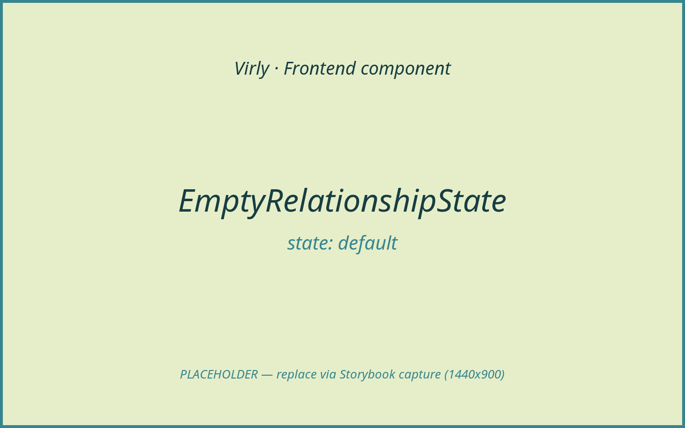
*No shared history, with a Transfer CTA when transfers are allowed.*

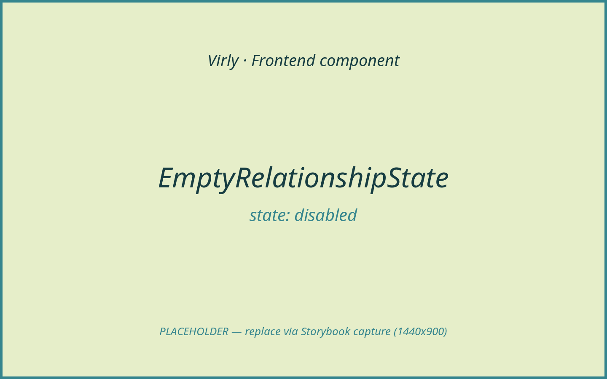
*Same card without the CTA when `canSendMoney` is false.*

> **Architecture constraints**
>
> - Backend is authoritative; this component does not mutate balances client-side.
> - The "Transfer" CTA only prefills the recipient and opens the transfer flow;
>   the explicit confirmation + `POST /api/transactions` still gate execution.
> - AI Assistant: N/A.

**Purpose & context**

Rendered by `UserProfilePage` when `relationship.transactionCount === 0`. It
invites the viewer to start a relationship by sending a first transfer.

**Anatomy**

A `card` wrapping `EmptyState` (HandCoins icon, title/message) with an optional
`Button` ("Transfer").

**Props / API**

| Prop | Type | Required | Default | Description |
|------|------|----------|---------|-------------|
| `viewedName` | `string` | Yes | — | Display name of the viewed user. |
| `canSendMoney` | `boolean` | Yes | — | Whether to render the Transfer CTA. |
| `onSendMoney` | `() => void` | Yes | — | Prefills recipient + navigates to transfer. |

**State & data**

None (presentational).

**Interactions & events**

"Transfer" button → `onSendMoney` (parent prefills + navigates).

**States & variants**

- `default` (CTA present), `disabled` (no CTA when `canSendMoney` is false).
  Loading/empty/error/success: N/A.

**Dependencies**

- Children: `EmptyState`, `Button`, `lucide-react` `HandCoins`.

**Accessibility**

`aria-label="No shared history"` on the section; `EmptyState` provides heading +
message.

**Usage example**

```tsx
<EmptyRelationshipState
  viewedName={user.displayName}
  canSendMoney={relationship.canTransferToUser}
  onSendMoney={handleSendMoney}
/>
```

**Related / used by**

Rendered by `UserProfilePage`. Sibling of `RelationshipSummaryCard`.

**Notes / gotchas**

`canSendMoney` derives from the server's `relationship.canTransferToUser`; the
client trusts the server's eligibility decision.

---

### RecipientStatusCard

- **Path:** `client/src/features/users/RecipientStatusCard.tsx`
- **Category:** feature | **Feature area:** Transfers | **Tier:** Full
- **Summary:** Sidebar card summarising whether the viewed user is a verified
  recipient and whether you can transfer to them.

**Screenshot(s)**

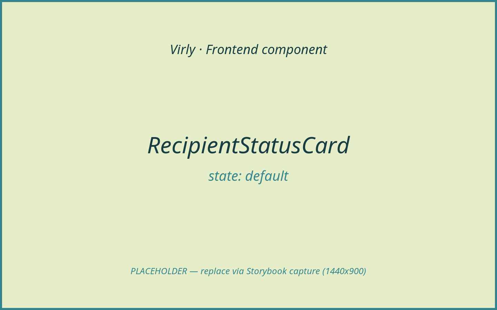
*Verified recipient with a Transfer CTA.*

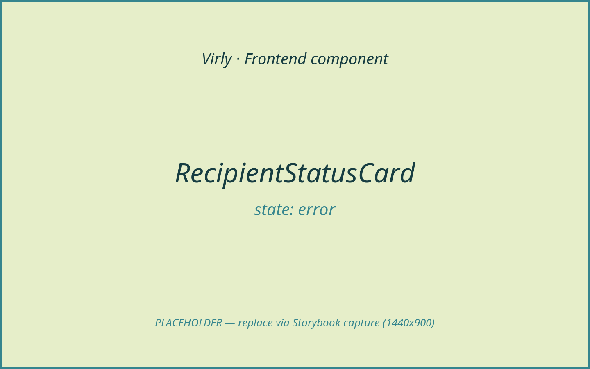
*"Not verified yet" — transfers allowed but flagged for extra care.*

> **Architecture constraints**
>
> - Backend is authoritative; verification + transfer eligibility come from the
>   server (`relationship.isVerifiedRecipient`, `canTransferToUser`).
> - The "Transfer" CTA only prefills the recipient; execution still requires the
>   explicit confirmation and `POST /api/transactions`.
> - AI Assistant: N/A.

**Purpose & context**

Rendered in the profile sidebar for users other than yourself. It maps the
relationship status to a verified / not-verified / self message and offers a
Transfer CTA when allowed.

**Anatomy**

Status head (icon + title from `getStatusCopy`), message paragraph, optional
`Button` ("Transfer").

**Props / API**

| Prop | Type | Required | Default | Description |
|------|------|----------|---------|-------------|
| `relationship` | `UserRelationshipSummary` | Yes | — | Server relationship summary. |
| `viewedName` | `string` | Yes | — | Display name of the viewed user. |
| `onSendMoney` | `() => void` | Yes | — | Prefills recipient + navigates to transfer. |

**State & data**

None; copy is derived from `relationship.relationshipStatus` /
`isVerifiedRecipient`.

**Interactions & events**

"Transfer" button (when `canTransferToUser`) → `onSendMoney`.

**States & variants**

- `default` (verified recipient), `error`-toned "not verified yet" warning,
  `self` (own account). CTA hidden when `canTransferToUser` is false.

**Dependencies**

- Children: `Button`, `lucide-react` (`BadgeCheck`, `CircleHelp`, `Send`,
  `UserCircle2`).

**Accessibility**

`aria-label="Recipient status"`; icons `aria-hidden`. The verified state gets a
distinct icon style.

**Usage example**

```tsx
<RecipientStatusCard
  relationship={relationship}
  viewedName={user.displayName}
  onSendMoney={handleSendMoney}
/>
```

**Related / used by**

Rendered by `UserProfilePage` (sidebar). Complements `RelationshipSummaryCard`.

**Notes / gotchas**

For unverified recipients the copy explicitly tells the user to double-check the
email before sending — a deliberate anti-misdirection nudge.

---

### RelationshipSummaryCard

- **Path:** `client/src/features/users/RelationshipSummaryCard.tsx`
- **Category:** feature | **Feature area:** Transfers | **Tier:** Full
- **Summary:** Stats card summarising money sent/received and the net balance
  between you and the viewed user.

**Screenshot(s)**

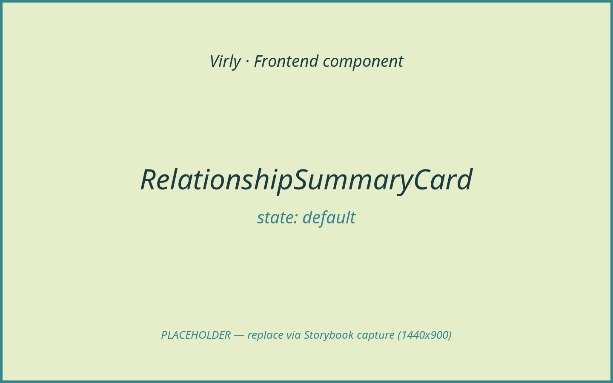
*Sent / received / net stats plus transaction count and last interaction.*

> **Architecture constraints**
>
> - Backend is authoritative; all totals come from the server relationship
>   summary (`totalSentToUser`, `totalReceivedFromUser`, `netAmount`).
> - This card is display-only — it neither initiates nor confirms transfers.
> - AI Assistant: N/A.

**Purpose & context**

Shown on a profile when there is shared history. It presents directional totals
(you sent / you received / net) and metadata (transaction count, last
interaction date), formatting amounts in the user's display currency.

**Anatomy**

Section heading ("Between you and {name}"), three stat tiles (sent / received /
net with a Scale icon), and a meta list (transactions, last interaction).

**Props / API**

| Prop | Type | Required | Default | Description |
|------|------|----------|---------|-------------|
| `relationship` | `UserRelationshipSummary` | Yes | — | Server relationship summary. |
| `viewedName` | `string` | Yes | — | Display name of the viewed user. |

**State & data**

- No local state; uses `useCurrency().formatAmount`.
- Net label is derived from the sign of `relationship.netAmount`.

**Interactions & events**

None (display-only).

**States & variants**

- `default` only (rendered solely when `transactionCount > 0`). The "Even" net
  label appears when net is zero. Loading/empty/error/disabled: N/A.

**Dependencies**

- Children: `lucide-react` (`ArrowUpRight`, `ArrowDownLeft`, `Scale`).
- Helper: `formatDate`, `useCurrency`.

**Accessibility**

`aria-label="Activity between you and {name}"`; stat icons `aria-hidden`; meta
list uses `<dl>`/`<dt>`/`<dd>`.

**Usage example**

```tsx
<RelationshipSummaryCard relationship={relationship} viewedName={user.displayName} />
```

**Related / used by**

Rendered by `UserProfilePage` alongside `RecentRelationshipTransactions`
(documented under Transactions / History).

**Notes / gotchas**

`formatAmount` converts the authoritative ILS figures into the selected display
currency; the underlying ledger values stay ILS.

---

### TransferCheque

- **Path:** `client/src/components/TransferCheque.tsx`
- **Category:** form | **Feature area:** Transfers | **Tier:** Full
- **Summary:** The bank-cheque surface that is editable in "form" mode and
  read-only in "review"/"success" mode (stamped "Cleared" on success).

**Screenshot(s)**

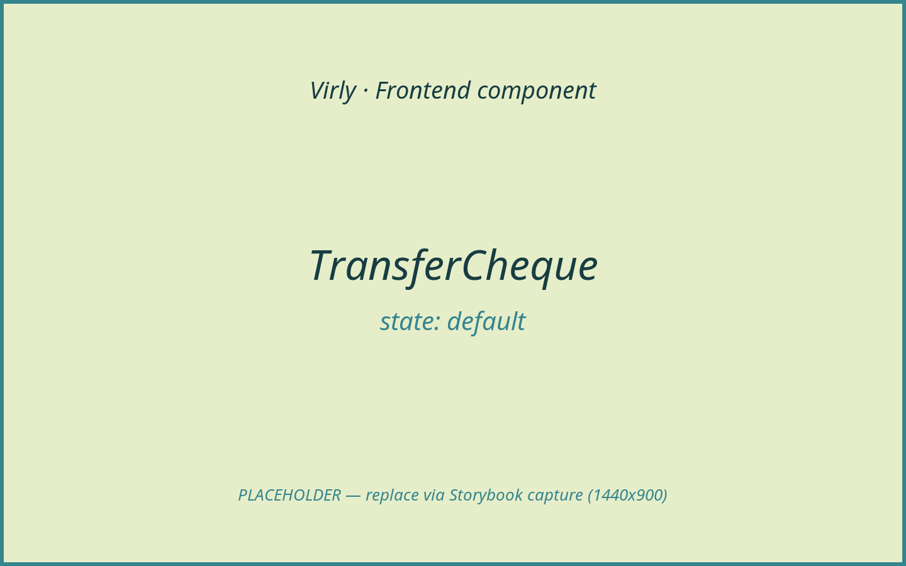
*Form mode: editable payee, amount, currency, and memo.*

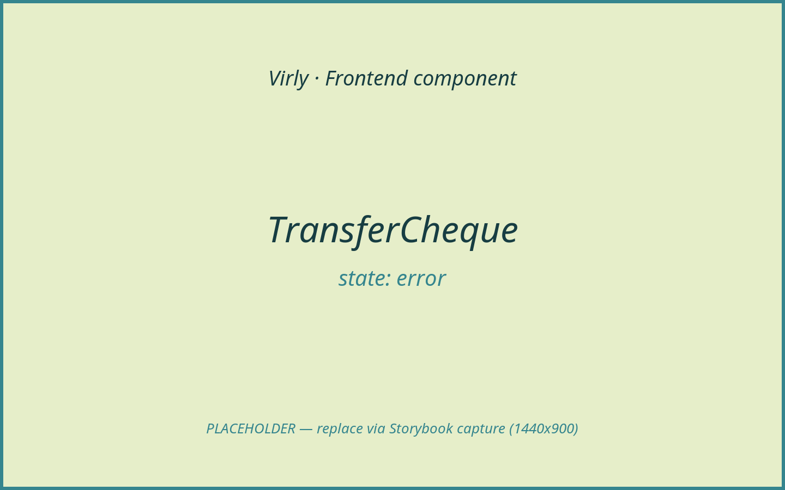
*Form mode with recipient/amount validation errors.*

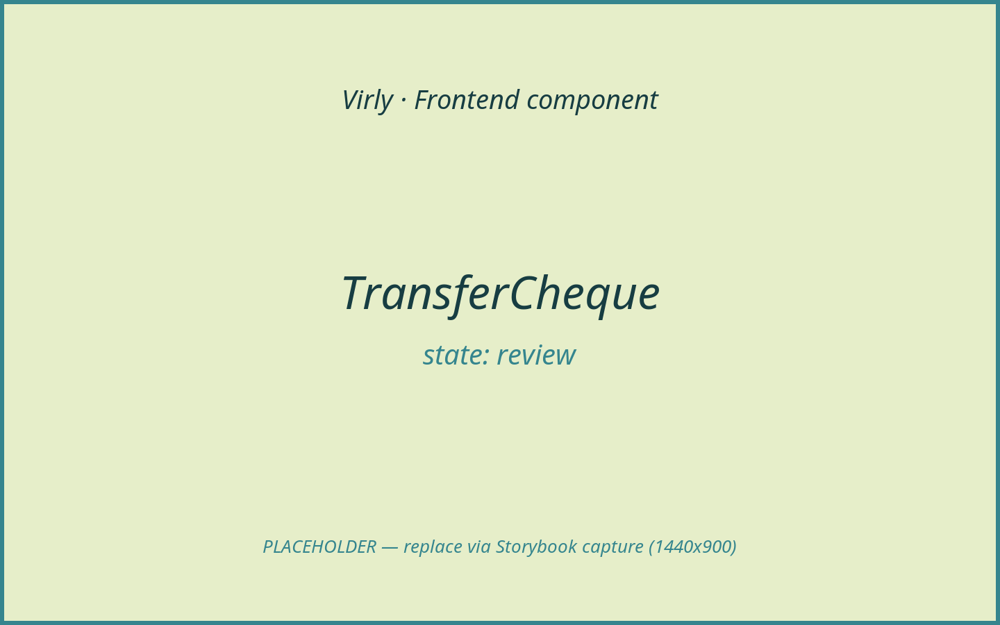
*Review mode: read-only cheque with a linked payee.*

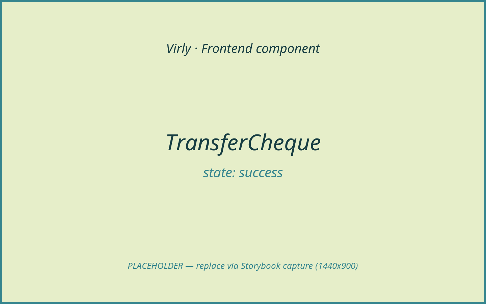
*Success mode: "Cleared" stamp animation.*

> **Architecture constraints**
>
> - Backend is authoritative; this component holds no balance and moves no money.
> - It is the *input surface* for a transfer; the explicit confirmation lives on
>   `TransferPage` ("Sign & send"), which calls `POST /api/transactions`. The
>   cheque itself never calls the API.
> - AI Assistant: N/A.

**Purpose & context**

Virly's signature transfer UI. In `form` mode the payee, amount, currency, and
memo are controlled inputs; in `review`/`success` mode the same values render as
static cheque text (the payee becomes a profile link, success stamps "Cleared").
All state is owned by `TransferPage`.

**Anatomy**

- Watermark + guilloche + (success) "Cleared" stamp.
- Header: brand + cheque number + date.
- Pay line: recipient (input or link) + amount box (currency glyph + figure).
- Amount-in-words line (`amountInWords`).
- Currency `<select>` (form mode only).
- Footer: memo (input/static) + signature line.
- MICR strip.

**Props / API**

| Prop | Type | Required | Default | Description |
|------|------|----------|---------|-------------|
| `mode` | `TransferChequeMode` (`"form" \| "review" \| "success"`) | Yes | — | Drives editable vs read-only + the stamp. |
| `chequeNumber` | `string` | Yes | — | Serial shown top-right and in MICR. |
| `issueDate` | `string` | Yes | — | Pre-formatted issue date. |
| `holderEmail` | `string \| null` | No | — | Source of the signature name. |
| `currency` | `DisplayCurrency` | Yes | — | Glyph, words, and picker value. |
| `payee` | `string` | Yes | — | Finalised recipient (linked in review/success). |
| `recipientEmail` | `string` | Yes | — | Controlled recipient (form mode). |
| `amount` | `string` | Yes | — | Controlled amount string. |
| `reason` | `string` | Yes | — | Controlled / static memo. |
| `errors` | `TransferChequeErrors` | No | `{}` | `recipientEmail` / `amount` / `reason` messages. |
| `onRecipientEmailChange` | `(value: string) => void` | No | — | Recipient input handler. |
| `onAmountChange` | `(value: string) => void` | No | — | Amount input handler. |
| `onReasonChange` | `(value: string) => void` | No | — | Memo input handler. |
| `onCurrencyChange` | `(currency: DisplayCurrency) => void` | No | — | Currency picker handler. |

**State & data**

- No local state; derives `holderName`, `hasAmount`, words, and a formatted
  figure. No data fetching.

**Interactions & events**

- Form mode: input changes call the matching `on*Change` callback.
- Review/success: payee renders as a `Link` to `/users/:payee`.

**States & variants**

- `default` (form), `error` (form with errors), `review` (read-only),
  `success` ("Cleared" stamp). Disabled/loading: N/A (the parent disables
  buttons).

**Dependencies**

- Libraries: `framer-motion`, `react-router-dom`.
- Helpers: `amountInWords`, currency labels/glyphs. Styling: `cheque-*`
  (`global.css`).

**Accessibility**

Inputs are labelled via `aria-label` (e.g. "Amount in Shekels"); error spans
render adjacent to fields; `aria-invalid` reflects errors; decorative elements
(`watermark`, `guilloche`, `stamp`, `MICR`) are `aria-hidden`. TODO: associate
field errors with inputs via `aria-describedby`.

**Usage example**

```tsx
<TransferCheque
  mode={step}
  chequeNumber={chequeNumber}
  issueDate={issueDate}
  currency={currency}
  payee={payee}
  recipientEmail={recipientEmail}
  amount={amount}
  reason={reason}
  errors={errors}
  onRecipientEmailChange={setRecipientEmail}
  onAmountChange={setAmount}
  onReasonChange={setReason}
  onCurrencyChange={(next) => { setCurrency(next); setQuote(null); }}
/>
```

**Related / used by**

Rendered by `TransferPage` across all three steps. Pairs with
`TransferQuoteSmallPrint` in review mode.

**Notes / gotchas**

`mode` is the single switch for editable vs static rendering — the same markup
serves all three steps, which keeps the cheque visually stable as it "clears".

---

### TransferPage

- **Path:** `client/src/features/transfer/TransferPage.tsx`
- **Category:** page | **Feature area:** Transfers | **Tier:** Full
- **Summary:** The three-step transfer flow (form → review → success) built
  around the cheque, with server-quoted FX for non-ILS amounts.

**Screenshot(s)**

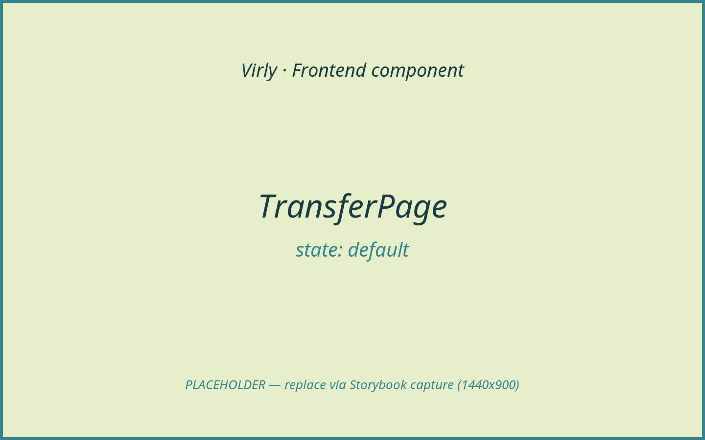
*Form step: cheque + recent payees + "Review cheque".*


*Review step: quote small-print + projected balance + "Sign & send".*


*Success step: cleared cheque + new balance.*

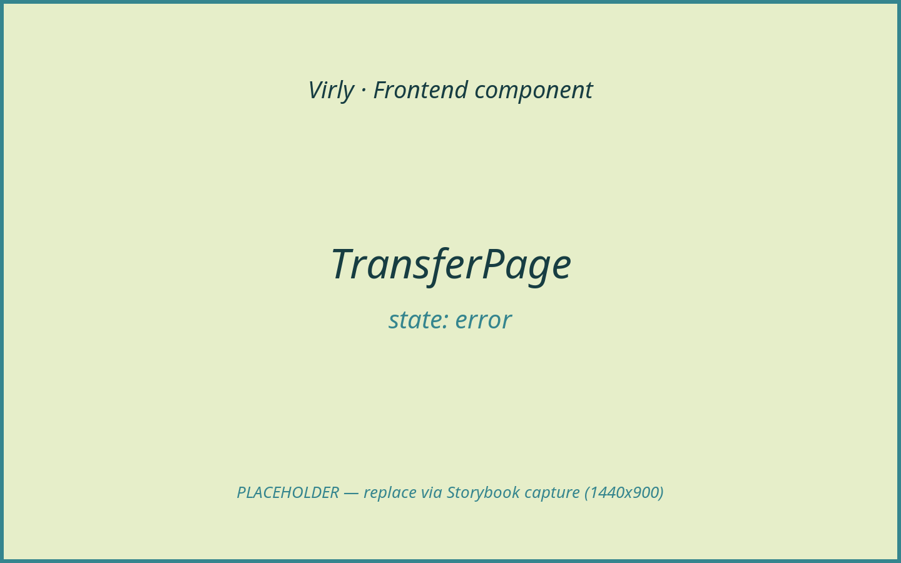
*Form step with server/validation errors (e.g. insufficient balance).*

> **Architecture constraints**
>
> - Backend is authoritative; the page never debits a balance locally — it
>   updates `AuthProvider` only from the server's `response.newBalance`.
> - **Explicit confirmation gate:** the transfer executes only on the review
>   step's "Sign & send", which calls `api.transfer` → `POST /api/transactions`.
>   The form/review steps prepare the request; nothing before "Sign & send"
>   moves money. For non-ILS amounts the review step first fetches an
>   authoritative quote (`POST /api/transactions/quote`); a `409` (rate changed)
>   refreshes the quote and asks the user to confirm the new figure.
> - AI Assistant: N/A.

**Purpose & context**

The primary money-movement flow. It fetches the account summary (balance +
recent payees), validates the draft, prepares an FX quote when needed, and on
explicit confirmation submits the transfer. The balance side panel projects the
post-transfer balance from the authoritative balance and the (quoted or
estimated) ILS amount.

**Anatomy**

- `PageHeader` ("Write a cheque").
- Cheque panel: `AnimatePresence` over the three steps, each rendering
  `TransferCheque` plus step-specific chrome (recent-payee chips, quote
  small-print, projection, success banner, action buttons).
- Balance aside card: current balance + projected after-transfer balance.

**Props / API**

None.

**State & data**

- Local state: `recipientEmail`, `amount`, `currency`, `reason`, `errors`,
  `step` (`"form" | "review" | "success"`), `isSubmitting`, `summary`, `quote`,
  `quoteNotice`, `result`.
- Hooks: `useAuth`, `useCurrency`, `useNavigate`, `useEffect`, `useMemo`.
- Data: `api.accountSummary` (mount); `api.transferQuote`
  (`POST /api/transactions/quote`) on review for non-ILS; `api.transfer`
  (`POST /api/transactions`) on confirm.

**Interactions & events**

- `handleReview` → validate → (ILS: go to review) / (non-ILS: fetch quote → review).
- `handleSubmit` (Sign & send) → `api.transfer` → `auth.updateBalance` → success;
  `409` → refresh quote + notice; field/`404`/`400` errors → back to form.
- Recent-payee chip → set recipient.
- Success actions → navigate `/transactions` or reset the form.

**States & variants**

- `default`/`form`, `loading` ("Preparing quote…" / "Sending…"), `review`,
  `success`, `error`. Empty/disabled: buttons disabled while `isSubmitting`.

**Dependencies**

- Children: `TransferCheque`, `TransferQuoteSmallPrint`, `Button`, `Card`,
  `ErrorBanner`, `SuccessBanner`, `PageHeader`, `PageStack`, `ResponsiveGrid`.
- Libraries: `framer-motion`, `react-router-dom`.
- Helpers: `validateEmail`/`validateAmount`/`validateReason`, `getQuickContacts`,
  currency conversion helpers.

**Accessibility**

Cheque inputs labelled via `TransferCheque`; banners carry `role`; the balance
panel exposes the current/projected balance as text. TODO: move focus to the
review actions when the step changes.

**Usage example**

```tsx
<Route path="/transfer" element={<TransferPage />} />
```

**Related / used by**

Routed inside the protected shell. Entry points that prefill the recipient:
`QuickContacts`, `UserProfileHeader`/`RecipientStatusCard`/`EmptyRelationshipState`
(via `virly-prefill-recipient`).

**Notes / gotchas**

- The self-transfer guard rejects sending to your own email client-side.
- The pre-review ILS estimate is a convenience; the server quote is
  authoritative and is what is submitted.
- A `409` on submit means the daily FX rate changed between quote and confirm —
  the user must re-confirm the refreshed amount.

---

### TransferQuoteSmallPrint

- **Path:** `client/src/features/transfer/TransferQuoteSmallPrint.tsx`
- **Category:** feature | **Feature area:** Transfers | **Tier:** Full
- **Summary:** The disclosure line under a non-ILS review showing the actual ILS
  ledger amount, the rate used, and the rate date.

**Screenshot(s)**


*Actual ILS amount + entered→ILS rate + rate date.*

> **Architecture constraints**
>
> - Backend is authoritative; the displayed ILS amount and rate are the server's
>   quote (`TransferQuote`), not a client computation.
> - It is informational only; it neither initiates nor confirms the transfer.
> - AI Assistant: N/A.

**Purpose & context**

Renders the small print in the review step so the user sees exactly how much ILS
will leave the account and at what rate before confirming. For ILS quotes it
renders nothing (no conversion happens).

**Anatomy**

A single `<p class="transfer-quote-small-print">` with the ILS amount, the
`enteredCurrency → ILS` rate, and the rate date.

**Props / API**

| Prop | Type | Required | Default | Description |
|------|------|----------|---------|-------------|
| `quote` | `TransferQuote` | Yes | — | Server quote (amount, rate, dates). |

**State & data**

None. Returns `null` when `quote.enteredCurrency === "ILS"`.

**Interactions & events**

None.

**States & variants**

- `default` (non-ILS quote shown). For ILS the component renders nothing.
  Loading/empty/error/success/disabled: N/A.

**Dependencies**

- Helper: `formatCurrency`.

**Accessibility**

Plain text paragraph; inherits review-area context.

**Usage example**

```tsx
{quote ? <TransferQuoteSmallPrint quote={quote} /> : null}
```

**Related / used by**

Rendered by `TransferPage` in the review step.

**Notes / gotchas**

Falls back to `rateFetchedAt`'s date (or "today") when `rateValidForDate` is
absent.

---

### UserProfileHeader

- **Path:** `client/src/features/users/UserProfileHeader.tsx`
- **Category:** feature | **Feature area:** Transfers | **Tier:** Full
- **Summary:** Profile masthead: avatar, name + verified badge, email, member
  since, and a "Transfer" CTA when allowed.

**Screenshot(s)**


*Verified user with a Transfer CTA.*


*Own profile / not-allowed — no Transfer CTA.*

> **Architecture constraints**
>
> - Backend is authoritative; verification + eligibility come from the server.
> - The "Transfer" CTA only prefills the recipient and opens the cheque flow;
>   execution still requires confirmation + `POST /api/transactions`.
> - AI Assistant: N/A.

**Purpose & context**

The header of `UserProfilePage`. It identifies the viewed user and offers the
primary action — sending money — when `canSendMoney` is true.

**Anatomy**

Avatar image, identity block (name + optional verified badge, email, member
since, "this is your profile" note), optional Transfer `Button`.

**Props / API**

| Prop | Type | Required | Default | Description |
|------|------|----------|---------|-------------|
| `user` | `PublicUserProfile` | Yes | — | Public profile (name, email, verified, memberSince). |
| `isSelf` | `boolean` | Yes | — | Whether this is the viewer's own profile. |
| `canSendMoney` | `boolean` | Yes | — | Whether to show the Transfer CTA. |
| `onSendMoney` | `() => void` | Yes | — | Prefills recipient + navigates to transfer. |

**State & data**

None; formats `memberSince` via `Intl.DateTimeFormat`.

**Interactions & events**

"Transfer" button → `onSendMoney`.

**States & variants**

- `default` (CTA present), `disabled` (no CTA — self or not allowed), verified
  badge variant. Loading/empty/error/success: N/A.

**Dependencies**

- Children: `Button`, `lucide-react` (`BadgeCheck`, `Send`).
- Helper: `getUserAvatarUrl`.

**Accessibility**

`aria-label="User profile"`; avatar uses empty `alt` (decorative); badge icon
`aria-hidden`.

**Usage example**

```tsx
<UserProfileHeader
  user={user}
  isSelf={isSelf}
  canSendMoney={relationship.canTransferToUser}
  onSendMoney={handleSendMoney}
/>
```

**Related / used by**

Rendered by `UserProfilePage`.

**Notes / gotchas**

The avatar URL falls back to a generated initial-avatar SVG (`getUserAvatarUrl`)
when no avatar service is configured.

---

### UserProfilePage

- **Path:** `client/src/features/users/UserProfilePage.tsx`
- **Category:** page | **Feature area:** Transfers | **Tier:** Full
- **Summary:** Recipient/relationship profile reached from counterparty links;
  shows verification, shared history, and a transfer CTA.

**Screenshot(s)**


*Other user with shared history + recipient status sidebar.*


*Skeleton while the profile loads.*


*No shared history (`EmptyRelationshipState`).*


*Not found (`404`) / load error states.*

> **Architecture constraints**
>
> - Backend is authoritative; the page reads a server profile + relationship and
>   never computes eligibility or balances itself.
> - Its only money-related action is the "Transfer" CTA, which prefills the
>   recipient (`virly-prefill-recipient`) and navigates to `TransferPage`. The
>   transfer still requires explicit confirmation + `POST /api/transactions`.
> - AI Assistant: N/A.

**Purpose & context**

Opened from counterparty links across the app (`/users/:userId`). It fetches the
public profile + relationship summary, then composes the header, relationship
summary, shared transactions, recipient-status sidebar, and the appropriate
empty/self branches. The "Transfer" action funnels back into the cheque flow.

**Anatomy**

- Loading (`Skeleton`), `404` (`EmptyState`, UserX), and generic-error (retry)
  branches.
- `UserProfileHeader`.
- Self branch (account links) **or** history branch
  (`RelationshipSummaryCard` + `RecentRelationshipTransactions`) **or**
  `EmptyRelationshipState`.
- Sidebar: `RecipientStatusCard` (non-self).

**Props / API**

None. (Reads `:userId` from `useParams`.)

**State & data**

- Local state: `profile`, `error` (`{ status, message }`), `isLoading`,
  `reloadKey`.
- Hooks: `useParams`, `useNavigate`, `useCallback`, `useEffect`, `useState`.
- Data: `api.userProfile(userId)` → `GET /api/users/:idOrEmail/profile`.

**Interactions & events**

- Mount / `reloadKey` change → fetch profile.
- "Transfer" (`handleSendMoney`) → store `virly-prefill-recipient` →
  navigate `/transfer`.
- "Try again" → bump `reloadKey`.

**States & variants**

- `default` (other user with history), `loading`, `empty` (no history), `error`
  (`404` vs generic), `self` (own profile). Disabled/success: N/A.

**Dependencies**

- Children: `UserProfileHeader`, `RelationshipSummaryCard`,
  `RecentRelationshipTransactions`, `RecipientStatusCard`,
  `EmptyRelationshipState`, plus `Primitives` (`Card`, `EmptyState`,
  `ErrorBanner`, `PageHeader`, `PageStack`, `ResponsiveGrid`, `Skeleton`,
  `Button`).
- Loaded lazily by `App` (`React.lazy` + `Suspense`).

**Accessibility**

`PageHeader` provides the page heading; the `404` branch uses `EmptyState`;
errors use `ErrorBanner`.

**Usage example**

```tsx
<Route path="/users/:userId" element={<Suspense fallback={<RouteFallback />}><UserProfilePage /></Suspense>} />
```

**Related / used by**

Linked from `TransactionList`, `TransactionReceipt`, `QuickContacts`, and the
review/success cheque payee. Renders the rest of the `features/users/*` cluster.

**Notes / gotchas**

The `:userId` segment may be an id **or** an email (the API accepts either);
counterparty links pass the email.
