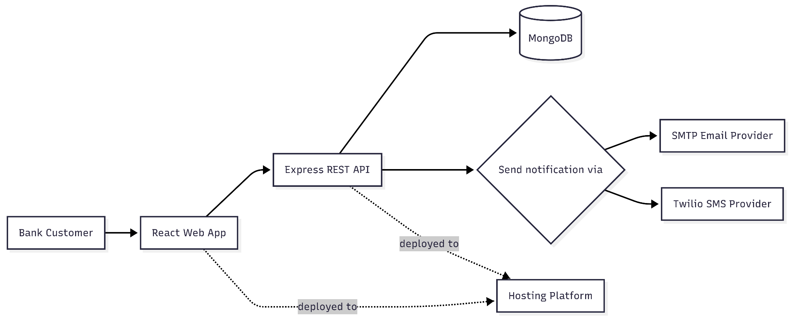
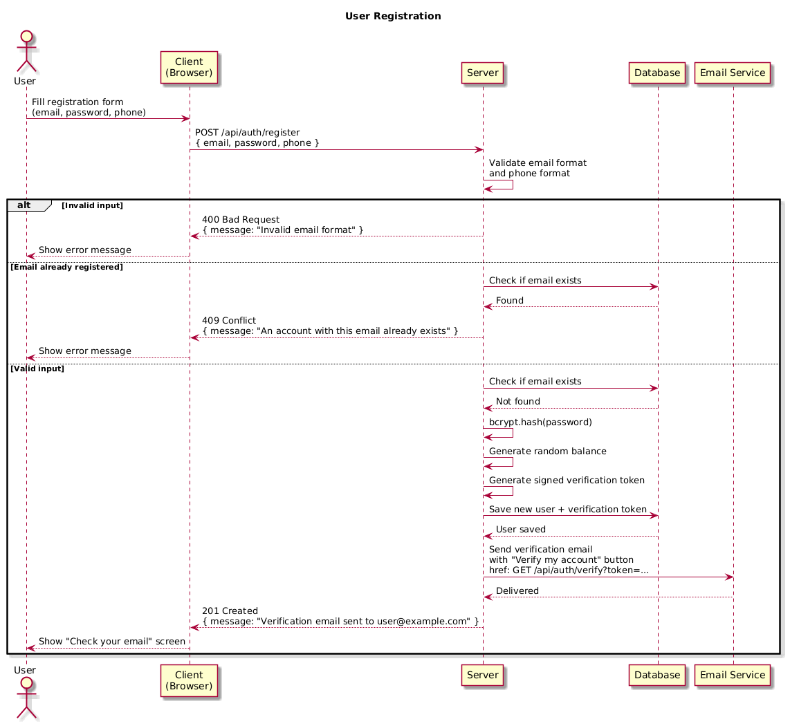
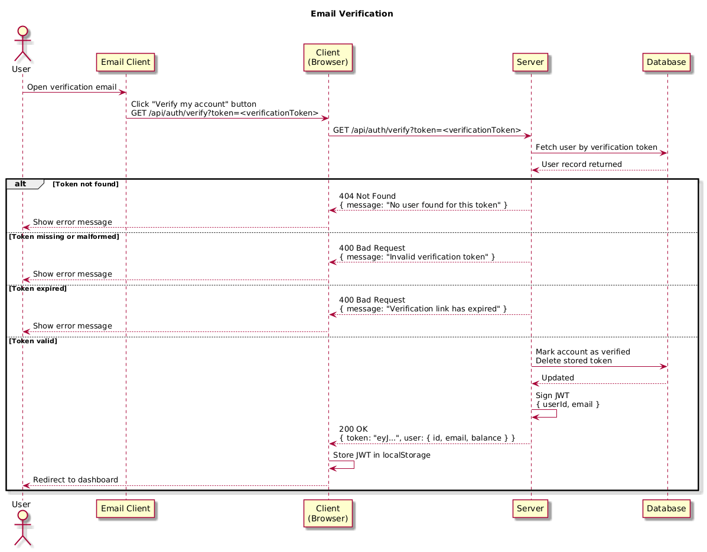
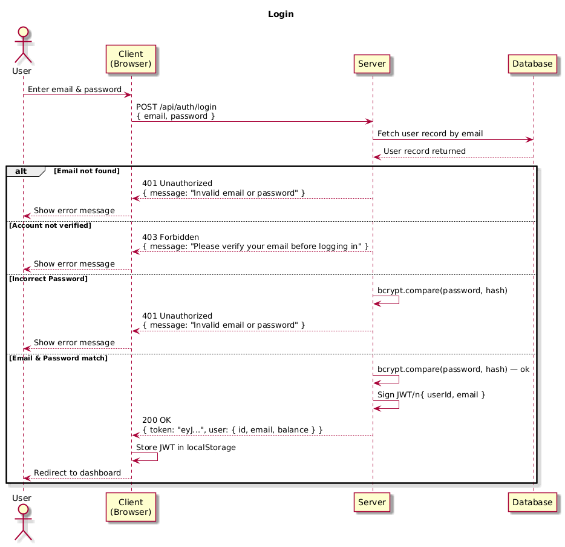
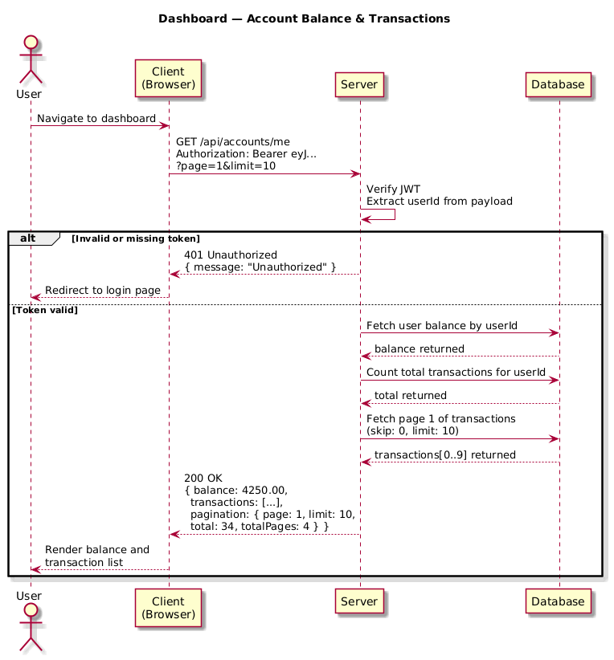
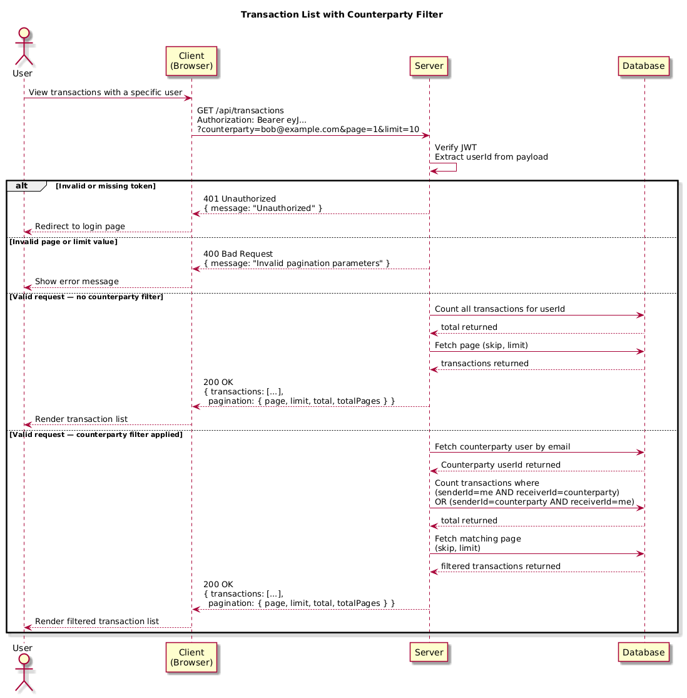
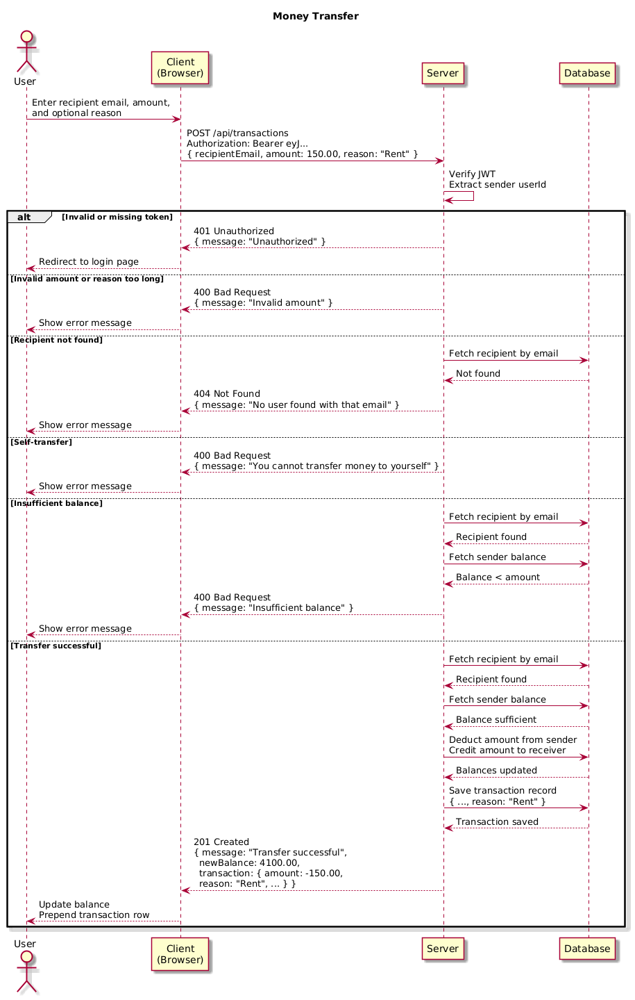

# Software Design Description
## For Web Banking Application

Version 1.0  
Web Banking Project  
April 2026

## Table of Contents
<!-- TOC -->
- [Software Design Description](#software-design-description)
  - [For Web Banking Application](#for-web-banking-application)
  - [Table of Contents](#table-of-contents)
  - [1. Introduction](#1-introduction)
    - [1.1 Document Purpose](#11-document-purpose)
    - [1.2 Subject Scope](#12-subject-scope)
    - [1.3 Definitions, Acronyms, and Abbreviations](#13-definitions-acronyms-and-abbreviations)
  - [2. Design Overview](#2-design-overview)
    - [2.1 API Design](#21-api-design)
    - [2.1.1 Authentication](#211-authentication)
    - [2.1.2 Endpoint Summary](#212-endpoint-summary)
  - [3. Design Views](#3-design-views)
    - [3.1 Context View](#31-context-view)
    - [3.2 API View](#32-api-view)
    - [3.3 Interaction View](#33-interaction-view)
      - [3.3.1 Interaction View: Registration and Email Verification](#331-interaction-view-registration-and-email-verification)
      - [3.3.2 Interaction View: Verification Link](#332-interaction-view-verification-link)
      - [3.3.3 Interaction View: Login](#333-interaction-view-login)
      - [3.3.4 Interaction View: Dashboard](#334-interaction-view-dashboard)
      - [3.3.5 Interaction View: Transaction List with Counterparty Filter](#335-interaction-view-transaction-list-with-counterparty-filter)
      - [3.3.6 Interaction View: Transfer](#336-interaction-view-transfer)


<!-- TOC -->

---

## 1. Introduction

### 1.1 Document Purpose

This Software Design Description (SDD) documents the architectural and detailed design of the backend server for the Web Banking Application. It serves as the single source of truth for anyone building, reviewing, or extending the system. The intended audiences are:

- **Developers** who implement or maintain any part of the backend codebase
- **Reviewers** who need to understand design decisions and their rationale
- **Testers** who need to understand the expected behaviour of each component

### 1.2 Subject Scope

The backend is a RESTful HTTP API server built with Node.js and Express. It is responsible for:

- Registering user accounts and delivering a verification link by email
- Authenticating the verification link click to activate the account
- Authenticating users with HttpOnly cookie sessions backed by signed JSON Web Tokens (JWT)
- Serving authenticated users their account balance and paginated transaction history
- Filtering transactions by counterparty
- Processing money transfers between registered accounts, with an optional reason field

### 1.3 Definitions, Acronyms, and Abbreviations

| Term               | Definition |
|--------------------|------------|
| API                | Application Programming Interface — a set of definitions and protocols for building and integrating application software |
| CORS               | Cross-Origin Resource Sharing — a browser mechanism that controls which origins may call an API |
| HTTP               | Hypertext Transfer Protocol — the communication protocol used between the client and server |
| JWT                | JSON Web Token — a compact, signed token used server-side to represent an authenticated identity |
| Auth cookie        | `virly_auth` — an HttpOnly, Secure, SameSite=Lax cookie containing the signed JWT session |
| CSRF cookie        | `virly_csrf` — a Secure, SameSite=Lax cookie readable by the frontend and echoed in `X-CSRF-Token` for unsafe authenticated requests |
| Verification token | A short-lived signed string embedded in the email verification link |
| Pagination         | A technique for splitting a large result set into discrete pages returned one at a time |
| REST               | Representational State Transfer — an architectural style for stateless HTTP APIs |
| SDD                | Software Design Document — a document describing the intended design of a software system |
| SMTP               | Simple Mail Transfer Protocol — the protocol used to send email messages |
| 

---

## 2. Design Overview

Virly follows a client-server web architecture. The React frontend owns browser routing, forms, dashboard presentation, local authentication state, and calls to the backend API. The Express backend owns validation, authentication, password hashing, verification-link handling, business rules, MongoDB persistence, and integration with email providers. MongoDB stores users, account state, verification state, and transaction records.


```
┌─────────────────────────────────────┐
│         Browser (React client)      │
└──────────────┬──────────────────────┘
               │  HTTP REST (JSON)
┌──────────────▼──────────────────────┐
│    Node.js / Express Server         │
│    http://localhost:3000/api        │
└──────┬─────────────────────────┬────┘
       │                         │    
┌──────▼──────────┐     ┌────────▼────────┐
│    MongoDB      │     │  SMTP Provider  │
│  ( Mongoose )   │     │  Verification   │
└─────────────────┘     │  email delivery │
                        └─────────────────┘
```

### 2.1 API Design

### 2.1.1 Authentication

All protected endpoints require the browser to send the `virly_auth` cookie:

```
Cookie: virly_auth=<JWT session>
```

The cookie is set by the backend with `HttpOnly`, `Secure`, `SameSite=Lax`, and `Path=/`. Login controls persistence with `rememberMe`: `true` adds a 30-day `Max-Age` and refreshes expiration on each successful login, while `false` or omitted uses browser-session cookies without `Max-Age`. Browser restore-session settings may preserve session cookies depending on the browser. The JWT payload contains only identity/session metadata:

```json
{
  "userId": "64a1b2c3d4e5f64840abcdef",
  "csrfTokenHash": "<sha256>",
  "iat": 1414000000,
  "exp": 1414086400
}
```

No user data (balance, email, role) is stored in the token. All user data is fetched fresh from the database on every request using the `userId` as the lookup key.

Authenticated unsafe methods (`POST`, `PUT`, `PATCH`, `DELETE`) also require:

```
X-CSRF-Token: <value from virly_csrf cookie>
```

The server compares the submitted CSRF token with the hash bound into the JWT payload. Public auth endpoints such as register, login, verify, and resend verification do not require CSRF because they do not rely on an existing authenticated cookie session.

### 2.1.2 Endpoint Summary

| Method | Path | Auth | Purpose |
|--------|------|------|---------|
| POST | `/api/auth/register` | No | Create an unverified user and send a verification email containing a confirmation link. |
| GET | `/api/auth/verify` | No | Receive the verification link click, validate the token, and activate the account. |
| POST | `/api/auth/login` | No | Authenticate email and password, then set auth and CSRF cookies. |
| GET | `/api/auth/me` | Yes | Return the current authenticated user from the cookie session. |
| POST | `/api/auth/logout` | Yes + CSRF | Clear auth and CSRF cookies. |
| GET | `/api/accounts/me` | Yes | Return current user balance and paginated recent transactions. |
| GET | `/api/transactions` | Yes | Return a paginated transaction list, optionally filtered by counterparty email. |
| POST | `/api/transactions` | Yes + CSRF | Transfer money from the authenticated user to another registered user, with an optional reason. |

**Request / response contracts (summary):**

`POST /api/auth/register`
- Body: `{ email, password, phone }`
- 201: `{ message: "Verification email sent to <email>" }`
- 400: invalid format or missing field
- 409: email already registered

> The server generates a short-lived signed verification token, stores it against the user record, and sends an email containing a button that links to `GET /api/auth/verify?token=<verificationToken>`.

`GET /api/auth/verify?token=<verificationToken>`
- Query param: `token` — the signed verification token from the email link
- 200: sets `virly_auth` and `virly_csrf`, returns `{ user: { id, email, balance, personalDetailsId, personalDetailsStatus, needsPersonalDetails } }`
- 400: token missing, malformed, or expired
- 404: no user found for this token

> The user clicks the button in their email. The browser navigates to this URL. The server validates the token, marks the account as verified, sets the session cookies, and returns the authenticated user to the client. No form entry is required from the user.

`POST /api/auth/login`
- Body: `{ email, password, rememberMe }` — `rememberMe` defaults to `false`
- 200: sets `virly_auth` and `virly_csrf`, persistent for 30 days when `rememberMe` is true or browser-session cookies when false, and returns `{ user: { id, email, balance, personalDetailsId, personalDetailsStatus, needsPersonalDetails } }`
- 401: wrong credentials
- 403: account not verified

`GET /api/auth/me`
- Cookie: `virly_auth` required
- 200: `{ user: { id, email, balance, personalDetailsId, personalDetailsStatus, needsPersonalDetails } }`
- 401: missing or invalid auth cookie
- 404: user no longer exists

`POST /api/auth/logout`
- Cookie: `virly_auth` required
- Header: `X-CSRF-Token` required
- 200: clears `virly_auth` and `virly_csrf`, returns `{ message }`
- 401: missing or invalid auth cookie
- 403: missing or invalid CSRF token

`GET /api/accounts/me`
- Cookie: `virly_auth` required
- Query params: `page` (default: 1), `limit` (default: 10, max: 50)
- 200:
```json
{
  "balance": 4250.00,
  "transactions": [
    { "id": "t_001", "counterpartyEmail": "bob@example.com", "amount": -150.00, "reason": "Rent", "date": "2024-06-01T14:30:00Z" }
  ],
  "pagination": { "page": 1, "limit": 10, "total": 34, "totalPages": 4 }
}
```
- 401: unauthorized

`GET /api/transactions`
- Cookie: `virly_auth` required
- Query params:
  - `page` (default: 1)
  - `limit` (default: 10, max: 50)
  - `counterparty` *(optional)* — filter to transactions involving this email address only
- 200:
```json
{
  "transactions": [
    { "id": "t_001", "counterpartyEmail": "bob@example.com", "amount": -150.00, "reason": "Rent", "date": "2024-06-01T14:30:00Z" }
  ],
  "pagination": { "page": 1, "limit": 10, "total": 7, "totalPages": 1 }
}
```
- 400: invalid `page` or `limit` value
- 401: unauthorized

> When `counterparty` is provided, only transactions where the other party's email matches are returned, allowing a user to view the full history with a specific person.

`POST /api/transactions`
- Cookie: `virly_auth` required
- Header: `X-CSRF-Token` required
- Body: `{ recipientEmail, amount, reason }` — `reason` is optional, max 200 characters
- 201: `{ message, newBalance, transaction: { id, counterpartyEmail, amount, reason, date } }`
- 400: insufficient balance, invalid amount, self-transfer, or reason too long
- 401: unauthorized
- 403: missing or invalid CSRF token
- 404: recipient not found


---

## 3. Design Views

### 3.1 Context View
Purpose: Depicts the system's relationship to its environment and external entities, showing boundaries and services provided.



Flow:
Bank Customers
 → use the Browser Application
 → to register, verify their account, log in, view their dashboard, and transfer money
 → the Browser Application sends requests to the Express API
 → the Express API validates requests, enforces authentication, and handles sensitive operations
 → the Express API persists state in MongoDB
*  The browser does not access the database directly.
* The browser does not access provider credentials directly.
* All sensitive operations must pass through the Express API.


### 3.2 API View

The full API surface is six endpoints. All responses use `Content-Type: application/json`. All error responses share the shape `{ "message": "<human-readable reason>" }`.

See section 2.1 for the complete interface specification.


### 3.3 Interaction View

Sequence diagram detailing the endpoints intersections.

#### 3.3.1 Interaction View: Registration and Email Verification



#### 3.3.2 Interaction View: Verification Link



#### 3.3.3 Interaction View: Login



#### 3.3.4 Interaction View: Dashboard



#### 3.3.5 Interaction View: Transaction List with Counterparty Filter



#### 3.3.6 Interaction View: Transfer



---
