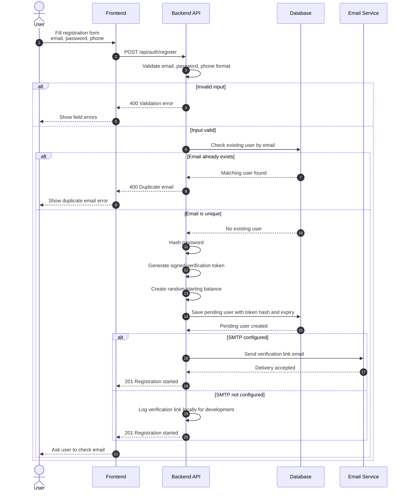
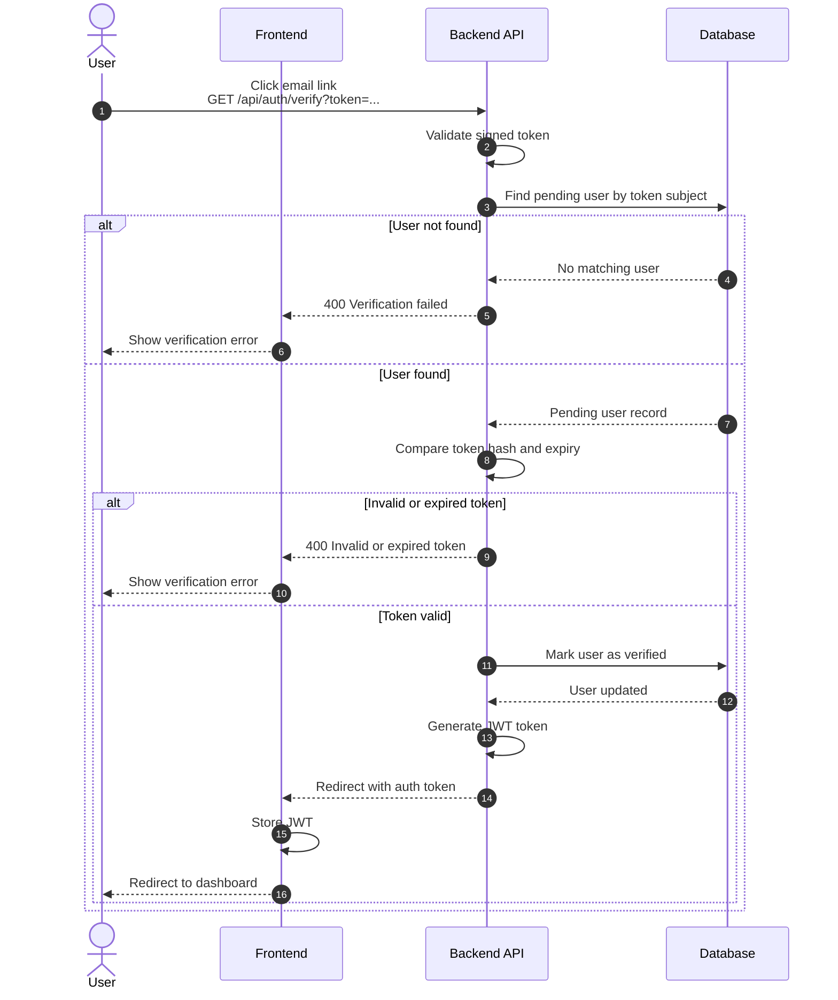
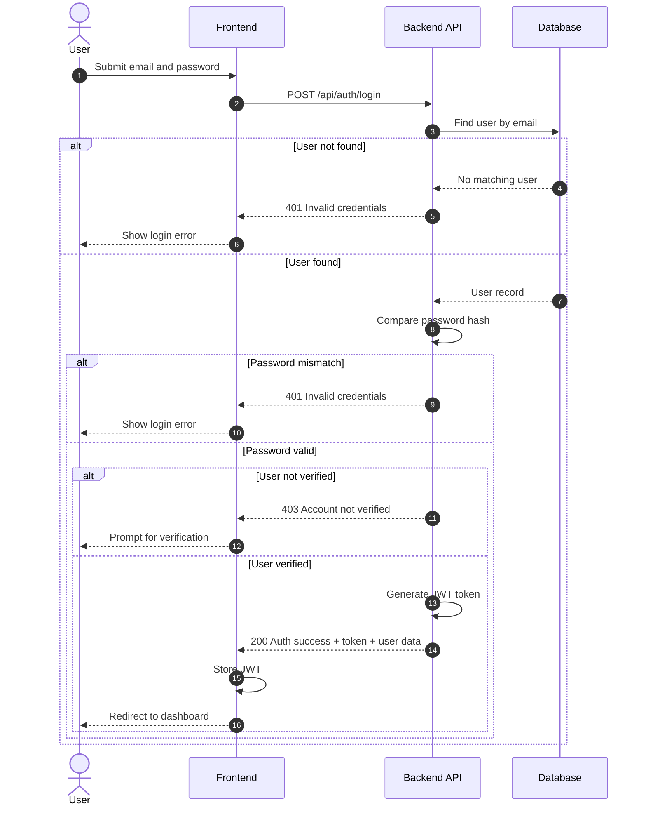
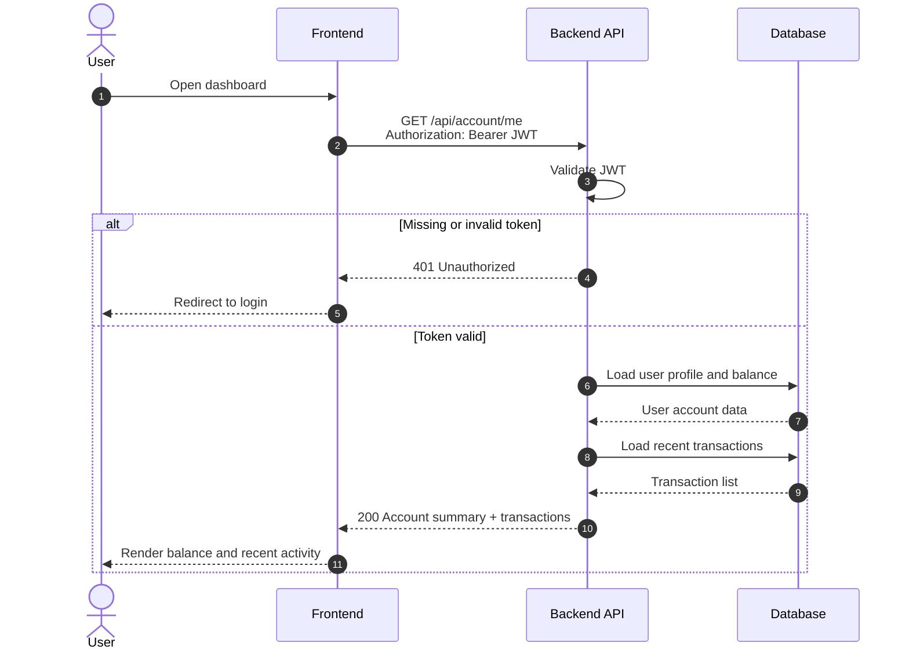
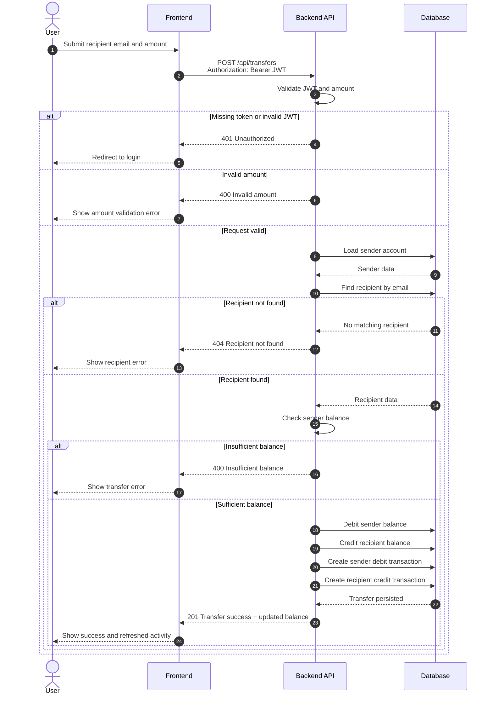
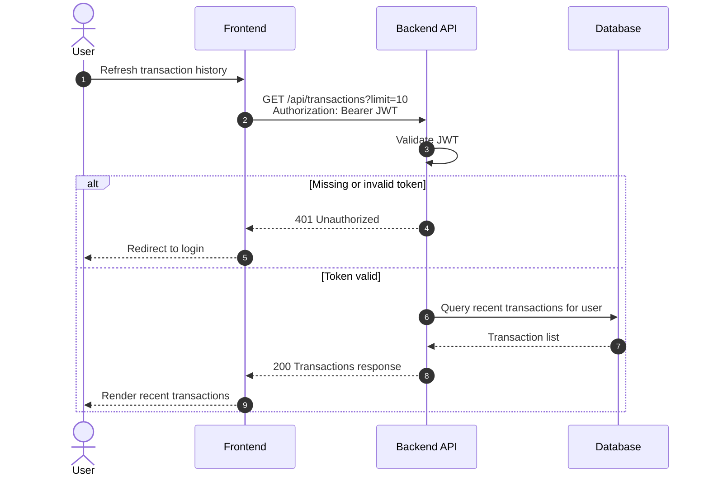
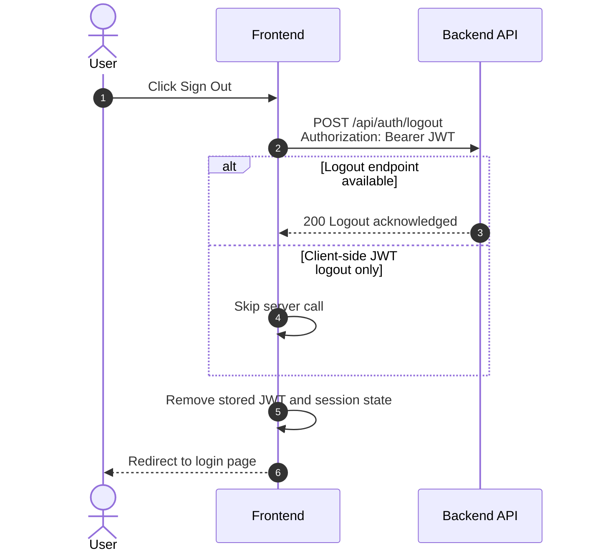

# Bank FS MVP Sequence Diagrams

This document captures the main Bank FS MVP interactions as Mermaid sequence diagrams.
It is based on the current repository documentation in `README.md` and `docs/bank-fs-project.md`.

## Participants

- `User`: End user interacting with the banking UI
- `Frontend`: React client application
- `Backend API`: Node.js + Express server
- `Database`: MongoDB persistence layer
- `Email Service`: SMTP provider or development fallback

## 1. Registration and Verification Link Dispatch

## 2. Email Verification and Account Activation

## 3. Login and JWT Issuance

## 4. Protected Dashboard and Recent Transactions

## 5. Money Transfer Between Registered Users

## 6. Recent Transactions Refresh

## 7. Logout

## Notes

- The diagrams reflect the documented MVP, not later planned phases such as Socket.IO notifications, Jitsi calls, or chatbot flows.
- Email verification is shown as the active path because the current repo documentation explicitly mentions email-based verification.
- The exact internal module names may change once the backend source is added; these diagrams focus on stable user-visible behavior and service boundaries.
