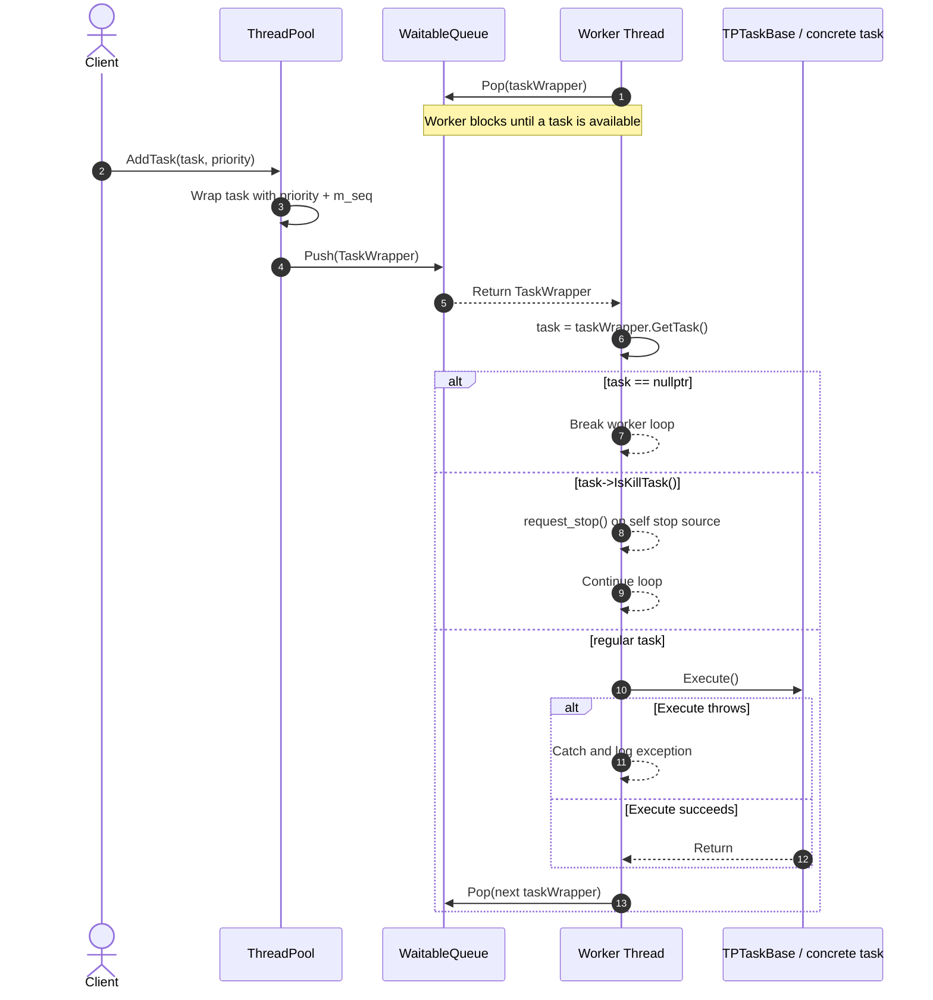
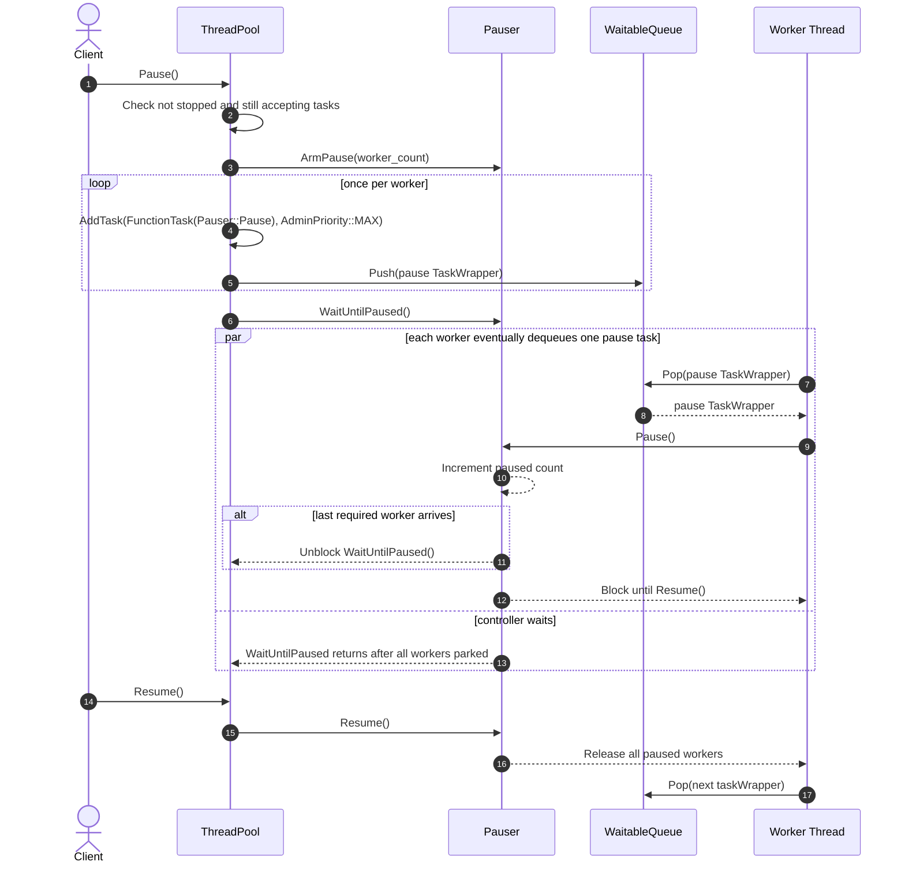
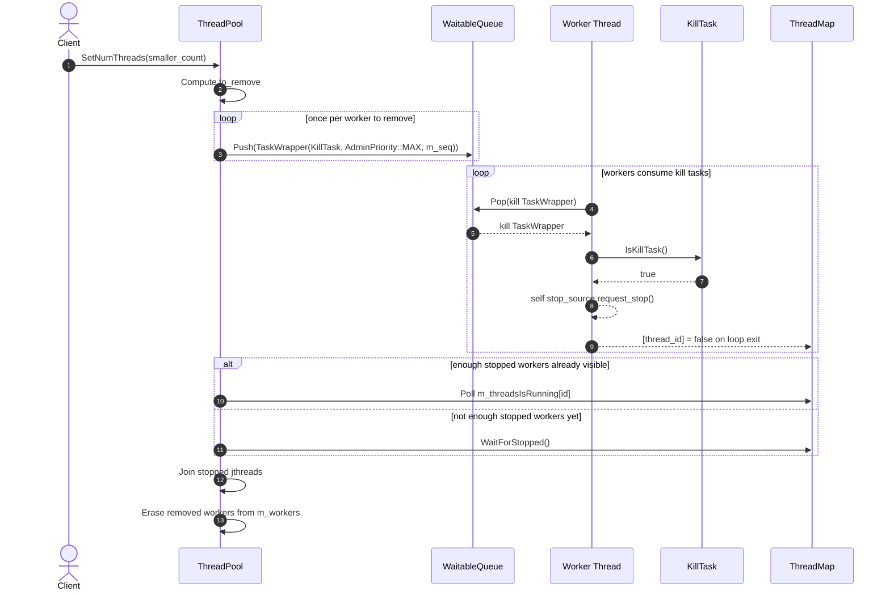
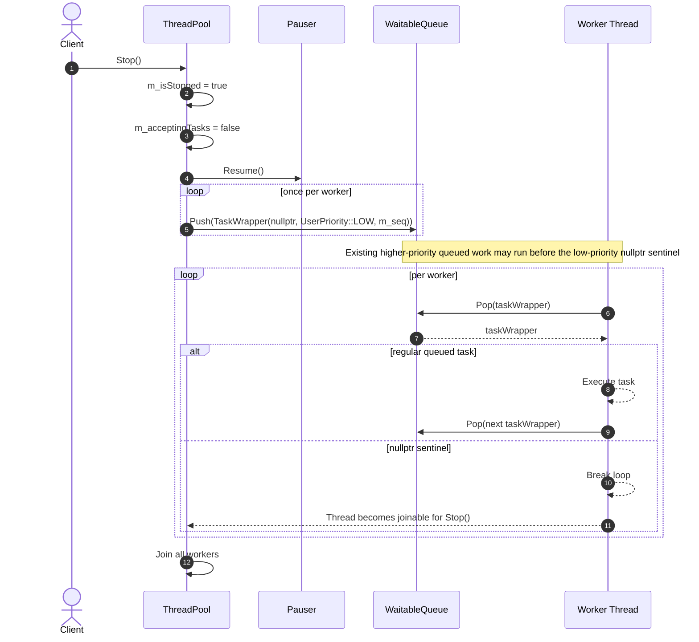
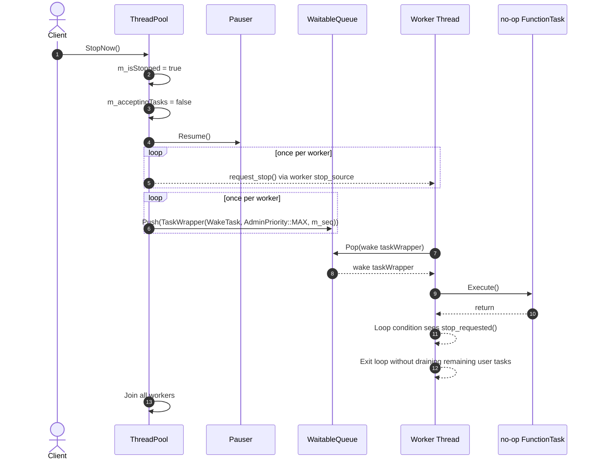

# ThreadPool Sequence Diagram

This document describes the current generic `ThreadPool` behavior implemented in
`framework/src/ThreadPool.cpp`, `framework/src/ThreadPoolTasks.cpp`,
`framework/src/Pauser.cpp`, and `framework/src/ThreadMap.cpp`.

Notes:
- Same-priority task ordering is FIFO because `TaskWrapper` carries `m_seq`.
- Administrative flows use special queue entries: pause tasks, `KillTask`, `nullptr` sentinels, and wake-up no-op tasks.
- Pause is cooperative. Workers stop only after they dequeue and execute the injected pause task.

## Normal Task Execution

## Pause / Resume

## Shrink Worker Count

## Graceful Stop

## Immediate Stop

